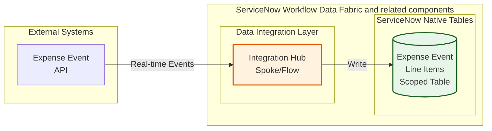

# Lab Exercise: Fundamentals

[Take me back to main page](./)

This lab will walk you through creation of the scoped tables needed to interact with the external system integrations.

## Data flow

The data flow below shows how ServiceNow will consume REST API endpoints via Integration Hub Spokes then further processed by a Flow so the entries will be written in the scoped table.

## Lab story so far

While you have the power of CMDB at your fingertips, there are processes which require specific steps and data formats. You will need to create a scoped table which will store information from an expense event API.

The table you will create here will not be used for the rest of the steps and serves mainly to introduce how target tables for REST API endpoints are created for ServiceNow.

## AI Search Configuration

1. This configuration section includes setting up of AI Search which is a critical tool for the AI Agents. You can skip this if you have done it for [Lab Exercise: Zero Copy Connectors](https://servicenow-lf.gitbook.io/the-workflow-data-fabric-loom/3_zero_copy).
2.  Using an private/incognito browser window, log into your instance as:

    1. User: **aislab.admin**
    2. Password: **aislab.admin**

    <figure><figcaption></figcaption></figure>
3.  Navigate to **All** > <mark style="color:green;">**a.)**</mark> type **Repair Machine Learning Settings** > <mark style="color:green;">**b.)**</mark> click on **Repair Machine Learning Settings**.

    <figure><figcaption></figcaption></figure>
4.  Click on Repair Machine Learning Settings.

    <figure><figcaption></figcaption></figure>
5.  You will get a message that the machine learning settings are being reset.

    <figure><figcaption></figcaption></figure>
6.  After a 2-3 minutes, you will get a notification that the machine learning settings are reset. This will do indexing of tables in the background which will be needed for the search functionality to be used by the AI Agents later.

    <figure><figcaption></figcaption></figure>
7. Exit your aislab.admin session and go back to your main session where you have logged in as **admin** user with the password provided to you.

## Steps

1. Go to the top right portion of your navigation and click on the <mark style="color:green;">**a.)**</mark> **globe icon** then **arrow** **>** the <mark style="color:green;">**b.)**</mark> **list icon** to create new scope.

<figure><figcaption></figcaption></figure>

2.  In the succeeding screen, click **New**.

    <figure><figcaption></figcaption></figure>
3.  Go to section **Start from Scratch** and click **Create**

    <figure><figcaption></figcaption></figure>
4.  Provide the scope details with <mark style="color:green;">**a.)**</mark> name **Forecast Variance \<YOUR INITIALS>** and the <mark style="color:green;">**b.)**</mark> scope. Click <mark style="color:green;">**c.)**</mark> Create. Note that the scope is a technical name and is automatically populated but you have the option to change it. In this example, the scope is **x\_snc\_forecast\_var**. Fell free to add your iniitials at the end of the scope. The scope here will not be used in the exercise and is only meant to serve as guide in demonstrating the fundamental steps. Click **Back to list** once done.

    <figure><figcaption></figcaption></figure>
5.  Verify that you are in the correct scope after you have created it. Being in the correct scope as you proceed with the lab will avoid scope access and object management issues. Do this by a.) clicking on the <mark style="color:green;">**a.)**</mark> scope (globe icon) and ensuring that has the value of the <mark style="color:green;">**b.)**</mark> **Forecast Variance \<YOUR INITIALS>** label you created.

    <figure><figcaption></figcaption></figure>
6.  <mark style="color:red;">**THIS NEXT STEP IS CRITICAL**</mark>. You will need to change scope after you have created the simulation scope. Click on the <mark style="color:green;">**a.)**</mark> **scope** (globe icon) and <mark style="color:green;">**b.)**</mark> **Forecast Variance**, this time <mark style="color:red;">**WITHOUT**</mark> your initials. This will be the scope you will use throughout the lab.

    <figure><figcaption></figcaption></figure>
7.  Now that you are in the right scope, you are ready to create the scoped table. Navigate to All > <mark style="color:green;">**a.)**</mark> type **System Definition** > <mark style="color:green;">**b.)**</mark> search for **Tables**

    <figure><figcaption></figcaption></figure>
8.  Go to the top right section of the navigation and click **New**.

    <figure><figcaption></figcaption></figure>
9.  Provide the <mark style="color:green;">**a.)**</mark> **Label** as **Expense Transaction Event \<your initials>**. The <mark style="color:green;">**b.)**</mark> **Name** which is a technical identifier will automatically be populated and can be modified to suit your requirement. Finally, untick <mark style="color:green;">**c.)**</mark> **Create module**.

    <figure><figcaption></figcaption></figure>
10. Right click on the header and click **Save**.

    <figure><figcaption></figcaption></figure>
11. Staying in the same screen, an option to create fields for the table will be available. In the tab **Columns** click on **New**.

    <figure><figcaption></figcaption></figure>
12. Let us use one column as an example. Provide the <mark style="color:green;">**a.)**</mark> **Type**, in this case **String**. Provide the <mark style="color:green;">**b.)**</mark> **Column label**, in this example, **Cost Center** which will automatically populate the <mark style="color:green;">**c.)**</mark> **Column name**. Since this is the string, provide the <mark style="color:green;">**d.)**</mark> **Max length** of **40**. Finally, right click on then header and <mark style="color:green;">**e.)**</mark> **Save**.

    <figure><figcaption></figcaption></figure>
13. Do the same steps for all of the 16 other fields below. Note that the **Column label**, **Column name**, **Type**, **Max length** vary across some columns. For now, keep **Display** as **false** across all fields.

    <figure><figcaption></figcaption></figure>

## Conclusion

Congratulations! You have created the destination table within ServiceNow for the external REST API sources. As a recap, the table you created will not be used for the rest of the steps and serves mainly to introduce how target tables for REST API endpoints are created for ServiceNow.

## Next step

Let us continue building the data foundations for the use case. Next up is creation of the Data Fabric tables which will be used by AI Agents. Click [here to proceed with configuring the Data Fabric tables using ServiceNow's Zero Copy capability](https://servicenow-lf.gitbook.io/the-workflow-data-fabric-loom/3_zero_copy).

Alternatively, you can focus purely on REST API connectivity by proceeding with the [Integration Hub configuration](https://servicenow-lf.gitbook.io/the-workflow-data-fabric-loom/2_integration_hub).

[Take me back to main page](./)
