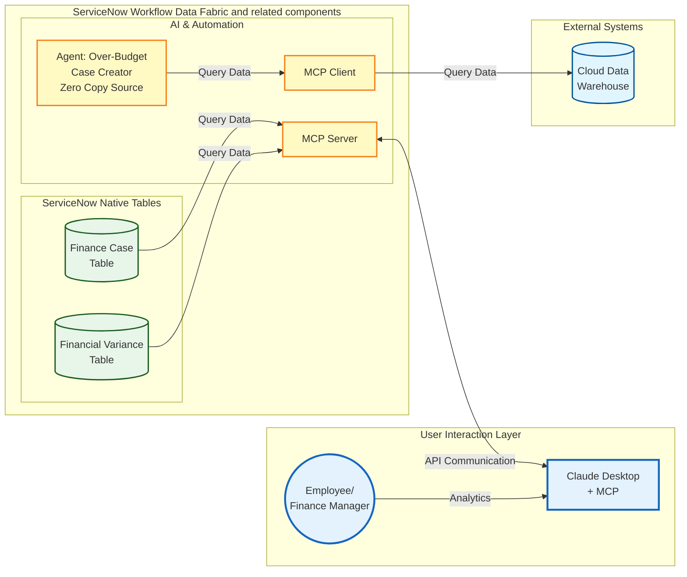

# Lab Exercise: Model Context Protocol Server/Client

[Take me back to main page](./)

This lab will walk you through the configuration and usage of MCP capabilities to interact with ServiceNow either as a client or as a server, allowing end users to interact with the platform as they see fit. For simplicity, this lab will cover ServiceNow acting as an MCP Client. More details on MCP Server scenarios will be added soon.

## Data flow

The data flow below shows how ServiceNow provides MCP client and server capabilities.



## Steps

### <mark style="color:red;">**Lab Admins, do this in advance!**</mark> MCP Server Preparations

1. You need access to a live Snowflake instance. Contact [Leo Francia](mailto:leo.francia@servicenow.com) for more details on instance access to [https://xwtgfjs-jq54573.snowflakecomputing.com](https://xwtgfjs-jq54573.snowflakecomputing.com/) which is used for this lab.
2.  Run the following in Snowflake for each lab instance. The first parameter is your lab prefix (e.g. `lef-feb-7318`) and the second is the instance running number (e.g. `0001`). For example, if your lab prefix is `lef-feb-7318` and you have 10 participants, you will need to run:

    ```sql
    CALL ALECTRI.FINANCE.SETUP_LAB_INSTANCE('lef-feb-7318', '0001');
    CALL ALECTRI.FINANCE.SETUP_LAB_INSTANCE('lef-feb-7318', '0002');
    CALL ALECTRI.FINANCE.SETUP_LAB_INSTANCE('lef-feb-7318', '0003');
    -- repeat up to your last instance
    CALL ALECTRI.FINANCE.SETUP_LAB_INSTANCE('lef-feb-7318', '0010');
    ```
3.  Each call returns a `SELECT` statement. Run each one to get the Client ID and Client Secret per instance.

    ```sql
    SELECT SYSTEM$SHOW_OAUTH_CLIENT_SECRETS('SN_MCP_7318_0001');
    SELECT SYSTEM$SHOW_OAUTH_CLIENT_SECRETS('SN_MCP_7318_0002');
    -- repeat for each instance
    ```
4. <mark style="color:red;">**\[IMPORTANT STEP TO AVOID LOGISTICAL ISSUES DURING LAB]**</mark> Compile the results into a shared file with one row per instance containing the **Client ID** and **Client Secret**. Share the file link with students, they will self-serve their own credentials based on their assigned instance number.
5. During the lab session, verbally share the **Snowflake username and password** that students will need when prompted during the OAuth sign-in step. **Do not include this in the shared file.**
6.  To clean up after the lab:

    ```sql
    CALL ALECTRI.FINANCE.TEARDOWN_LAB_INSTANCE('lef-feb-7318', '0001');
    -- repeat for each instance
    ```

### MCP Client Preparations

1. Navigate to All > <mark style="color:green;">**a.)**</mark> type **AI Agent Studio** > <mark style="color:green;">**b.)**</mark> click on **Settings**.

<figure><figcaption></figcaption></figure>

2. In the **Settings** page > <mark style="color:green;">**a.)**</mark> go to **Manage MCP Servers** > <mark style="color:green;">**b.)**</mark> click on **New**.

<figure><figcaption></figcaption></figure>

3.  Enter the name as <mark style="color:green;">**a.)**</mark> **Snowflake MCP Lab** with <mark style="color:green;">**b.)**</mark> Authentication type OAuth 2.1 and with <mark style="color:green;">**c.)**</mark> the URL [**https://xwtgfjs-jq54573.snowflakecomputing.com/api/v2/databases/alectri/schemas/finance/mcp-servers/variance\_mcp\_server**](https://xwtgfjs-jq54573.snowflakecomputing.com/api/v2/databases/alectri/schemas/finance/mcp-servers/variance_mcp_server). Then <mark style="color:green;">**d.)**</mark> click **Next**.

    <figure><figcaption></figcaption></figure>
4. The following screen has more inputs required.

<mark style="color:green;">**a.)**</mark> For **Client registration type** select **Manual Registration**

<mark style="color:green;">**b.)**</mark> For **Grant type** select **Authorization Code**

<mark style="color:green;">**c.)**</mark> For **Token authentication method** select **Client Secret Basic**

<mark style="color:green;">**d.)**</mark> **Client ID** will be provided to you by your **Lab Admin**

<mark style="color:green;">**e.)**</mark> **Client Secret** will be provided to you by your **Lab Admin**

<mark style="color:green;">**f.)**</mark> For **Authorization URL**, type [**https://xwtgfjs-jq54573.snowflakecomputing.com/oauth/authorize**](https://xwtgfjs-jq54573.snowflakecomputing.com/oauth/authorize)

<mark style="color:green;">**g.)**</mark> For **Token URL**, type [**https://xwtgfjs-jq54573.snowflakecomputing.com/oauth/token-request**](https://xwtgfjs-jq54573.snowflakecomputing.com/oauth/token-request)

<mark style="color:green;">**h.)**</mark> Click **Add**

<figure><figcaption></figcaption></figure>

5.  Navigate to **All** > <mark style="color:green;">**a.)**</mark> type **Connection & Credential Aliases** then <mark style="color:green;">**b.)**</mark> click **Connections & Credentials > Connection & Credential Aliases**.

    <figure><figcaption></figcaption></figure>
6. Search for an entry with the prefix **AutoGen-Snowflake MCP Lab**. Take note of the string **Lab**! There might be an entry with a similar prefix.

<figure><figcaption></figcaption></figure>

7. You can configure the alias by going through the link under the <mark style="color:green;">**a.)**</mark>**&#x20;Name** field or <mark style="color:green;">**b.)**</mark> Credential field. The succeeding screens are through the **Credential** field so click <mark style="color:green;">**b.)**</mark>.

<figure><figcaption></figcaption></figure>

8. Ctrl / ⌘ + click on the **i-icon** in the screen that follows to open a new window. <mark style="color:green;">**You will need to come back to this window later!**</mark>

<figure><figcaption></figcaption></figure>

9.  In the screen that follows, double-click on a line below **OAuth Entity Scope** which is under the section **OAuth Entity Profile Scopes**. A small dialog box will pop-up. Click on the **magnifying class icon**.

    <figure><figcaption></figcaption></figure>
10. In the next dialog box that appears, click **New**.

<figure><figcaption></figcaption></figure>

11. Beside <mark style="color:green;">**a.)**</mark> Name and <mark style="color:green;">**b.)**</mark> OAuth scope, type **session:role:MCP\_SERVICE\_ROLE**.

<figure><figcaption></figcaption></figure>

12. Beside OAuth provider, <mark style="color:green;">**a.)**</mark> type AutoGen and <mark style="color:green;">**b.)**</mark> select the entry with the prefix **AutoGen-Snowflake MCP Lab**, then <mark style="color:green;">**c.)**</mark> click **Submit**.

<figure><figcaption></figcaption></figure>

13. This will lead you back to the small dialog box, click the **check mark** to confirm your settings.

<figure><figcaption></figcaption></figure>

14. This will lead to the screen below.

<figure><figcaption></figcaption></figure>

15. Do the same steps you have done for **sesion:role:MCP\_SERVICE\_ROLE** but this time for the value **refresh\_token**. Put the value **refresh\_token** for **Name** and **OAuth scope**.

<figure><figcaption></figcaption></figure>

16. For OAuth provider, simply get your **Recent selections** item which has the **AutoGen-Snowflake MCP Lab** prefix.

<figure><figcaption></figcaption></figure>

17. You will see the **sesion:role:MCP\_SERVICE\_ROLE** and **refresh\_token** entries stored. Right click on the header and click **Save**.

<figure><figcaption></figcaption></figure>

19. Go back to your tab which has the **OAuth 2.0 Credentials** open and click **Get OAuth Token**.

<figure><figcaption></figcaption></figure>

20. Your Lab Admin will provide the <mark style="color:green;">**a.)**</mark>**&#x20;Username** and <mark style="color:green;">**b.)**</mark>**&#x20;Password** and once entered <mark style="color:green;">**c.)**</mark> click **Sign in**.

<figure><figcaption></figcaption></figure>

21. Click **Allow**.

<figure><figcaption></figcaption></figure>

22. Your will have a refreshed OAuth token that will last for 1 hour before it expires. You can now connect to the Snowflake cloud data warehouse via MCP and call MCP tools using ServiceNow's AI Agents.

<figure><figcaption></figcaption></figure>

### Connecting to an MCP Server (Snowflake)

This provides the steps needed to connect ServiceNow to an MCP ([Model Context Protocol](https://modelcontextprotocol.io/docs/getting-started/intro)) Server tool configured in Snowflake. ServiceNow can serve as an MCP Client to connect to any solution that has MCP support.

This exercise does not cover the creation of the MCP Service from Snowflake as that requires administrator rights and CDW expertise which may not be widely available to various personas.

1. Navigate to All > <mark style="color:green;">**a.)**</mark> type **AI Agent Studio** > <mark style="color:green;">**b.)**</mark> click on **Create and Manage**.

<figure><figcaption></figcaption></figure>

2. This will go to the list of workflows and agents. Go to **AI agents** tab > <mark style="color:green;">**a.)**</mark> click **search (magnifying glass)** > <mark style="color:green;">**b.)**</mark> type **Forecast Variance** and hit **Return/Enter ↵**.

<figure><figcaption></figcaption></figure>

3. Click on **Forecast Variance**.

<figure><figcaption></figcaption></figure>

4.  Click on <mark style="color:$success;">**a.)**</mark> **more (vertical three dots)** > <mark style="color:$success;">**b.) Duplicate**</mark>

    <figure><figcaption></figcaption></figure>
5.  You will get a prompt to confirm whether you want to duplicate the agent. Click **Duplicate**.

    <figure><figcaption></figcaption></figure>
6.  In the new Agent screen, go to the **AI agent name** and rename it to **Forecast Variance Snowflake MCP Lab**.

    <figure><figcaption></figcaption></figure>
7.  In the section **Define the role and Required steps** under sub-section **List of steps**, go to step 2 after the paragraph which starts with **Get cost center obtained in...** then add **Also run the MCP tool "Get Details via Snowflake MCP" as a secondary check. Only return one entry (limit = 1). Columns should be \["COST\_CENTER", "ACTUAL\_AMOUNT\_USD", "BASELINE\_AMOUNT\_USD", "VARIANCE", "VARIANCE\_PCT"]**. It should look like the screenshot below.

    <figure><figcaption></figcaption></figure>
8.  Click **Save and Continue**.

    <figure><figcaption></figcaption></figure>
9.  Navigate to <mark style="color:green;">**a.)**</mark> **Add tools and information** > <mark style="color:green;">**b.)**</mark> **Add tool** > <mark style="color:green;">**c.)**</mark> > **MCP server tool**.

    <figure><figcaption></figcaption></figure>
10. In the pop-up that appears, <mark style="color:green;">**a.)**</mark> click on the **dropdown** > <mark style="color:green;">**b.)**</mark> select **Snowflake MCP**.

    <figure><figcaption></figcaption></figure>
11. In the same pop-up screen, select the tool **variance-baseline-search**.

    <figure><figcaption></figcaption></figure>
12. Still in the same pop-up screen provide the following details. Screenshot on how the settings should look like immediately follows. You only need to modify three settings and leave the rest as they are.

<mark style="color:green;">**a.)**</mark> **Name**: **Get Details in Snowflake MCP**

<mark style="color:green;">**b.)**</mark> **Tool description**:

* query: Get the details via Snowflake MCP using the cost center taken from "Extract Cost Center" step (e.g. "CC\_IT\_001")
* columns: \["COST\_CENTER", "ACTUAL\_AMOUNT\_USD", "BASELINE\_AMOUNT\_USD", "VARIANCE", "VARIANCE\_PCT"]
* limit: 1

<mark style="color:green;">**c.)**</mark> **Execution mode**: **Autonomous**

<mark style="color:green;">**d.)**</mark>**&#x20;Save**

<figure><figcaption></figcaption></figure>

13. The pop-up will exit and you should get a section on **Model Context Protocol tools** which should look like below.

    <figure><figcaption></figcaption></figure>
14. Click **Save and Continue**.

    <figure><figcaption></figcaption></figure>
15. Since this is copied from an existing AI Agent configuration, simply accept the default values for **Define security controls** and its 2 sub-items. Also keep A**dd triggers value** blank.

    <figure><figcaption></figcaption></figure>
16. Finally, click on <mark style="color:green;">**a.)**</mark> **Select channels and status**. This configures the availability of the AI Agent. In this case, it is enabled and can be accessed using <mark style="color:green;">**b.)**</mark>**&#x20;Now Assist panel** toggled on as well as via <mark style="color:green;">**c.)**</mark>**&#x20;Now Assist in Virtual Agent** added as chat assistant. Click <mark style="color:green;">**d.)**</mark>**&#x20;Save and test**.

    <figure><figcaption></figcaption></figure>
17. You **MIGHT** be alerted of potential duplicates but this is due to the multiple AI Agents created to test various integration scenarios. Click **Ignore and continue**.

    <figure><figcaption></figcaption></figure>
18. You will be directed to the Test AI reasoning tab. To proceed with testing, <mark style="color:green;">**a.)**</mark> type **Help me process EXP-2025-IT-002-1007-01** and <mark style="color:green;">**b.)**</mark> click **Continue to Test Chat Response**.

    <figure><figcaption></figcaption></figure>
19. The test will run for a few seconds and will show you that it is running the tool **Get Details in Snowflake MCP**. This is the additional tool you created earlier.

    <figure><figcaption></figcaption></figure>
20. Finally, you will notice that the **Get Details in Snowflake MCP** has obtained the closest matching the value of cost center CC\_IT\_001. For this exercise, we only returned the raw JSON value to demonstrate the MCP capability where we did not use any SQL or API to return the matching row; instead we just provided a high-level instruction seen in step 12.

    <figure><figcaption></figcaption></figure>
21. **Challenge:** once you are done with this lab, see if you can remove the tool **Extract Cost Center** and replace it completely with the data from **Get Details via Snowflake MCP** as seen in step 7. No hints this time. 😉

## Troubleshooting

1. If the Now Assist Agent is not showing the action being executed and the history of chats like below, wait for 5 minutes or so and refresh your browser. This is primarily due to the instance's fresh Now Assist settings which you have just configured earlier.

<figure><figcaption></figcaption></figure>

2. If you get messages in Now Assist from the agent saying messages like below, this just means that indexing of the tables needed by the agent to search transactions is not yet completed. Wait for 10 to 15 minutes.

* Errors/messages in Now Assist below. These do not affect the outcome of your lab activity as the agents and the tools related to this are already configured and is only related to the lab instance server load.
  * There is no available information indicating similar transactions for this vendor in the past based on the cost center being processed.
  * Based on the available information, there is insufficient data to determine whether the results are mostly 'On Target', 'Over Budget', or 'Under Budget.' Please provide additional details or context for a more accurate evaluation.
*   **If the errors persist after waiting 10 to 15 minutes, do the following steps to force an indexing job, but this is not a guaranteed fix if there is a high load in the shared lab ML services used in AI search**.

    * Navigate to **All** > <mark style="color:green;">**a.)**</mark> type **Indexed Sources** > <mark style="color:green;">**b.)**</mark> click **AI Search > AI Search Index >** and Ctrl / ⌘ + click **Indexed Sources** to open a new window.

    <figure><figcaption></figcaption></figure>

    *   Search for **Sources** with the string <mark style="color:green;">**a.)**</mark> \*x\_snc\_forecast then Ctrl / ⌘ + click both <mark style="color:green;">**b.)**</mark> **Cost Center Budget History Indexed Source** and <mark style="color:green;">**c.)**</mark>**&#x20;Expense Transactions Indexed Source** so you have two new windows for these objects.

        <figure><figcaption></figcaption></figure>
    * In the new window for **Center Budget History Indexed Source**, click **Index All Tables**.

    <figure><figcaption></figcaption></figure>

    *   In the new window for **Expense Transactions Indexed Source**, click **Index All Tables**.

        <figure><figcaption></figcaption></figure>
    * Once done, you can re-execute your agent.

## Conclusion

Congratulations! You have created the **MCP Server** integrations that allows ServiceNow to make use of MCP capabilities from other systems outside ServiceNow, allowing LLM-powered integrations alternative APIs ,that require less development.

## Next step

You can explore a bonus use case that makes use of Stream Connect for Apache Kafka for integrations that require more throughput and data volume.

[Take me back to main page](./)
