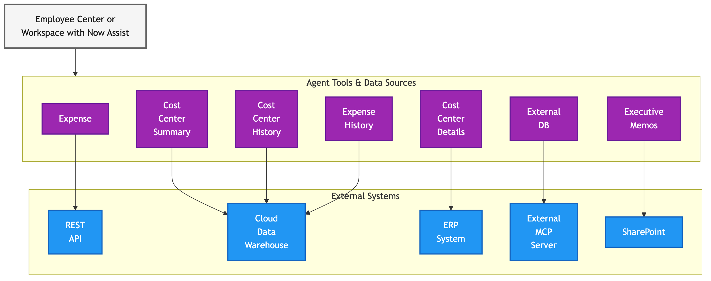
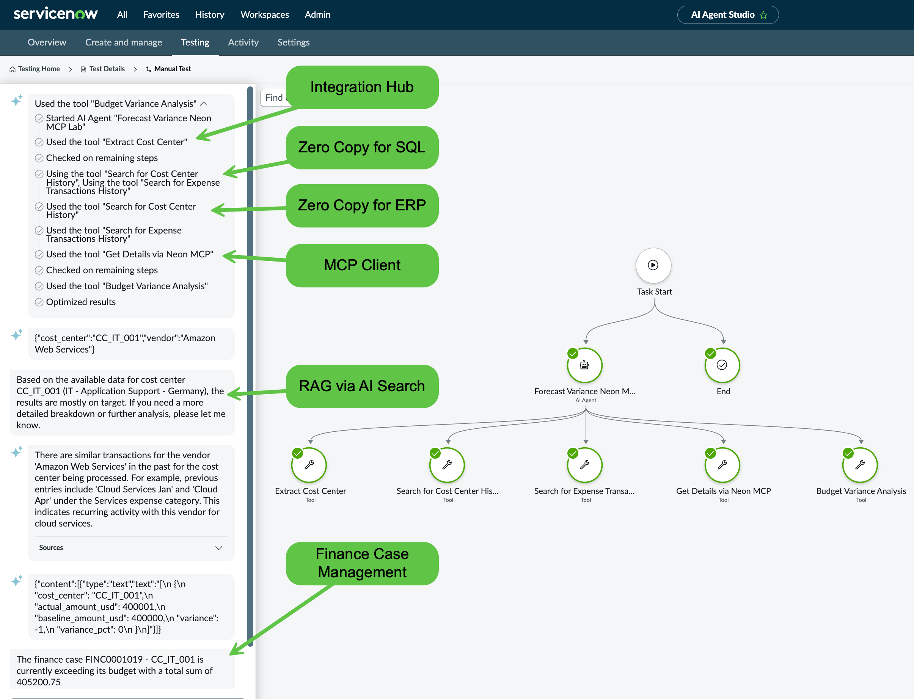
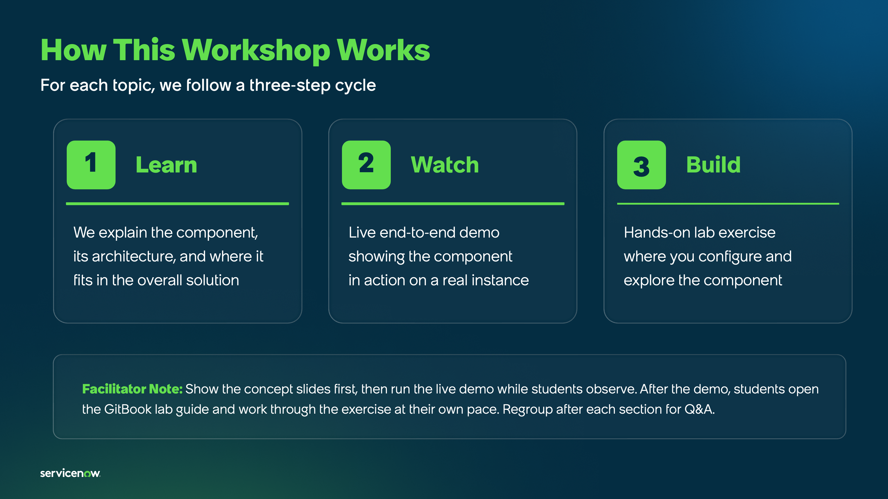

# APAC AI End-to-End Lab: Workflow Data Fabric

<figure><picture><source srcset=".gitbook/assets/wdf_connectors_banner_dark.gif" media="(prefers-color-scheme: dark)"></picture><figcaption></figcaption></figure>

## Business motivation

<figure><figcaption></figcaption></figure>

Finance teams discover budget overruns weeks too late. Expense analysis requires manually piecing together data from ERP systems, data warehouses, and SharePoint. By the time finance reacts, small variances become major problems. **ServiceNow Workflow Data Fabric transforms reactive financial management into proactive intelligence**. By unifying data across systems through Zero Copy for SQL and ERP, Integration Hub, External Content Connectors, MCP, and AI agents, organizations can:

* **Detect budget issues in real-time** before they escalate
* **Scale financial operations** with AI agents, not headcount
* **Automate financial case creation** enriched with multiple external data sources and trend analysis

Your automations and AI Agents are just as good as your underlying data. Integrations powered by Workflow Data Fabric allow AI Agents to automate critical processes using accurate and consistent data.

With the trend of external agents reaching through enterprise data, it is worth examining why platform-native agents can scale more safely. Agents built within ServiceNow inherit battle-tested authorization models: role-based access, ACLs, and purpose-built security controls for AI agents; allowing organizations to automate confidently without stepping outside their governance boundaries.

## Persona context

You're a **Data Architect** serving the Finance department. Finance Managers need immediate visibility into budget performance. Cost Center Owners need to understand why they're over budget; with context beyond just numbers. **Your mission**: Build an intelligent financial data fabric that connects ServiceNow to external systems, deploys AI agents to detect and analyze budget issues automatically, surfaces executive guidance, and enables self-service analytics through Employee Center and Claude Desktop. You'll solve three critical problems:

1. "We find out about budget overruns too late: can we get real-time alerts?"
2. "Investigation means manually searching expenses, reports, and memos: can you unify this?"
3. "We answer the same questions daily: can employees self-serve?"

## Outcome

<figure><picture><source srcset=".gitbook/assets/dataflow_outcome_agent_flow_dark.png" media="(prefers-color-scheme: dark)"></picture><figcaption></figcaption></figure>

> **Legend:** 🟤 Data | 🟣 Workflow Data Fabric | 🔵 External Systems | ⚪ Workspace | ↓ Takes data from

<figure><figcaption></figcaption></figure>

By completing this lab, you'll build an interconnected financial intelligence platform demonstrating:

* **Integration Hub** for real-time expense event processing
* **Zero Copy integration** with ERP and cloud warehouses (no data duplication)
* **MCP Server** enabling integration with any application that supports the protocol
* **AI agents** that autonomously search via [RAG](https://en.wikipedia.org/wiki/Retrieval-augmented_generation), analyze trends, and create contextual cases
* **Lens and Document Intelligence** for invoice data capture individually or batch, respectively
* **External Content Connector** bringing executive memos into making decisions
* **Finance Case Management** which receives the cases pre-processed by the AI Agents based on data taken from WDF

You'll master the architectural patterns for transforming siloed enterprise data into unified, intelligent decision-making platforms. **Let's build something intelligent**. 🚀💡

## Lab exercises

This lab is divided into 7 exercisesover 3 sections with the suggested sequence below. The ServiceNow-led lab environments which contains these exercises will allow you to complete individual labs in any sequence you prefer. The exercises focus on walk through and basic configuration of Workflow Data Fabric integrations and there are pre-made custom agents that make use of the integrations to demonstrate what is possible. You will not need to configure agents in this lab but steps are provided on how you can explore how the agents were configured.

This is designed to be a full day workshop covering most of WDF's capabilities. As such, we will not be able to cover in great depth all of the capabilities. If there are capabilities most relevant to your requirements, do ask your Lab Admin if there is a relevant deep dive lab available.

<table><thead><tr><th width="203.09375">Topic</th><th width="180.48828125">Difficulty</th><th>AI Agents involved</th><th>Suggested duration</th></tr></thead><tbody><tr><td><a href="data-and-flow-diagrams.md">Workflow Data Fabric Diagrams</a></td><td>N/A</td><td>No</td><td>N/A</td></tr><tr><td><strong>Main Exercises</strong></td><td></td><td></td><td></td></tr><tr><td><a href="main-exercises/lab-exercise-fundamentals.md">Lab Exercise: Fundamentals</a></td><td>Beginner</td><td>No</td><td>30 minutes</td></tr><tr><td><a href="main-exercises/lab-exercise-integration-hub.md">Lab Exercise: Integration Hub</a></td><td>Intermediate</td><td>Yes</td><td>90 minutes</td></tr><tr><td><a href="main-exercises/lab-exercise-zero-copy-connectors.md">Lab Exercise: Zero Copy Connectors</a></td><td>Intermediate</td><td>Yes</td><td>90 minutes</td></tr><tr><td><strong>Extended Exercises</strong></td><td></td><td></td><td></td></tr><tr><td><a href="extended-exercises/lab-exercise-external-content-connector.md">Lab Exercise: External Content Connector</a></td><td>Beginner</td><td>Yes</td><td>30 minutes</td></tr><tr><td><a href="extended-exercises/lab-exercise-servicenow-lens-and-document-intelligence.md">Lab Exercise: ServiceNow Lens and Document Intelligence</a></td><td>Beginner</td><td>Yes</td><td>30 minutes</td></tr><tr><td><a href="extended-exercises/lab-exercise-model-context-protocol-server-client.md">Lab Exercise: Model Context Protocol Server/Client</a></td><td>Intermediate</td><td>Yes</td><td>1 hour</td></tr><tr><td><strong>Hungry for more?</strong></td><td></td><td></td><td></td></tr><tr><td><a href="hungry-for-more/lab-exercise-kafka_stream_connect.md">Lab Exercise: Stream Connect for Apache Kafka Lab</a></td><td>Advanced</td><td>Yes</td><td>1 hour</td></tr></tbody></table>

## How each lab exercise will be conducted

<figure><figcaption></figcaption></figure>

## Post-lab recommended materials

Below is a list of recommended courses that you can read up on after the lab to learn more about Workflow Data Fabric.

<table><thead><tr><th width="203.09375">Course</th><th width="180.48828125">Level</th><th>Type</th><th width="182.0078125">Duration</th></tr></thead><tbody><tr><td><a href="https://learning.servicenow.com/lxp/en/general/what-are-the-components-of-workflow-data-fabric?id=learning_course_prev&#x26;course_id=5a15e37147052e103c6f6013e16d430b&#x26;s=1&#x26;ssa=3">What are the Components of Workflow Data Fabric</a></td><td>Beginner</td><td>On-demand Course</td><td>10 minutes</td></tr><tr><td><a href="https://learning.servicenow.com/lxp/en/automation-engine/workflow-data-fabric-explained?id=learning_course_prev&#x26;course_id=72a3657f87671a58e6ba74c7dabb35c6&#x26;s=1&#x26;ssa=3">Workflow Data Fabric Explained</a></td><td>Beginner</td><td>On-demand Course</td><td>1 hour, 5 minutes</td></tr><tr><td><a href="https://learning.servicenow.com/lxp/en/now-platform/introduction-to-ai-search-and-external-content-connectors?id=learning_course_prev&#x26;course_id=62283c7c93d46e50f2d9bc686cba107b&#x26;s=1&#x26;ssa=3">Introduction to AI Search and External Content Connectors</a></td><td>Beginner</td><td>On-demand Course</td><td>1 hour, 10 minutes</td></tr></tbody></table>

## A note from the author and some disclaimers

This lab involves integrating ServiceNow with external systems (e.g., databases, APIs, cloud services). Some steps require pre-configured environments and connectivity that may not be available in a standard PDI; this is best run as a guided workshop.

### ServiceNow dependencies

Before attempting these exercises, ensure you have access and license entitlements to the following:

| Component needed                                  | Required version, Zurich Patch 4 recommended |
| ------------------------------------------------- | -------------------------------------------- |
| Zero Copy Connector for SQL                       | 2.0.0                                        |
| Zero Copy Connector for ERP                       | 8.0.14                                       |
| External Content Connectors for SharePoint Online | 4.1.7                                        |
| Workflow Studio                                   | 28.1.4                                       |
| Now Assist Skill Kit                              | 6.0.7                                        |
| MCP Server                                        | 1.0.0                                        |
| MCP Client                                        | 1.0.7                                        |
| Lens                                              | 2.0.0                                        |
| Document Intelligence                             | 7.1.5                                        |

### About the author

This lab is created by [Leo Francia](https://www.linkedin.com/in/leojmfrancia/), a Data Architect at ServiceNow, and is in no way a ServiceNow official manual. Leo is an active member of the [ServiceNow community](https://www.servicenow.com/community/workflow-data-fabric/ct-p/workflow-data-fabric) and presales organization so do not hesitate to drop him a note. He is also not sure if he should continue to talk about himself in the third person, but please leave him be.

### Acknowledgement

This lab would not have been possible without the help of exceptional colleagues at ServiceNow:

* [Kamal Shewakramani](https://www.linkedin.com/in/kamal-shewakramani/)
* [Gurjot Joshi](https://www.linkedin.com/in/gurjotjoshi/)
* [Santosh Panda](https://www.linkedin.com/in/santosh-panda015/)
* [Jia Khee Lim](https://www.linkedin.com/in/jia-khee-lim-79427a151/)
* [Rahul Adlakha](https://www.linkedin.com/in/rahuladlakha/)
* [Theo Simmons](https://www.linkedin.com/in/theo-simmonsnow/)
* [Quentin Carton](https://www.linkedin.com/in/quentincarton/)
* [Dan Clark](https://www.linkedin.com/in/dannyclark/)
