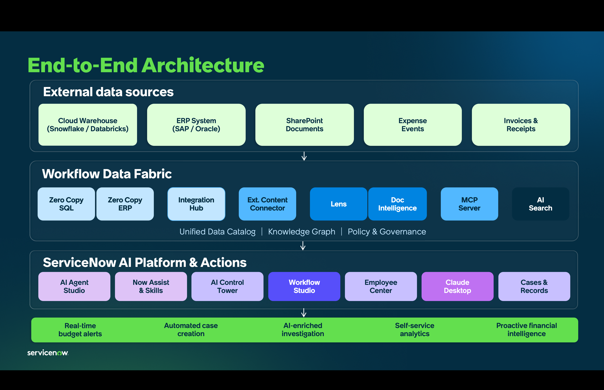

# Demo Hub Preparations

## Obtain Demo Hub Instance

Obtain a **Zurich (Alectri)** .png>) instance in Demo Hub as your instance for the workshop in your data center of choice. <mark style="color:red;">**Note:**</mark> the workshop labs will only work on a **Zurich (Alectri)** image; selecting any other category will lead to steps not working correctly.

1. Log-in to [https://demohub.service-now.com/](https://demohub.service-now.com/) with your ServiceNow account.
2. Go to Manage Instances in the top right corner of the page. This will open a new window.

<figure><figcaption></figcaption></figure>

4.  In the next screen, click **Request an Instance**.

    <figure><figcaption></figcaption></figure>
5. Fill in the following details:

<mark style="color:green;">**a.)**</mark> Nickname: optional

<mark style="color:green;">**b.)**</mark> Notes: optional

<mark style="color:green;">**c.)**</mark> Data Center Region: select your preferred region. Note that you may need to cycle across different regions if your preferred region does not have an available instance. More on this on next step.

<figure><figcaption></figcaption></figure>

6.  See below for a negative scenario where upon selecting <mark style="color:green;">**a.)**</mark> Australia for <mark style="color:green;">**b.)**</mark> Alectri (Zurich), the available instances is <mark style="color:green;">**c.)**</mark> 0.&#x20;

    <figure><figcaption></figcaption></figure>
7.  Selecting <mark style="color:green;">**a.)**</mark> **Brazil Data Center Region** then <mark style="color:green;">**b.)**</mark> **Alectri (Zurich)** **Category** in this example, shows that there are 8 instances available. You may have a different experience on instance availability by the time you provision. <mark style="color:green;">**c.)**</mark> **Agree to Terms of Use**. Notice there are <mark style="color:green;">**d.)**</mark> **8** available instances with a **e.)** confirmation of the version you are selecting.

    <figure><figcaption></figcaption></figure>
8.  Click on the **Submit** button at the top-right corner of the navigation.

    <figure><figcaption></figcaption></figure>
9.  In less than 10 minutes, you will receive an email indicating that your instance has been provisioned with the instance ID and login details.

    <figure><figcaption></figcaption></figure>

## <mark style="color:red;">Important Preparation:</mark> Install Lab Dependencies

This contains critical steps to prepare your Demo Hub Instance.

1.  Ensure you are at least in Zurich Patch 6. Go to **All** > type **stats.do** and hit Return/Enter ↵. Ensure that it is empty.

    <figure><figcaption></figcaption></figure>
2.  You should get a build tag with Zurich and the needed patch name.

    <figure><figcaption></figcaption></figure>
3. If you have not done so yet, log in to [Demo Hub](https://demohub.service-now.com/) then go to the [APAC End-to-End AI Workshop ](https://demohub.service-now.com/edsp?id=sc_cat_item\&sys_id=8bb12066fb2f761042e1f57675efdc85\&sysparm_category=f2d15f6893429250e0d5b3aa6aba105a)catalog item to install the lab dependencies in your instance.
4.  Provide your <mark style="color:green;">**a.)**</mark> Zurich Patch 6 or newer **Instance** name, <mark style="color:green;">**b.)**</mark>**&#x20;Admin User ID**, and <mark style="color:green;">**c.)**</mark> **Password**, then <mark style="color:green;">**d.)**</mark> click **Submit**.

    <figure><figcaption></figcaption></figure>
5. Wait for 10 to 15 minutes.
6. Once completed, you will get an email indicating that the import of update sets is successful.

<figure><figcaption></figcaption></figure>
