# Lab Exercise: External Content Connector

[Take me back to main page](../)

<mark style="color:$warning;">**Note:**</mark> This is a controlled lab and is only accessible in ServiceNow internal demo instances. Please bear with us as we translate this into a widely available lab exercise.

This lab will walk you through the configuration and usage of External Content Connectors as a source of unstructured document data to supplement automations needed in Finance case creation.

## Data flow

The data flow below shows how ServiceNow will get information from indexed documents from a document repository such as SharePoint to provide additional context and information to assist with Flows and Automations.

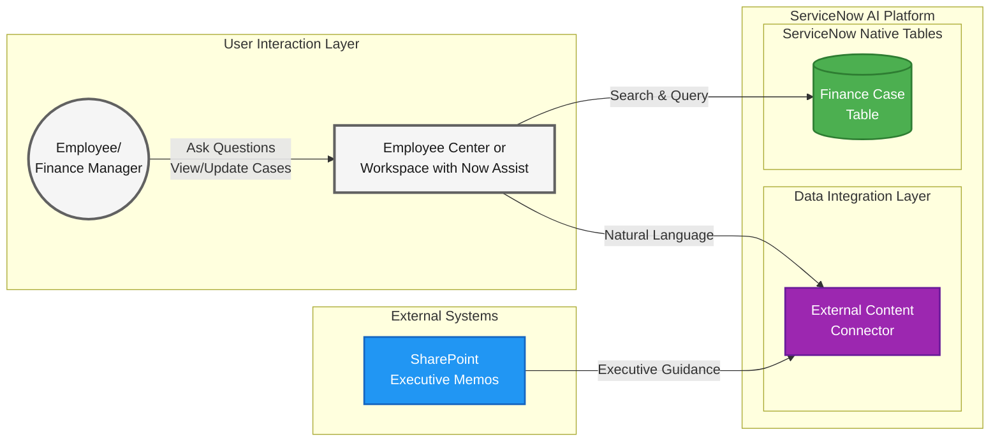

> **Color Legend:** 🟢 Platform | 🟣 Workflow Data Fabric | 🔵 External Systems | ⚪ User Interaction

## Steps

### Preparation steps

1.  Navigate to **All** > <mark style="color:green;">**a.)**</mark> type **Users and Groups** > <mark style="color:green;">**b.)**</mark> click on **Users and Groups > Users**.

    <figure><figcaption></figcaption></figure>
2.  Search for <mark style="color:green;">**a.)**</mark> **System Administrator** then hit **Return/Enter ↵** > <mark style="color:green;">**b.)**</mark> click on **admin**.

    <figure><figcaption></figcaption></figure>
3.  Set the <mark style="color:green;">**a.)**</mark> **Email** to **demouser@wdfdemo.onmicrosoft.com**, <mark style="color:green;">**b.)**</mark> click **Save**. Then <mark style="color:green;">**c.)**</mark> click **Roles** then <mark style="color:green;">**d.)**</mark> click **Edit**.

    <figure>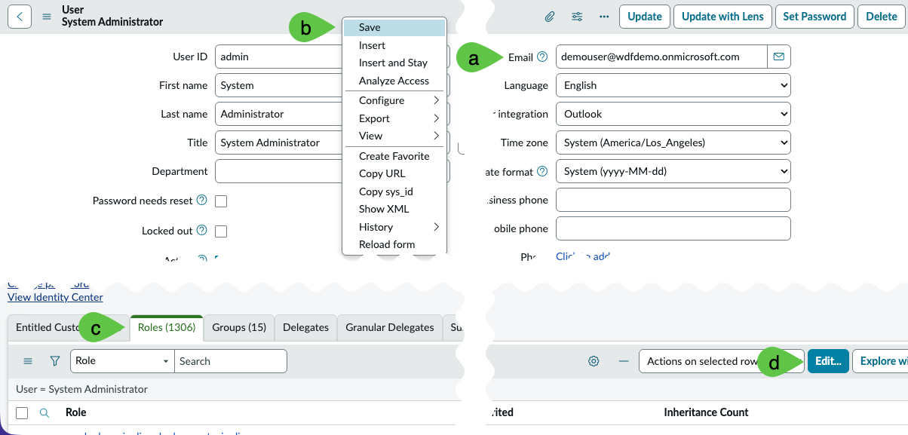<figcaption></figcaption></figure>
4.  Search for <mark style="color:green;">**a.)**</mark> **ais\_high\_security\_admin** > <mark style="color:green;">**b.)**</mark> click on **ais\_high\_security\_admin** > <mark style="color:green;">**c.)**</mark> click on **>** to move the role to the right panel > then <mark style="color:green;">**d.)**</mark> click **Save**.&#x20;

    <figure>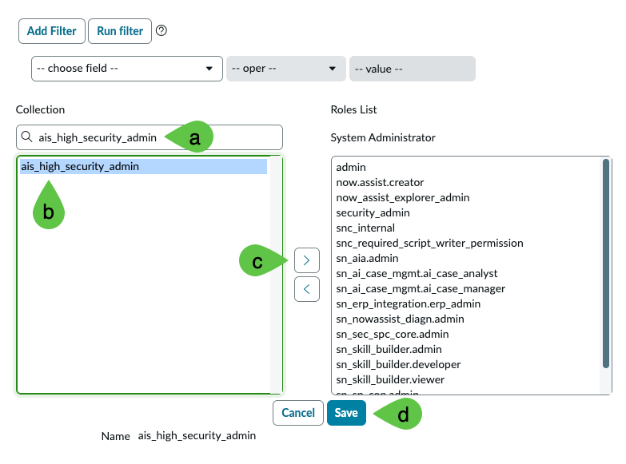<figcaption></figcaption></figure>
5.  Right-click on the top panel and click **Save**.

    <figure><figcaption></figcaption></figure>
6.  <mark style="color:red;">**IMPORTANT**</mark>. Log out and log back in. Click on <mark style="color:green;">**a.)**</mark> your user **System Administrator** > then <mark style="color:green;">**b.)**</mark> click on **Log out**.

    <figure><figcaption></figcaption></figure>

### Crawl and Usage of External Content Connectors

This provides the steps to execute a crawl of documents to file repositories XCC (External Content Connectors) are set up for. This also provides the steps in a real life scenario on how XCC can help end users with their daily tasks.

This does not include steps in setting up XCC to connect to a SharePoint account as that requires SharePoint administrator rights which are not widely available to various personas.

1.  For this step, change the scope to Global by navigating to the <mark style="color:green;">**a.)**</mark> **globe icon** and clicking <mark style="color:green;">**b.)**</mark> **Global** application scope.

    <figure><figcaption></figcaption></figure>
2.  Elevate your role. Click on <mark style="color:green;">**a.)**</mark> your user System Administrator > then <mark style="color:green;">**b.)**</mark> click on **Elevate role**.

    <figure>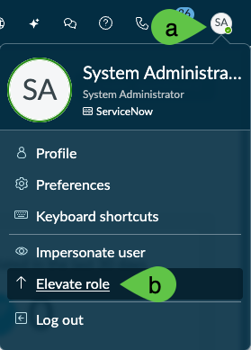<figcaption></figcaption></figure>
3.  Select <mark style="color:green;">**a.)**</mark> **ais\_high\_security\_admin** then <mark style="color:green;">**b.)**</mark> click on **Update**.

    <figure>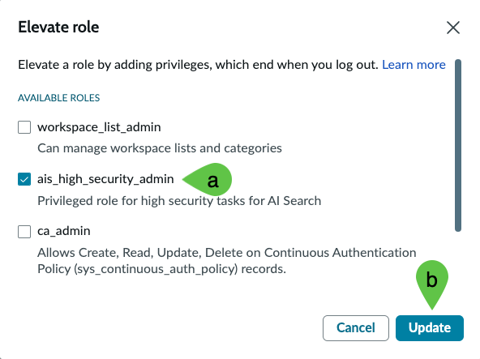<figcaption></figcaption></figure>
4. Navigate to All > <mark style="color:green;">**a.)**</mark> type **External Content Connectors** > <mark style="color:green;">**b.)**</mark> click on **External Content Admin Home**.

<figure>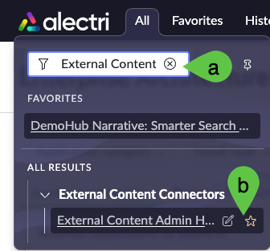<figcaption></figcaption></figure>

5.  This will lead you the XCC home screen. Click on **Create** to create a new connection.

    <figure>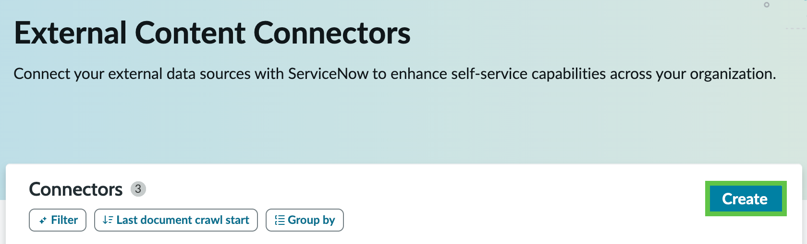<figcaption></figcaption></figure>
6.  You will be asked to select a source. Depending on your instance image, you may have multiple options. For this exercise, you only need **SharePoint**. <mark style="color:green;">**a.)**</mark> Select it and <mark style="color:green;">**b.)**</mark> click **Next**.

    <figure>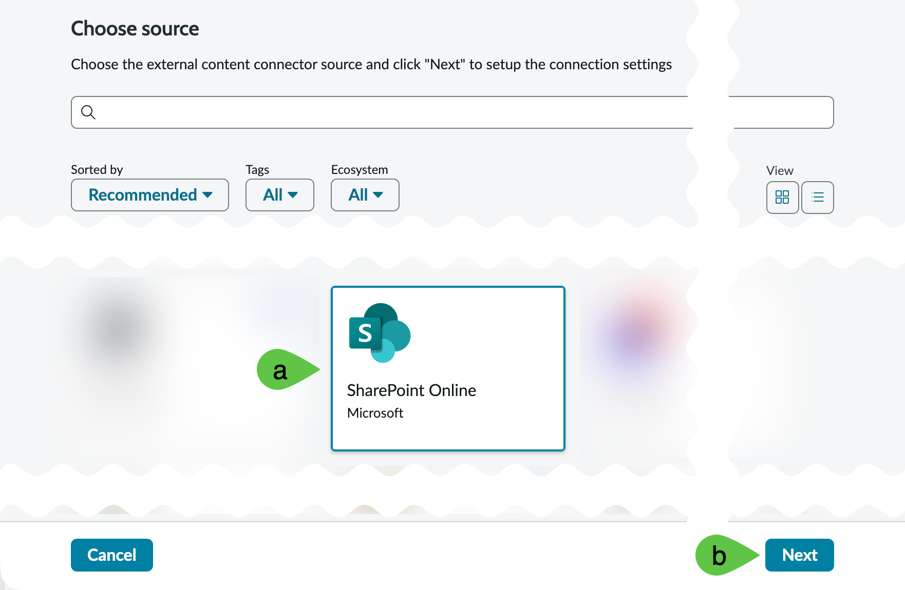<figcaption></figcaption></figure>
7. Input the following details in the next screen. As some of the credentials here are sensitive, you will need to access them through additional logins via the corresponding links.

<mark style="color:green;">**a.)**</mark> **Connector Name: SharePoint Online \<YOUR INITIALS>**

<mark style="color:green;">**b.)**</mark> **Application (client) ID: 26ec3997-e7da-4a95-91dd-d19f8c66b849**

<mark style="color:green;">**c.)**</mark> **Directory (tenant) ID: 53136633-b712-40ba-8c0b-0747745c05be**

<mark style="color:green;">**d.)**</mark> **JKS Certificate:** [obtain here](https://servicenow.sharepoint.com/:u:/s/iaapj/IQC6aY0kjVdSQYrYR8JkpYi3AUVOyZAxfP3GsT6W96xpWII?e=Ee7nZt) and upload, <mark style="color:$warning;">**ServiceNow internal login required**</mark>

<mark style="color:green;">**e.)**</mark> **JKS certificate password:** [obtain here](https://servicenow.sharepoint.com/:x:/s/iaapj/IQA9-mRIzGQYSaI0ab6a--VYAQv5ZKgUGg0RVyiTdEDezq4?e=1gXVAa) <mark style="color:$warning;">**ServiceNow internal login required**</mark>

<mark style="color:green;">**f.)**</mark> **JKS certificate thumbprint:** [obtain here](https://servicenow.sharepoint.com/:x:/s/iaapj/IQA9-mRIzGQYSaI0ab6a--VYAQv5ZKgUGg0RVyiTdEDezq4?e=1gXVAa), <mark style="color:$warning;">**ServiceNow internal login required**</mark>

<mark style="color:green;">**g.)**</mark> Once everything is configured, you can click **Validate Connection**.

<figure>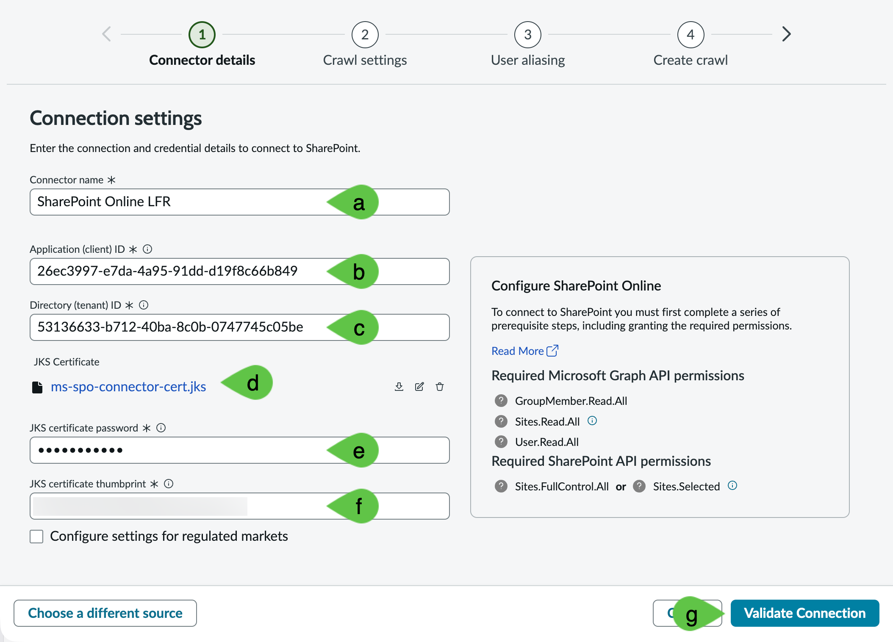<figcaption></figcaption></figure>

8. If everything is correctly configured, you will get a message indicating <mark style="color:green;">**a.)**</mark> the connection is **Successfully created.** After this, click <mark style="color:green;">**b.)**</mark> **Next**.

<figure>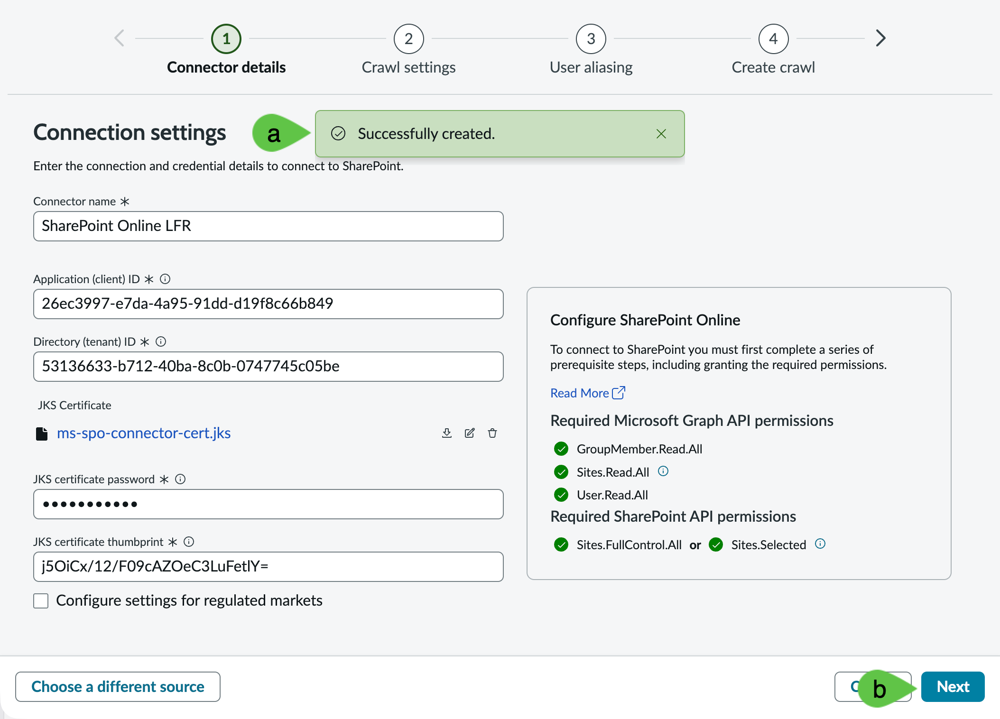<figcaption></figcaption></figure>

9. The next screen shows the settings for the crawl, accept the default and click **Next**.

<figure>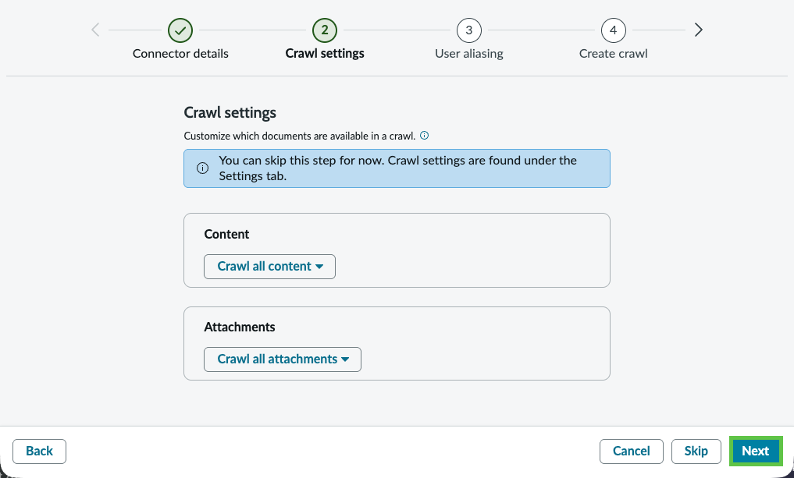<figcaption></figcaption></figure>

10. Since you are elevated as **ais\_high\_security\_admin**, you will be able to set this up. If you skipped adding the **ais\_high\_security\_admin** role and elevating to it, you will not be able to set this step up; i.e. even accepting defaults is not possible if you do not have elevated roles in this step. You can do a mapping <mark style="color:green;">**a.)**</mark> Test as an optional step. Otherwise, if you have the correct roles and have elevated your access, you can simply <mark style="color:green;">**b.)**</mark> click **Next**.&#x20;

    <figure>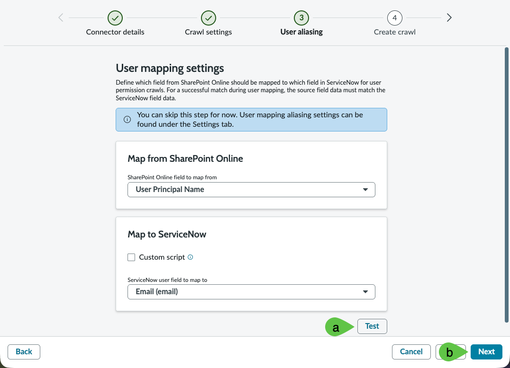<figcaption></figcaption></figure>
11. In the next screen, <mark style="color:green;">**a.)**</mark> click **Full document crawl**, <mark style="color:green;">**b.)**</mark> tick **Crawl user permissions**, then finally <mark style="color:green;">**c.)**</mark> click **Next**. If for whatever reason you miss the setting in crawling permissions, don't worry, it is possible to run it separately.

    <figure>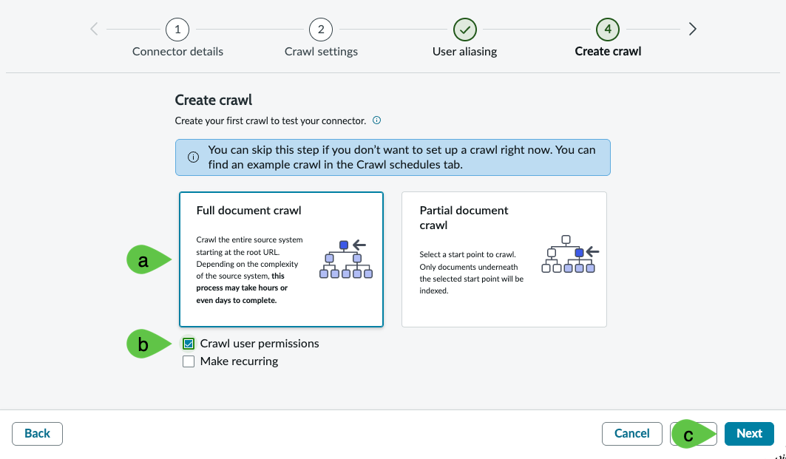<figcaption></figcaption></figure>
12. Click **Proceed**.

    <figure>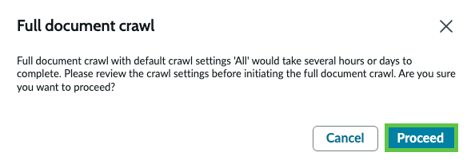<figcaption></figcaption></figure>
13. Accept default settings and click **Save**.

    <figure>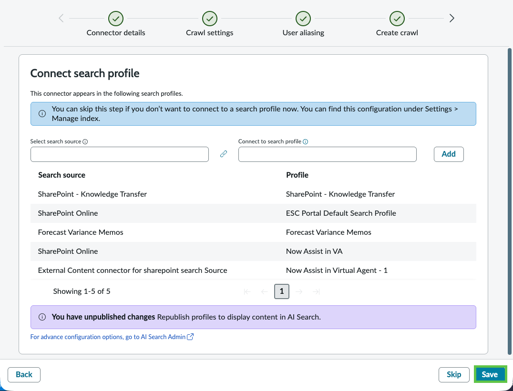<figcaption></figcaption></figure>
14. It will take \~1 minute for the **User Mapping** and **Document** crawls to complete.

    <figure>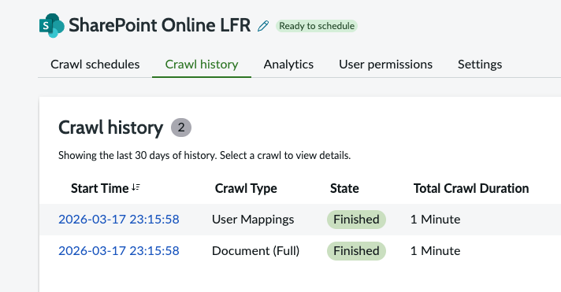<figcaption></figcaption></figure>
15. Remove your role elevation, it is no longer needed at this point. Click on <mark style="color:green;">**a.)**</mark> your user **System Administrator** > then <mark style="color:green;">**b.)**</mark> click on **Elevate role**.

<figure><figcaption></figcaption></figure>

16. Deselect <mark style="color:green;">**a.)**</mark> **ais\_high\_security\_admin** then <mark style="color:green;">**b.)**</mark> click on **Update**.

    <figure>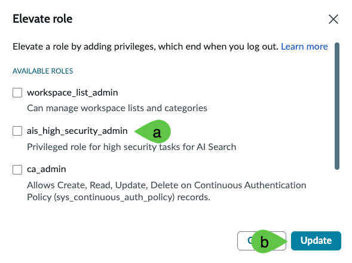<figcaption></figcaption></figure>
17. Navigate to All > <mark style="color:green;">**a.)**</mark> type **Employee Center** > <mark style="color:green;">**b.)**</mark> click on **Employee Center**.

    <figure>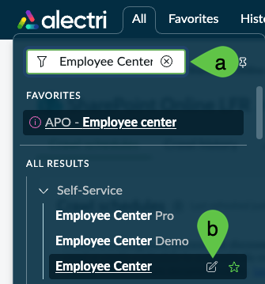<figcaption></figcaption></figure>
18. This will lead to the **Employee Center** home page. Note the **Ask Now Assist for help or search**. This is where you will type the query.

    <figure>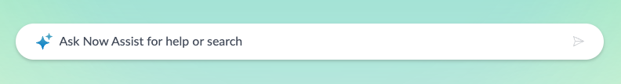<figcaption></figcaption></figure>
19. In that dialog, type: **Marketing team cost centre in France seems to have gone over-budget. Can you look for any documents that can assist in checking if there are management directives which might have triggered this?** Then hit **Return/Enter ↵**.

    <figure>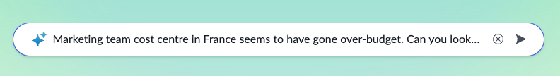<figcaption></figcaption></figure>
20. You will get a <mark style="color:green;">**a.)**</mark> detailed response based on the SharePoint documents that were crawled earlier, which is also aligned with the over-budget entries. Click on the <mark style="color:green;">**b.)**</mark> number **1** then <mark style="color:green;">**c.)**</mark> take note of the PDF file **Strategic Memo - European Product Launch.pdf**. No need to click this file as this will require SharePoint login which is not provided for this activity. <mark style="color:$warning;">**Note:**</mark> as Now Assist, like any LLM-based service is probabilistic, you might get a different response or format to what you see in the screenshot below but the key ideas remain the same.

<figure><figcaption></figcaption></figure>

21. For reference, a screenshot of the PDF that was used as source on why cost center **MKTG-FR-PR** went over-budget is shown below.&#x20;

<figure><figcaption></figcaption></figure>

## Conclusion

Congratulations! You have completed configuration of the **External Content Connector** integration that allows ServiceNow to read indexed unstructured documents to supplement unstructured data for both interactive and AI Agent-based workflows.

## Next step

Keeping with the unstructured data theme, you can explore an exercise that focuses on how ServiceNow gets unstructured data from documents and feed them into ServiceNow forms or records.

[Take me back to main page](../)
