# Lab Exercise: Model Context Protocol Server/Client

[Take me back to main page](../)

This lab will walk you through the configuration and usage of MCP ([Model Context Protocol](https://modelcontextprotocol.io/docs/getting-started/intro)) capabilities to interact with ServiceNow either as a client or as a server, allowing end users to interact with the platform as they see fit. For simplicity, this lab will cover ServiceNow acting as an MCP Client. More details on MCP Server scenarios will be added soon.

Specifically, this provides the steps needed to connect ServiceNow to an MCP Server tool configured in Neon.

This exercise does not cover the creation of the MCP Service from Neon as that requires administrator rights and CDW expertise which may not be widely available to various personas.

## Lab Sections and Objectives

<table><thead><tr><th width="83">Step</th><th width="106">Who</th><th>Description</th></tr></thead><tbody><tr><td><a href="lab-exercise-model-context-protocol-server-client.md#data-flow">1</a></td><td>Facilitator</td><td><strong>Context Setting:</strong> Review the data flow diagram showing how ServiceNow provides MCP client and server capabilities to interact with external systems.</td></tr></tbody></table>

**MCP Client Configuration**

<table><thead><tr><th width="83">Step</th><th width="106">Who</th><th>Description</th></tr></thead><tbody><tr><td><a href="lab-exercise-model-context-protocol-server-client.md#hands-on-configure-mcp-client">2</a></td><td>Student</td><td><strong>Configure MCP Client:</strong> Navigate to AI Agent Studio Settings. Add a new MCP Server entry for Neon with API Key authentication.</td></tr></tbody></table>

**AI Agent Configuration**

<table><thead><tr><th width="83">Step</th><th width="106">Who</th><th>Description</th></tr></thead><tbody><tr><td><a href="lab-exercise-model-context-protocol-server-client.md#hands-on-configure-new-ai-agent-for-mcp-scenario">3</a></td><td>Student</td><td><strong>Configure new AI Agent:</strong> Duplicate the Forecast Variance agent. Rename it to Forecast Variance Neon MCP Lab.</td></tr><tr><td><a href="lab-exercise-model-context-protocol-server-client.md#hands-on-configure-mcp-step-and-tool">4</a></td><td>Student</td><td><strong>Configure MCP Step and Tool:</strong> Add MCP instructions to the agent specialty. Add the variance-baseline-search MCP server tool from Neon. Configure tool name, description, and execution mode.</td></tr><tr><td><a href="lab-exercise-model-context-protocol-server-client.md#walkthrough-complete-ai-agent-configuration">5</a></td><td>Student</td><td><strong>Complete AI Agent Configuration:</strong> Accept default security controls. Configure channels and status. Save and test.</td></tr></tbody></table>

**AI Agent Testing**

<table><thead><tr><th width="83">Step</th><th width="106">Who</th><th>Description</th></tr></thead><tbody><tr><td><a href="lab-exercise-model-context-protocol-server-client.md#hands-on-test-and-review-custom-ai-agent">6</a></td><td>Student</td><td><strong>Test AI Agent:</strong> Enter test prompt to process an expense event. Verify the MCP tool returns matching cost center data from Neon.</td></tr></tbody></table>

<table><thead><tr><th width="83">Step</th><th width="106">Who</th><th>Description</th></tr></thead><tbody><tr><td><a href="lab-exercise-model-context-protocol-server-client.md#conclusion">7</a></td><td>Facilitator</td><td><strong>Conclusion:</strong> Walk through how MCP allows ServiceNow to connect to external systems using LLM-powered integrations as an alternative to traditional APIs.</td></tr></tbody></table>

## Data flow

The data flow below shows how ServiceNow provides MCP client and server capabilities.

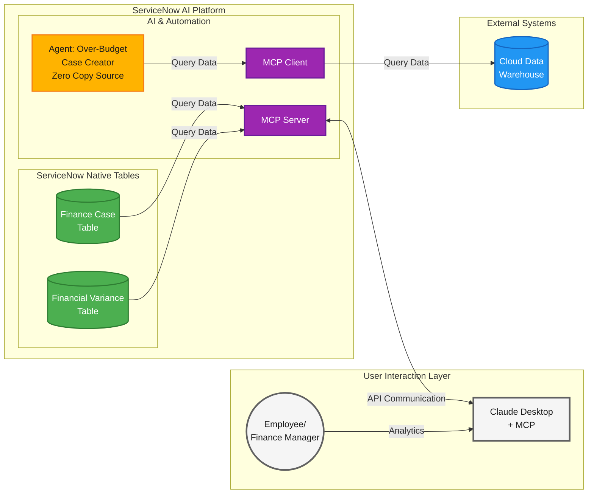

> **Color Legend:** 🟡 Now Assist | 🟢 Platform | 🟣 Workflow Data Fabric | 🔵 External Systems | ⚪ User Interaction

## MCP Client Configuration

### Hands-on: Configure MCP Client

Navigate to AI Agent Studio Settings. Add a new MCP Server entry for Neon with API Key authentication.

1. Navigate to All > <mark style="color:green;">**a.)**</mark> type **AI Agent Studio** > <mark style="color:green;">**b.)**</mark> click on **Settings**.

<figure><figcaption></figcaption></figure>

2. In the **Settings** page > <mark style="color:green;">**a.)**</mark> go to **Manage MCP Servers** > <mark style="color:green;">**b.)**</mark> click on **New**.

<figure>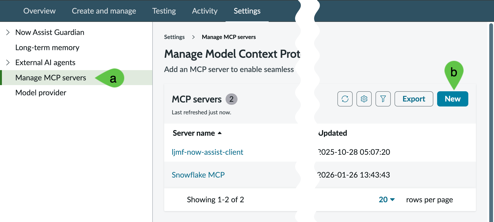<figcaption></figcaption></figure>

3. Enter the details below:

<mark style="color:green;">**a.)**</mark> **Name:** **Neon MCP Lab**

<mark style="color:green;">**b.)**</mark>**&#x20;Authentication type:** **API Key**

<mark style="color:green;">**c.)**</mark> **URL:** [**https://mcp.neon.tech/mcp**](https://mcp.neon.tech/mcp)

<mark style="color:green;">**d.)**</mark>**&#x20;API Key:** Bearer \<ask\_your\_lab\_guide\_for\_key>

Note: there should be the word **Bearer** as a prefix so your value in the API Key will be something like **Bearer napi\_some\_secure\_key**

<mark style="color:green;">**e.)**</mark> **Add**

<figure>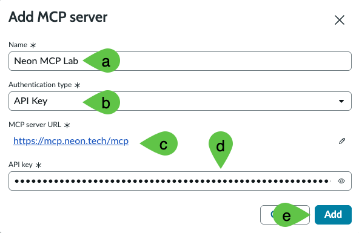<figcaption></figcaption></figure>

## AI Agent Configuration

### Hands-On: Configure new AI Agent for MCP scenario

This provides the steps needed to connect ServiceNow to an MCP ([Model Context Protocol](https://modelcontextprotocol.io/docs/getting-started/intro)) Server tool configured in Neon. ServiceNow can serve as an MCP Client to connect to any solution that has MCP support.

This exercise does not cover the creation of the MCP Service from Neon as that requires administrator rights and CDW expertise which may not be widely available to various personas.

1. Navigate to All > <mark style="color:green;">**a.)**</mark> type **AI Agent Studio** > <mark style="color:green;">**b.)**</mark> click on **Create and Manage**.

<figure>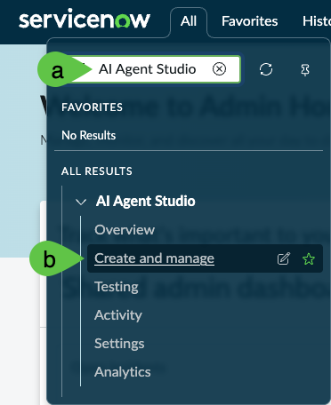<figcaption></figcaption></figure>

2. Go to **AI agents** tab > <mark style="color:green;">**a.)**</mark> click **Conditions** > <mark style="color:green;">**b.)**</mark> select **Field** as **Name** <mark style="color:green;">**c.)**</mark> **Operator** as **is** and for <mark style="color:green;">**d.)**</mark> Value type **Forecast Variance** and hit **Return/Enter ↵**. Click on the <mark style="color:green;">**e.)**</mark> result.

<figure>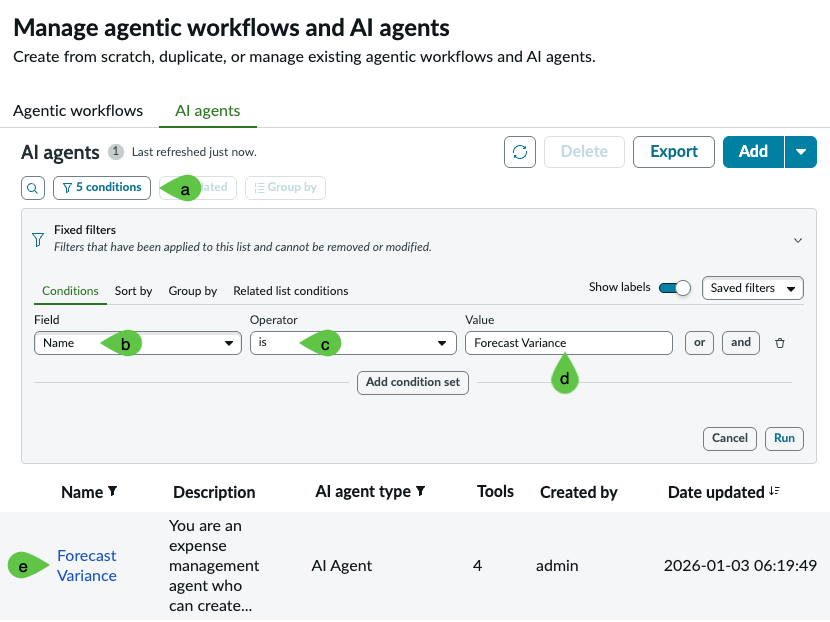<figcaption></figcaption></figure>

3. Click on **Forecast Variance**.

<figure>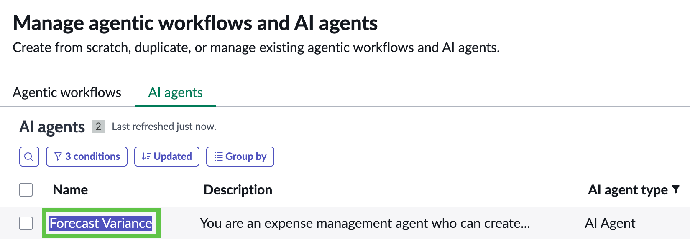<figcaption></figcaption></figure>

4.  Click on <mark style="color:green;">**a.)**</mark> **more (vertical three dots)** > <mark style="color:green;">**b.)**</mark> **Duplicate**

    <figure>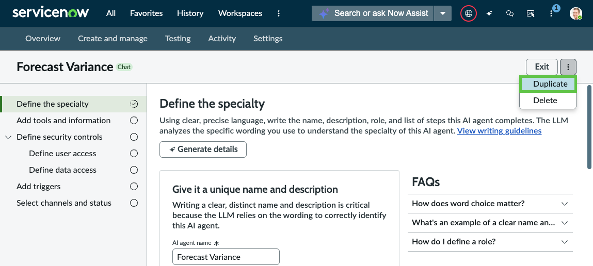<figcaption></figcaption></figure>
5.  You will get a prompt to confirm whether you want to duplicate the agent. Click **Duplicate**.

    <figure>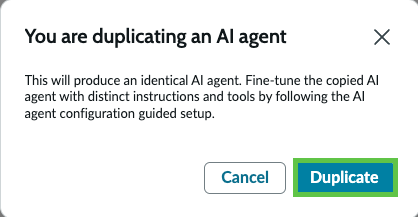<figcaption></figcaption></figure>
6.  In the new Agent screen, go to the **AI agent name** and rename it to **Forecast Variance Neon MCP Lab**.

    <figure>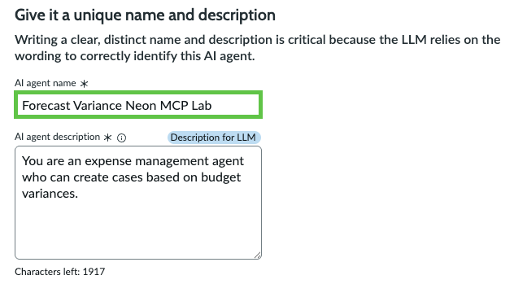<figcaption></figcaption></figure>

### Hands-On: Configure MCP Step and Tool

Add MCP instructions to the agent specialty. Add the variance-baseline-search MCP server tool from Neon. Configure tool name, description, and execution mode.

1. In the same **Define the Specialty > Define the role and Required steps > List of steps** sub-section, go to step 2 after the paragraph which starts with **Get cost center obtained in...** then add **Also run the MCP tool "Get Details via Neon MCP" as a secondary check. Only return one entry (limit = 1). Columns should be \["COST\_CENTER", "ACTUAL\_AMOUNT\_USD", "BASELINE\_AMOUNT\_USD", "VARIANCE", "VARIANCE\_PCT"]**. It should look like the screenshot below.

<figure>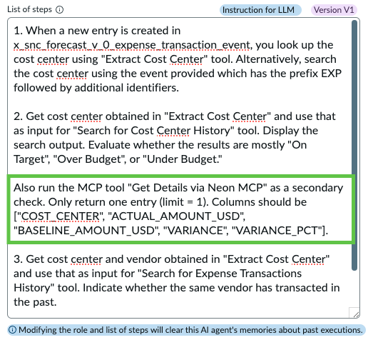<figcaption></figcaption></figure>

2.  Click **Save and Continue**.

    <figure><figcaption></figcaption></figure>
3.  Navigate to <mark style="color:green;">**a.)**</mark> **Add tools and information** > <mark style="color:green;">**b.)**</mark> **Add tool** > <mark style="color:green;">**c.)**</mark> > **MCP server tool**.

    <figure>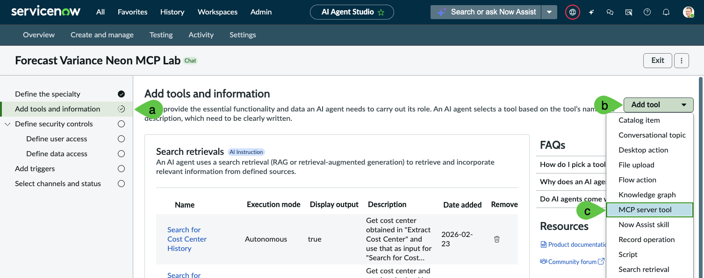<figcaption></figcaption></figure>
4.  In the pop-up that appears, <mark style="color:green;">**a.)**</mark> click on the **dropdown** > <mark style="color:green;">**b.)**</mark> select **Neon MCP**.

    <figure>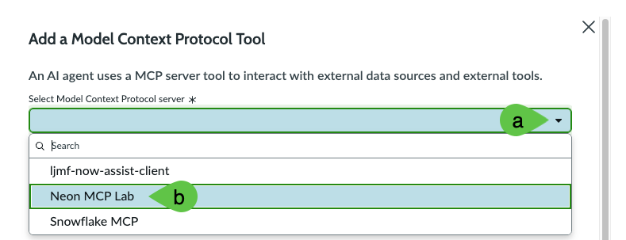<figcaption></figcaption></figure>
5.  In the same pop-up screen, select the tool **run\_sql**.

    <figure>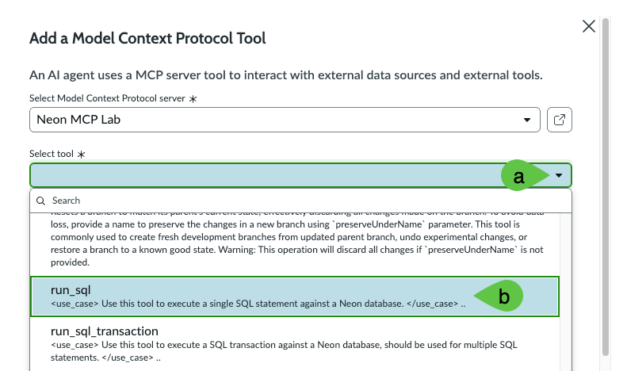<figcaption></figcaption></figure>
6. Still in the same pop-up screen provide the following details. Screenshot on how the settings should look like immediately follows. You only need to modify three settings and leave the rest as they are.

<mark style="color:green;">**a.)**</mark> **Name**: **Get Details via Neon MCP**

<mark style="color:green;">**b.)**</mark> **Tool description**:

* projectId: shy-base-71725149 (camelCase, not project\_id)
* sql: SELECT cost\_center, actual\_amount\_usd, baseline\_amount\_usd, variance, variance\_pct FROM "VARIANCE\_BASELINE\_V" WHERE cost\_center = '\{{cost\_center\}}' LIMIT 1

<mark style="color:green;">**c.)**</mark> **Execution mode**: **Autonomous**

<mark style="color:green;">**d.)**</mark>**&#x20;Save**

<figure>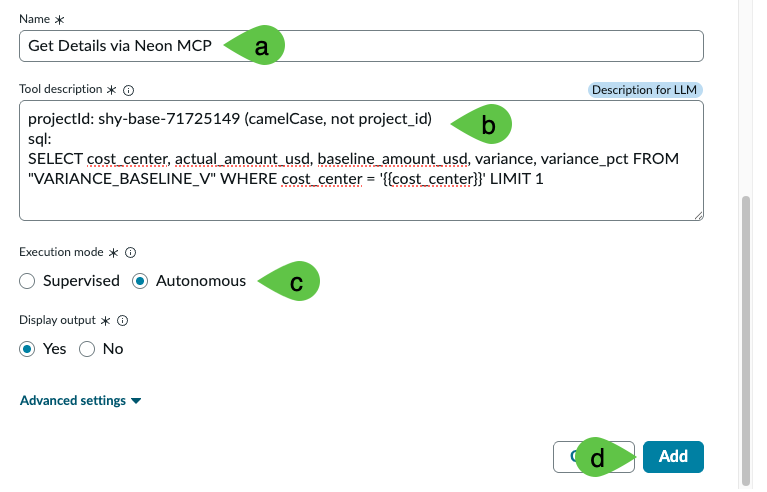<figcaption></figcaption></figure>

7.  The pop-up will exit and you should get a section on **Model Context Protocol tools** which should look like below.

    <figure>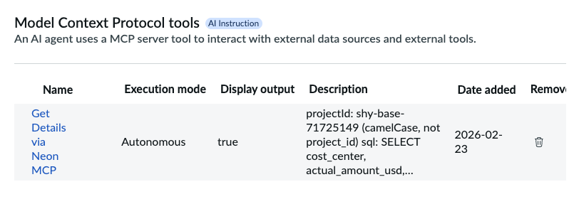<figcaption></figcaption></figure>
8.  Click **Save and Continue**.

    <figure><figcaption></figcaption></figure>

### Walkthrough: Complete AI Agent configuration

Accept default security controls. Configure channels and status. Save and test.

1.  Since this is copied from an existing AI Agent configuration, simply accept the default values for **Define security controls** and its 2 sub-items. Also keep A**dd triggers value** blank.

    <figure>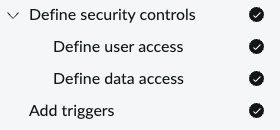<figcaption></figcaption></figure>
2.  Finally, click on <mark style="color:green;">**a.)**</mark> **Select channels and status**. This configures the availability of the AI Agent. In this case, it is enabled and can be accessed using <mark style="color:green;">**b.)**</mark>**&#x20;Now Assist panel** toggled on as well as via <mark style="color:green;">**c.)**</mark>**&#x20;Now Assist in Virtual Agent** added as chat assistant. Click <mark style="color:green;">**d.)**</mark>**&#x20;Save and test**. <mark style="color:$warning;">**Note:**</mark> if Chat Assistants (step <mark style="color:green;">**2.c.**</mark>) does not give you options, check and execute the steps in [Lab Exercise: Integration Hub > Platform Configuration](https://servicenow-lf.gitbook.io/the-workflow-data-fabric-loom/main-exercises/lab-exercise-integration-hub#preparation-platform-configuration) > Steps 9 to 18; esp. if you are doing this lab standalone or have skipped the [Lab Exercise: Integration Hub](https://servicenow-lf.gitbook.io/the-workflow-data-fabric-loom/main-exercises/lab-exercise-integration-hub) portion.

    <figure>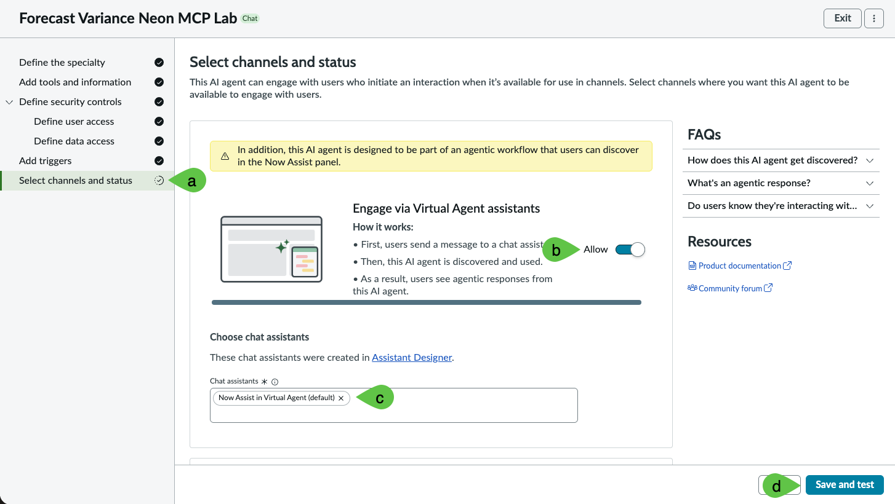<figcaption></figcaption></figure>
3.  You **MIGHT** be alerted of potential duplicates but this is due to the multiple AI Agents created to test various integration scenarios. Click **Ignore and continue**.

    <figure>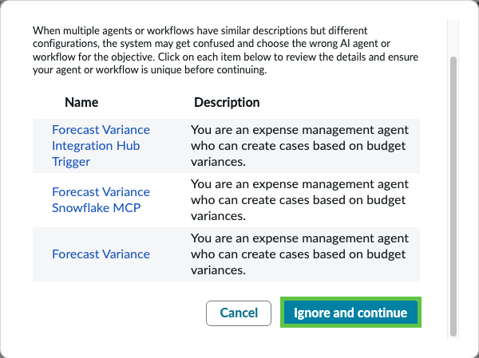<figcaption></figcaption></figure>

## AI Agent Testing

### Hands-on: Test and review Custom AI Agent

Enter test prompt to process an expense event. Verify the MCP tool returns matching cost center data from Neon.

1. You will be directed to the Test AI reasoning tab. To proceed with testing, <mark style="color:green;">**a.)**</mark> type **Help me process EXP-2025-IT-002-1007-01** and <mark style="color:green;">**b.)**</mark> click **Continue to Test Chat Response**.

<figure>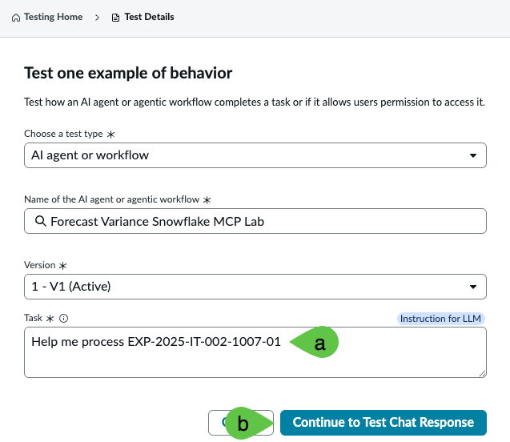<figcaption></figcaption></figure>

2. The test will run for a few seconds and will show you that it is running the tool **Get Details in Neon MCP**. This is the additional tool you created earlier.

<figure>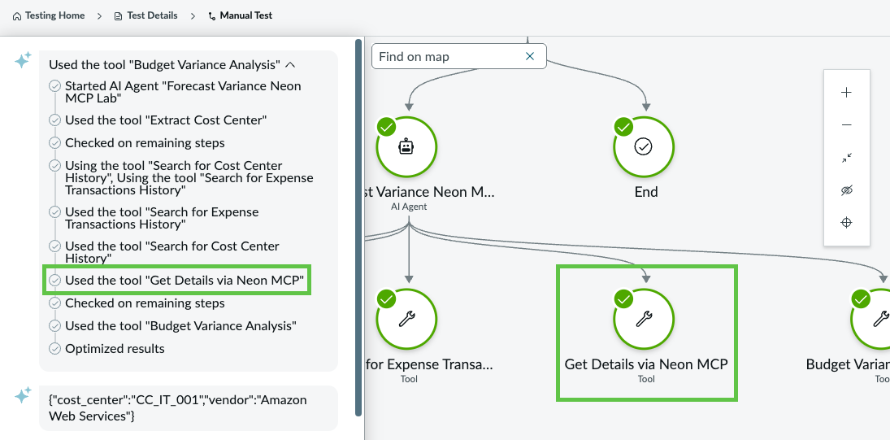<figcaption></figcaption></figure>

3. Finally, you will notice that the **Get Details in Neon MCP** has obtained the closest match for the value of cost center CC\_IT\_001. For this exercise, we only returned the raw JSON value to demonstrate the MCP capability where we did not use any SQL or API to return the matching row; instead we just provided a high-level instruction seen in step 12.

<figure>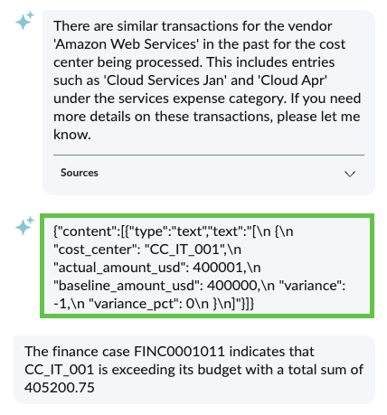<figcaption></figcaption></figure>

4. **Challenge:** once you are done with this lab, see if you can remove the tool **Extract Cost Center** and replace it completely with the data from **Get Details via Neon MCP** as seen in step 7. No hints this time. 😉

## Conclusion

Congratulations! You have created the **MCP Server** integrations that allows ServiceNow to make use of MCP capabilities from other systems outside ServiceNow, allowing LLM-powered integrations alternative to APIs that require less development.

## Next step

You can explore a bonus use case that makes use of Stream Connect for Apache Kafka for integrations that require more throughput and data volume.

[Take me back to main page](../)
