# Lab Exercise: ServiceNow Document Intelligence and Lens

[Take me back to main page](../)

This lab will walk you through the configuration and usage of ServiceNow Lens and Document Intelligence as sources of unstructured document data for interactive and batch capture of expense information from documents.

**A note on this exercise:** In production, invoices are captured at the source: an ERP, procurement platform, or expense system, not uploaded directly into ServiceNow. ServiceNow's strength in this pattern is what happens _after_ ingestion: orchestrating validation against external data, enriching records via integration, and routing exceptions through case management. That's the capability we're demonstrating in most of the exercises in this lab.

To keep this exercise self-contained and reuse the agent built in [Lab Exercise: Integration Hub](https://servicenow-lf.gitbook.io/the-workflow-data-fabric-loom/lab-exercise-integration-hub), we upload the document to a task record and let Document Intelligence extract it locally. Once the document is extracted, everything downstream such as the agent calls, the cross-system lookups, and the case creation, works the same regardless of how the document arrived. The document upload through a task table is a stand-in for the real action that happens in an ERP system. This exercise is about what ServiceNow _does_ with the document and is not about how it _receives_ it.

A more detailed version of this exercise with significantly more configuration steps is available as standalone. Reach out to your Lab Administrator for more details.

## Lab Sections and Objectives

<table><thead><tr><th width="83">Step</th><th width="106">Who</th><th>Description</th></tr></thead><tbody><tr><td><a href="lab-exercise-servicenow-lens-and-document-intelligence.md#data-flow">1</a></td><td>Facilitator</td><td><strong>Context Setting:</strong> Review the data flow diagram showing how ServiceNow captures information from documents via Lens and Document Intelligence.</td></tr></tbody></table>

**Document Intelligence**

<table><thead><tr><th width="83">Step</th><th width="106">Who</th><th>Description</th></tr></thead><tbody><tr><td><a href="lab-exercise-servicenow-lens-and-document-intelligence.md#walkthrough-document-intelligence-setup">2</a></td><td>Student</td><td><strong>Document Intelligence Setup:</strong> Navigate to Now Assist Admin Skills. Activate the Extract information from documents skill. Review the Expense Transaction Event use case configuration and integrations.</td></tr><tr><td><a href="lab-exercise-servicenow-lens-and-document-intelligence.md#hands-on-document-intelligence-parameters">3</a></td><td>Student</td><td><strong>Document Intelligence Parameters:</strong> Set extraction thresholds to 0.01 in Global scope for lab purposes.</td></tr><tr><td><a href="lab-exercise-servicenow-lens-and-document-intelligence.md#hands-on-document-intelligence-runtime">4</a></td><td>Student</td><td><strong>Document Intelligence Runtime:</strong> Create a variance task record. Upload the Invoice_IT_Laptop_CC_IT_002.pdf document. Set state to Work in Progress and submit.</td></tr><tr><td><a href="lab-exercise-servicenow-lens-and-document-intelligence.md#walkthrough-custom-forecast-variance-ai-agent">5</a></td><td>Student</td><td><strong>Watch the AI Agent React:</strong> Look for the Now Assist badge. Open Now Assist chat. Expand to Modal view. Review planning steps, event ID extraction, RAG search results, and Finance Case link.</td></tr><tr><td><a href="lab-exercise-servicenow-lens-and-document-intelligence.md#completion-verify-finance-case">6</a></td><td>Student</td><td><strong>Verify the Finance Case:</strong> Navigate to Finance Operations Workspace. Find the case created by the agent.</td></tr><tr><td><a href="lab-exercise-servicenow-lens-and-document-intelligence.md#optional-completion-verify-document-output">7</a></td><td>Student</td><td><strong>[Optional] Verify Document Output:</strong> Navigate to Now Assist Admin Skills. Review the extracted document information in the Test Outputs tab.</td></tr></tbody></table>

**AI Lens**

<table><thead><tr><th width="83">Step</th><th width="106">Who</th><th>Description</th></tr></thead><tbody><tr><td><a href="lab-exercise-servicenow-lens-and-document-intelligence.md#walkthrough-ai-lens-setup">8</a></td><td>Student</td><td><strong>AI Lens Setup:</strong> Navigate to Now Assist Admin Skills. Activate ServiceNow AI Lens.</td></tr><tr><td><a href="lab-exercise-servicenow-lens-and-document-intelligence.md#walkthrough-ai-lens-download">9</a></td><td>Student</td><td><strong>AI Lens Download:</strong> Download and install the Lens application for your device.</td></tr><tr><td><a href="lab-exercise-servicenow-lens-and-document-intelligence.md#hands-on-ai-lens-runtime">10</a></td><td>Student</td><td><strong>AI Lens Runtime:</strong> Open the Invoice_Injection_PROD_DE_2.pdf document. Navigate to the Expense Transaction Event table. Use Create with Lens to capture and submit expense data.</td></tr></tbody></table>

<table><thead><tr><th width="83">Step</th><th width="106">Who</th><th>Description</th></tr></thead><tbody><tr><td><a href="lab-exercise-servicenow-lens-and-document-intelligence.md#conclusion">11</a></td><td>Facilitator</td><td><strong>Conclusion:</strong> Walk through the capabilities of both Document Intelligence and AI Lens for document-based data capture.</td></tr></tbody></table>

## Data flow

The data flow below shows how ServiceNow will get information from documents from invoices and further process said information to evaluate whether a Finance case should be created.

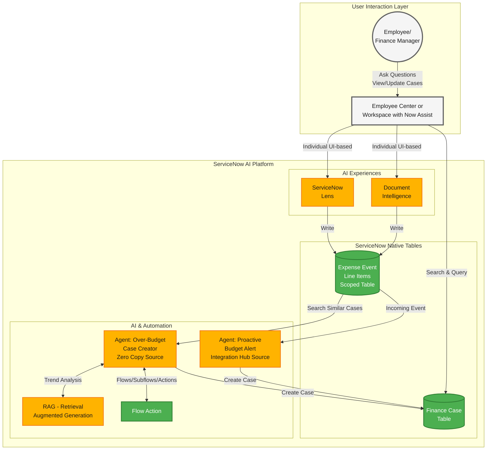
```mermaid
graph TB
    subgraph "User Interaction Layer"
        Employee((Employee/<br/>Finance Manager))
        EC[Employee Center or<br/>Workspace with Now Assist]
    end

    subgraph "ServiceNow AI Platform"
        subgraph "ServiceNow Native Tables"
            ExpenseTable[(Expense Event<br/>Line Items<br/>Scoped Table)]
            FinCase[(Finance Case<br/>Table)]
        end

        subgraph "AI & Automation"
            Agent1[Agent: Over-Budget<br/>Case Creator<br/>Zero Copy Source]
            Agent2[Agent: Proactive<br/>Budget Alert<br/>Integration Hub Source]
            RAG[RAG - Retrieval<br/>Augmented Generation]
            FlowAction[Flow Action]
        end
        subgraph "AI Experiences"
            Lens["ServiceNow</br>Lens"]
            DocIntel["Document</br>Intelligence"]
        end
    end


    %% Data Flow Connections
    EC -->|Individual UI-based| Lens -->|Write| ExpenseTable
    EC -->|Individual UI-based| DocIntel -->|Write| ExpenseTable

    %% Agent 1 Workflow - Zero Copy Source
    ExpenseTable -->|Search Similar Cases| Agent1
    Agent1 -->|Create Case| FinCase
    Agent1 <-->|Trend Analysis| RAG
    Agent1 <-->|Flows/Subflows/Actions| FlowAction

    %% Agent 2 Workflow - Integration Hub Source
    ExpenseTable -->|Incoming Event| Agent2
    Agent2 -->|Create Case| FinCase

    %% User Interaction Connections
    Employee -->|Ask Questions<br/>View/Update Cases| EC
    EC -->|Search & Query| FinCase


    %% Styling
    classDef user fill:#F5F5F5,stroke:#616161,stroke-width:3px,color:#1a1a1a
    classDef nowassist fill:#FFB300,stroke:#F57F17,stroke-width:2px,color:#1a1a1a
    classDef platform fill:#4CAF50,stroke:#2E7D32,stroke-width:2px,color:#fff

    class ExpenseTable,FinCase platform
    class Agent1,Agent2,RAG nowassist
    class FlowAction platform
    class Lens,DocIntel nowassist
    class Employee,EC user
```

> **Color Legend:** 🟡 Now Assist | 🟢 Platform | ⚪ User Interaction

## Document Intelligence

### Walkthrough: Document Intelligence Setup

Navigate to Now Assist Admin Skills. Activate the Extract information from documents skill. Review the Expense Transaction Event use case configuration and integrations.

1.  Navigate to **All** > <mark style="color:green;">**a.)**</mark> type **Now Assist Admin** > <mark style="color:green;">**b.)**</mark> click on **Now Assist Admin > Skills**.

    <figure>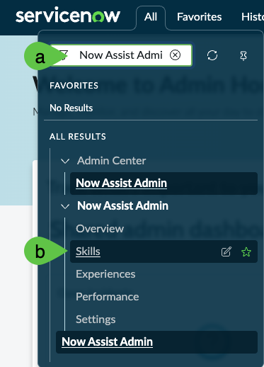<figcaption></figcaption></figure>
2.  Go to <mark style="color:green;">**a.)**</mark> **Platform** > <mark style="color:green;">**b.)**</mark>**&#x20;Other** > <mark style="color:green;">**c.)**</mark> type **Extract information from documents** > <mark style="color:green;">**d.)**</mark> click **Activate Skill**. <mark style="color:$warning;">**Note:**</mark> If the skill is already activated, it should show a **three dot vertical icon**, click on that then click **Edit**.

    <figure>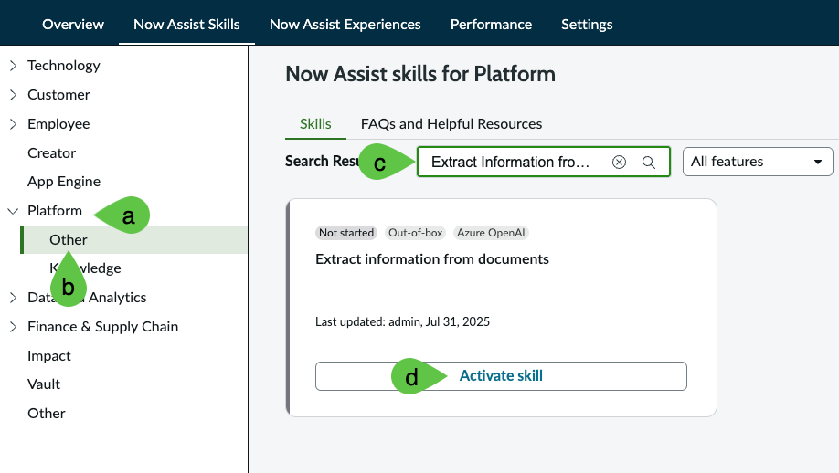<figcaption></figcaption></figure>
3.  Go to <mark style="color:green;">**a.)**</mark> **Create Usecase** > <mark style="color:green;">**b.)**</mark> click on **Expense Transaction Event.**

    <figure>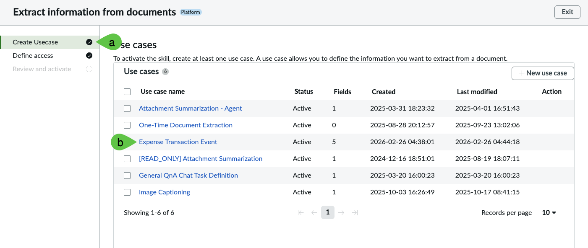<figcaption></figcaption></figure>
4. In this screen, you do not have to configure anything as this has been preconfigured as a custom **use case** under the standard platform skill **Extract information from documents**. The sub-steps below only serve as a tour of the different configuration components for a Document Intelligence components.

<mark style="color:green;">**a.)**</mark>**&#x20;Status: Active** indicates that this has been activated prior.

<mark style="color:green;">**b.)**</mark>**&#x20;Target table: Expense Transaction Event** is the table that will save the extracted information from the documents. This can be a standard or a custom table

<mark style="color:green;">**c.)**</mark>**&#x20;Full automation mode: On** indicates that this skill will automatically process and extract the information from uploaded documents. If [Document Intelligence Admin](https://store.servicenow.com/sn_appstore_store.do#!/store/application/8700f4efc3a411101d9a3cadb140ddad/1.1.0) is installed, the thresholds fore **Full automation** to trigger can be set for each use case. Our scenario does not have it installed so we will configure the thresholds for Full automation mode in the latter steps.

<mark style="color:green;">**d.)**</mark>**&#x20;Field Names** show all of the relevant fields for this use case, these have been preconfigured.

<mark style="color:green;">**e.)**</mark>**&#x20;Target fields** show the fields from the **Target table** where the extracted information will be saved in.

<mark style="color:green;">**f.)**</mark>**&#x20;Type** is where the data type can be configured. For this scenario we are using Text for all as Document Intelligence is capable of mapping this to the appropriate data type in the target table in most cases.

<mark style="color:green;">**g.)**</mark> **Required** can be configured to set whether a field is mandatory for the Document Intelligence extraction, i.e. a blank required field will result into the extraction not being saved into the target table.

<mark style="color:green;">**h.)**</mark>**&#x20;+ New field** allows addition of new fields for Document Intelligence to extract. No additional fields are needed for this scenario.

<mark style="color:green;">**i.)**</mark>**&#x20;Settings (gear icon)** allow you to toggle **Full Automation mode** and **Manage LLMs**.

<mark style="color:green;">**j.)**</mark> Go to **Integrations** tab.

<figure>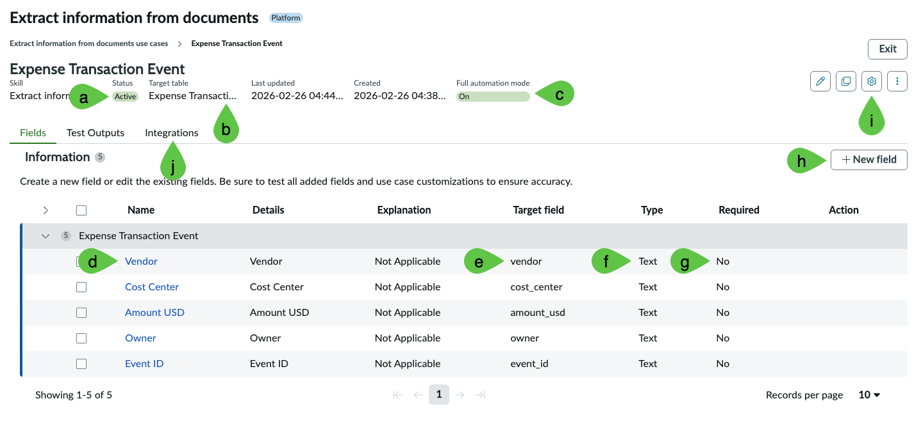<figcaption></figcaption></figure>

5. In the integrations tab the following needs to be observed. The **Process** integration picks up the document from the source table and **Extract** integration extracts the contents of the document to be saved to the target table.

<mark style="color:green;">**a.)**</mark>**&#x20;Extract** integration should be present with the target table **x\_snc\_forecast\_v\_0\_expense\_transaction\_event (Expense Transaction Event)**.

<mark style="color:green;">**b.)**</mark>**&#x20;DocIntel Extract Values Flow - Expense Transaction Event - Extract** should be the Flow assigned. If it is not assigned, double click and type the name of the flow to assign it. This is a scoped Flow and is created specifically for this use case.

<mark style="color:green;">**c.)**</mark>**&#x20;Process** integration should be present with the target table **x\_snc\_forecast\_v\_0\_expense\_transaction\_event (Expense Transaction Event)**.

<mark style="color:green;">**d.)**</mark>**&#x20;DocIntel Task Processing Flow - Expense Transaction Event - Process** should be the Flow assigned. If it is not assigned, double click and type the name of the flow to assign it. This is a scoped Flow and is created specifically for this use case.

<mark style="color:green;">**e.)**</mark> If everything is correct, click **Exit**.

<figure>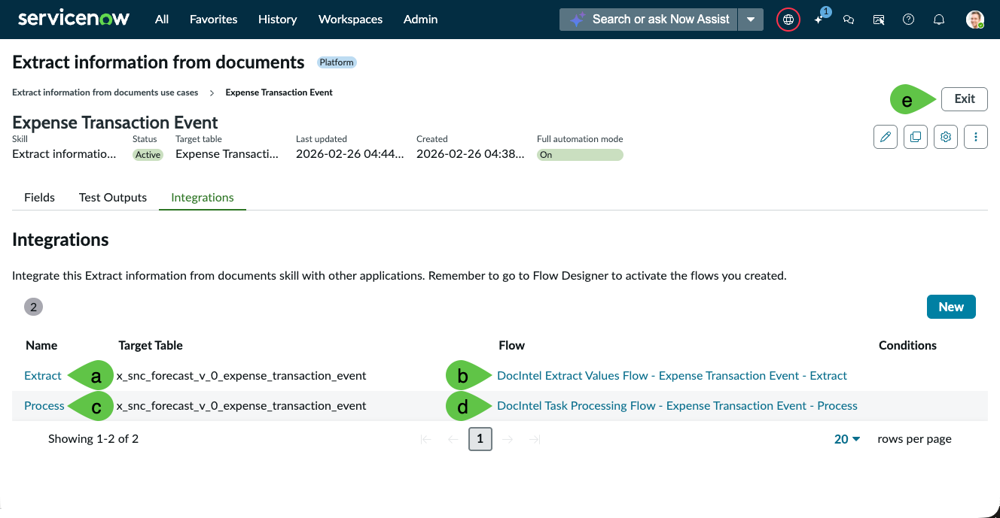<figcaption></figcaption></figure>

6. Click **Save and Continue**.

<figure>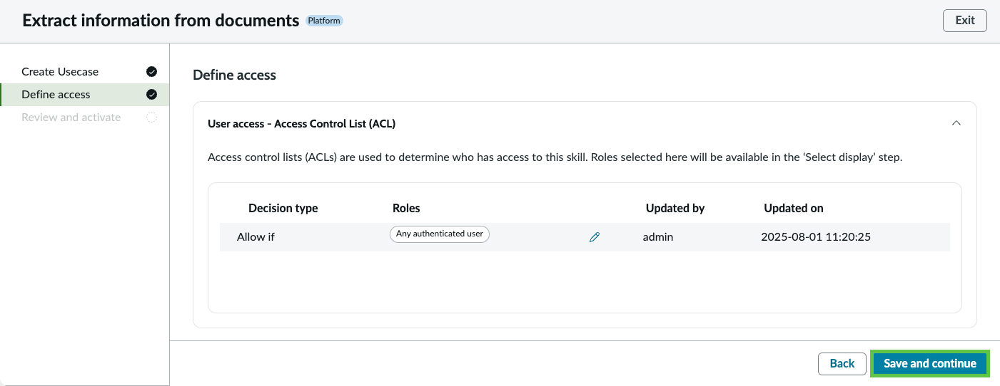<figcaption></figcaption></figure>

7.  Click **Activate**. <mark style="color:$warning;">**Note:**</mark> If the skill is already activated, just click **Done**.

    <figure>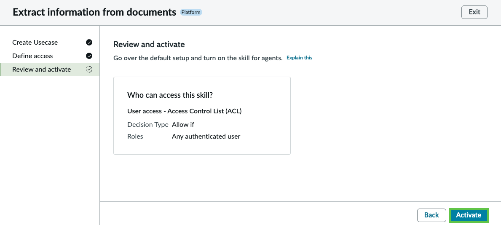<figcaption></figcaption></figure>
8.  Click **Return to Platform**. <mark style="color:$warning;">**Note:**</mark> If the skill is already activated, this modal pop-up will not appear.

    <figure>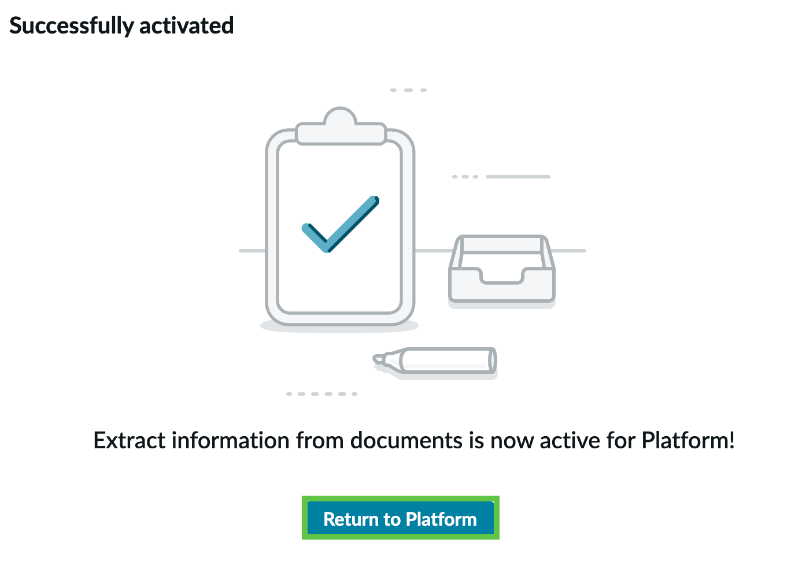<figcaption></figcaption></figure>
9.  You will be redirected to the Skills screen and this concludes the walkthrough of the Skills needed for document extraction.

    <figure>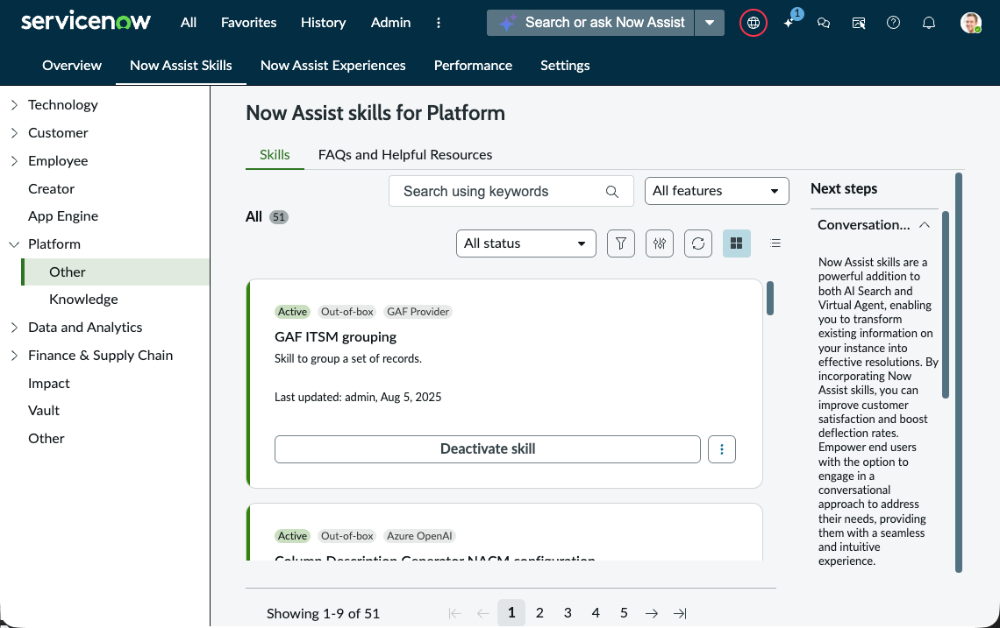<figcaption></figcaption></figure>

### Hands-on: Document Intelligence Parameters

1. Steps 2 to 4 are applicable if you do **NOT** have [Document Intelligence Admin](https://store.servicenow.com/sn_appstore_store.do#!/store/application/8700f4efc3a411101d9a3cadb140ddad/1.1.0) plugin installed which is the case for this lab. Succeeding versions of this lab will have the said plugin installed which will result in a more streamlined experience.
2.  For this step, change the scope to Global by navigating to the <mark style="color:green;">**a.)**</mark> **globe icon** and clicking <mark style="color:green;">**b.)**</mark> **Global** application scope.

    <figure><figcaption></figcaption></figure>
3. Navigate to All > <mark style="color:green;">**a.)**</mark> type **Document Data Extraction** > <mark style="color:green;">**b.)**</mark> click Document **Data Extraction > System Properties**.

<figure>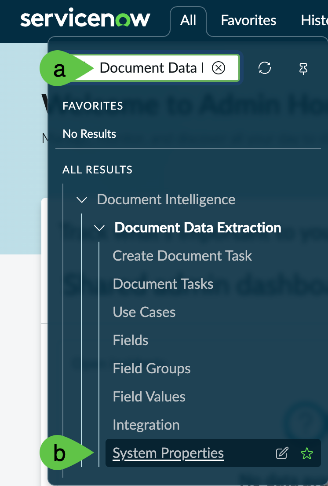<figcaption></figcaption></figure>

4. Search for <mark style="color:green;">**a.)**</mark> **\*threshold** and update the values of the three parameters below <mark style="color:green;">**b.)**</mark> to **0.01**. This is to reduce the threshold for the automation and avoid trial and error issues. In a production environment, you are likely to test and fine-tune this to ensure exceptions are caught and corrected manually.

<figure>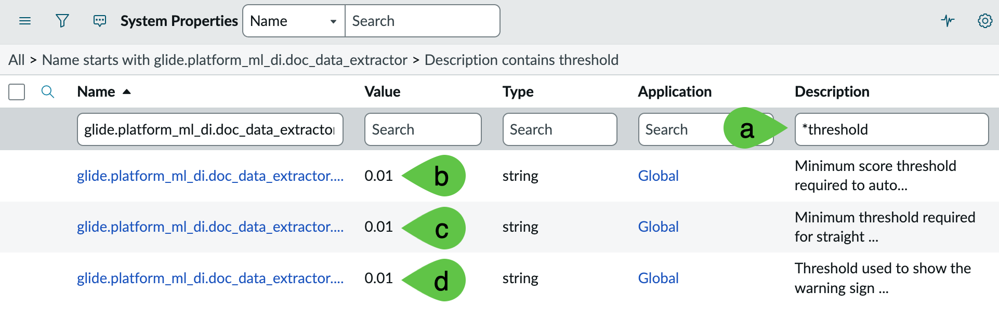<figcaption></figcaption></figure>

5. Change the scope back by navigating to the <mark style="color:green;">**a.)**</mark> **globe icon** and <mark style="color:green;">**b.)**</mark> searching and/or clicking **Forecast Variance** application scope.

<figure>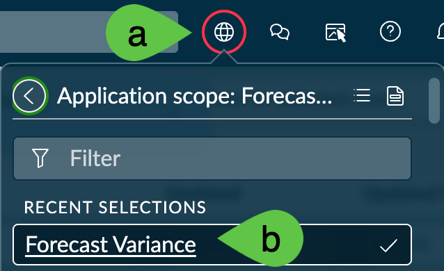<figcaption></figcaption></figure>

### Hands-on: Document Intelligence Runtime

Create a variance task record. Upload the Invoice\_IT\_Laptop\_CC\_IT\_002.pdf document. Set state to Work in Progress and submit.

1.  Go to **All** > type **x\_snc\_forecast\_v\_0\_variance\_task.do** and hit **Return/Enter ↵**.

    <figure>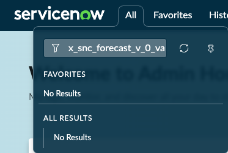<figcaption></figcaption></figure>
2. We will be uploading a document in the **x\_snc\_forecast\_v\_0\_variance\_task** task table. As mentioned earlier in this lab, ServiceNow is not a usual source of uploaded invoices as invoice uploads are normally done in ERP systems. The objective of these next steps is to show how ServiceNow would be able to capture information from similar documents and process them upstream. **Remember the automatically generated task ID!** Your task ID might differ from what is displayed in this screen, will need this later. Follow the steps below:

<figure>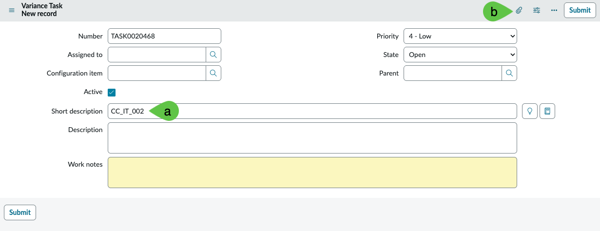<figcaption></figcaption></figure>

<mark style="color:green;">**a.)**</mark> Put **CC\_IT\_002** as the short description. You can make it as descriptive as you like, the intent is to identify this as a document upload for this cost center.

<mark style="color:green;">**b.)**</mark> Click the **Attach (**[**paper clip**](https://cepr.org/voxeu/columns/ai-and-paperclip-problem)**)** button.

2. Obtain the invoice file to attach which is a sample invoice for CC\_IT\_002 cost center. File here: [**Invoice\_IT\_Laptop\_CC\_IT\_002.pdf**](https://raw.githubusercontent.com/leojacinto/WorkflowDataFabric-TypeA/refs/heads/main/.gitbook/assets/Invoice_IT_Laptop_CC_IT_002.pdf).
3.  Click **Choose file**.

    <figure>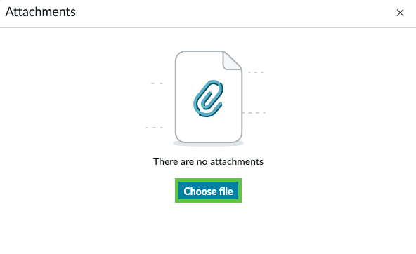<figcaption></figcaption></figure>
4.  Upload the file > <mark style="color:green;">**a.)**</mark> [**Invoice\_IT\_Laptop\_CC\_IT\_002.pdf**](https://raw.githubusercontent.com/leojacinto/WorkflowDataFabric-TypeA/refs/heads/main/.gitbook/assets/Invoice_IT_Laptop_CC_IT_002.pdf) > <mark style="color:green;">**b.)**</mark> click **Exit (x)**.

    <figure>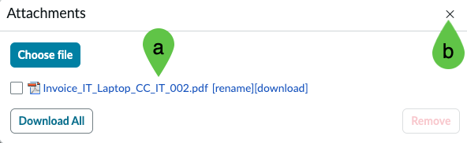<figcaption></figcaption></figure>
5.  Go to field > <mark style="color:green;">**a.)**</mark>**&#x20;State** and > <mark style="color:green;">**b.)**</mark> change it to **Work in Progress**.

    <figure>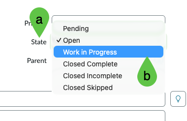<figcaption></figcaption></figure>
6.  You can _either_ <mark style="color:green;">**a.)**</mark> right-click on the header and click **Save** or > <mark style="color:green;">**b.)**</mark> simply click **Submit**.

    <figure>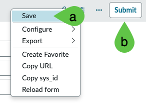<figcaption></figcaption></figure>

### Walkthrough: Custom Forecast Variance AI Agent

Look for the Now Assist badge. Open Now Assist chat. Expand to Modal view. Review planning steps, event ID extraction, RAG search results, and Finance Case link.

1. In the same browser window, you will notice that there is a new **Now Assist badge**. This is the AI Agent at work in the back end because the Document Intelligence integration flows have been triggered by changing the status of the task in which we have uploaded the Invoice to. This in turn triggered the same agent in [Lab Exercise: Integration Hub](https://servicenow-lf.gitbook.io/the-workflow-data-fabric-loom/lab-exercise-integration-hub). Click on the **Now Assist icon** with the updated badge count. <mark style="color:$warning;">**Note:**</mark> If the **Now Assist badge** does not appear, simply reload your page as it may run slow in demo or lab instances or click on the **Now Assist icon** anyway and wait for a new **Active** chat to appear, indicated by a red dot beside it.

<figure><figcaption></figcaption></figure>

2.  This will open the **Now Assist** chat. Click on the two-headed diagonal arrow to Enter **Modal**.

    <figure><figcaption></figcaption></figure>
3. This will expand the Now Assist window.

<mark style="color:green;">**a.)**</mark> Expand **Planning the next steps** show tools used.

<mark style="color:green;">**b.)**</mark> Note the **Event ID** extracted from the invoice event. We are using **Event ID** to leverage the flow built in [Lab Exercise: Integration Hub](https://servicenow-lf.gitbook.io/the-workflow-data-fabric-loom/lab-exercise-integration-hub). Note that in a real business scenario, the relevant field would be invoice ID or something similar for such a document type used in this exercise.

<mark style="color:green;">**c.)**</mark> Note the **cost\_center** and **vendor** extracted from the expense event.

<mark style="color:green;">**d.)**</mark> There are no results from the **Retrieval-augmented Generation (RAG) search** for this vendor.

<mark style="color:green;">**e.)**</mark> You can also access the **RAG search** results for the vendors associated with the expense event.

<mark style="color:green;">**f.)**</mark> Finally, if the expense event will lead to the associated cost center being over budget, the total cost center expense and the **Finance Case** created for exceeding the budget for further review and action is listed. In this case it is FINC0010017.

<figure>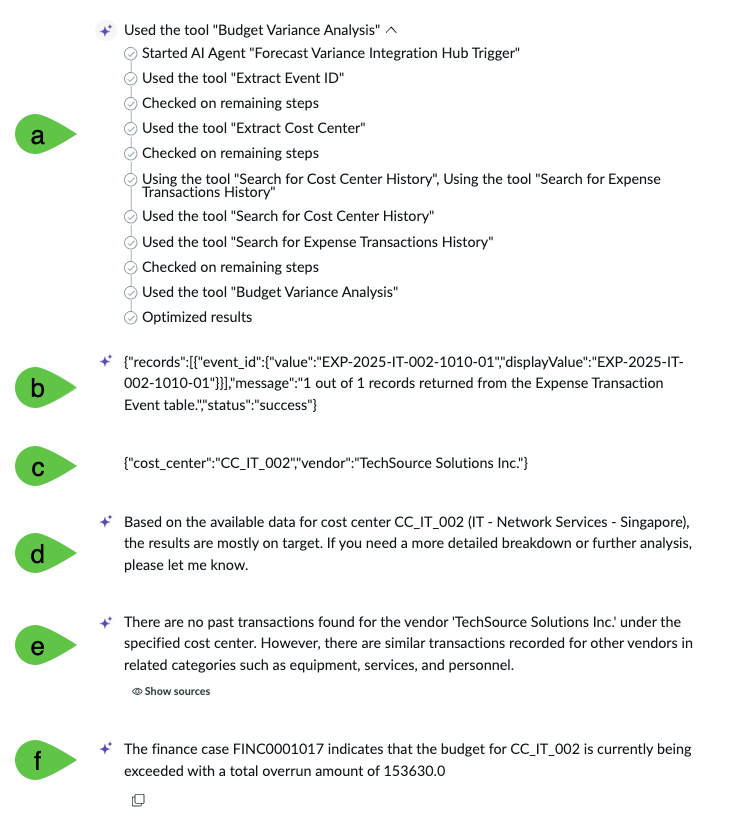<figcaption></figcaption></figure>

### Completion: Verify Finance Case

Navigate to Finance Operations Workspace. Find the case created by the agent.

1. Navigate to Workspaces > <mark style="color:green;">**a.)**</mark> type **Finance Operations Workspace** and click on the <mark style="color:green;">**b.)**</mark> workspace with the same name.

<figure><figcaption></figcaption></figure>

2. For this exercise, we are not impersonating a persona so you remain as the System user.

<figure><figcaption></figcaption></figure>

3. Go to <mark style="color:green;">**a.)**</mark> **list (list icon)** > <mark style="color:green;">**b.)**</mark> **Lists** > <mark style="color:green;">**c.)**</mark> sort by **Number** descending/ascending > <mark style="color:green;">**d.)**</mark> or look for the Finance case created by the AI Agent, FINC0010017 in the example above.

<figure>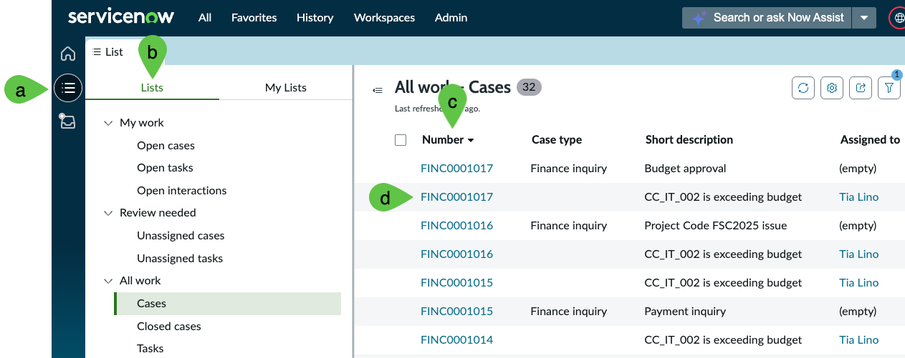<figcaption></figcaption></figure>

4. Congratulations! You have walked through the configuration and runtime of Document Intelligence, integrated with AI Agents that process the contents of the invoice for appropriate case handling for over-budget cost centers.

### \[Optional] Completion: Verify Document Output

Navigate to Now Assist Admin Skills. Review the extracted document information in the Test Outputs tab.

1. Navigate to **All** > <mark style="color:green;">**a.)**</mark> type **Now Assist Admin** > <mark style="color:green;">**b.)**</mark> click on **Now Assist Admin > Skills**.

<figure><figcaption></figcaption></figure>

2. Go to <mark style="color:green;">**a.)**</mark> **Platform** > <mark style="color:green;">**b.)**</mark>**&#x20;Other** > <mark style="color:green;">**c.)**</mark> type **Extract information from documents** > go to **Extract information from documents** > **vertical tree dot** > <mark style="color:green;">**d.)**</mark>**&#x20;Edit**.

<figure>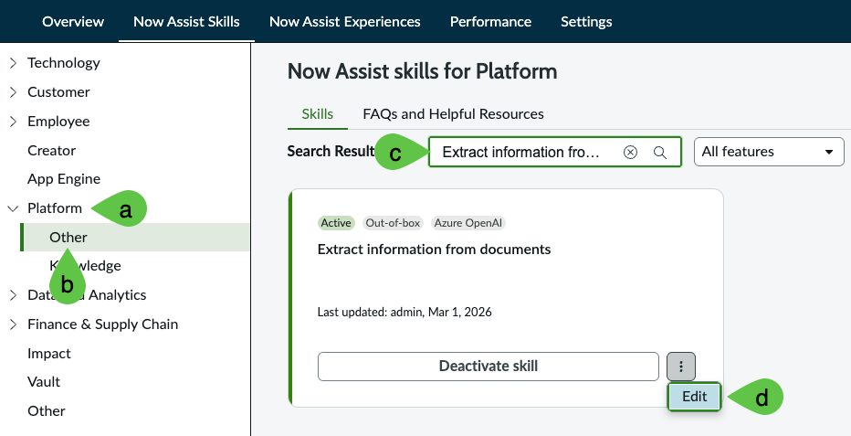<figcaption></figcaption></figure>

3. Go to <mark style="color:green;">**a.)**</mark> **Create Usecase** > <mark style="color:green;">**b.)**</mark> click on **Expense Transaction Event.**

<figure><figcaption></figcaption></figure>

4. In the screen that follows, go to <mark style="color:green;">**a.)**</mark> **Test Outputs** > <mark style="color:green;">**b.)**</mark> note the **Task ID** automatically generated when you created an entry in **x\_snc\_forecast\_v\_0\_variance\_task**. Your task ID may differ from what is shown here. Finally, > <mark style="color:green;">**c.)**</mark> > click on **Process**.

<figure>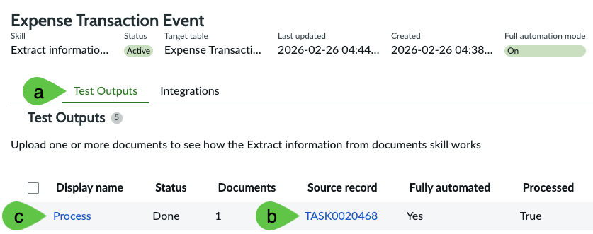<figcaption></figcaption></figure>

5. You can do several things here. Notice the <mark style="color:green;">**a.)**</mark> **Invoice** you uploaded with the <mark style="color:green;">**b.)**</mark>**&#x20;information** now extracted. You can also see the <mark style="color:green;">**c.)**</mark>**&#x20;Status**. You also have the option to open the section into a new **Document Intelligence** window.

    <figure>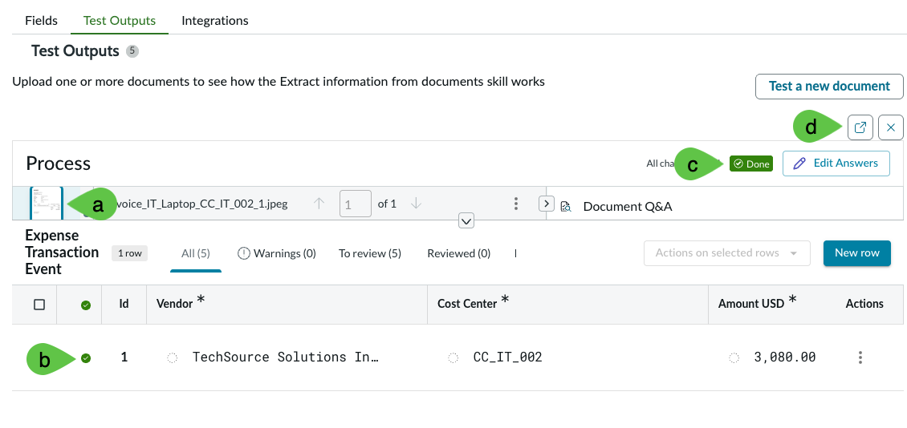<figcaption></figcaption></figure>

## AI Lens

**ServiceNow AI Lens** is a capability that allows capturing of information from documents and images via UI (dialog) with the use of AI. Unlike Document Intelligence which can execute in the back-end (e.g. by picking information from documents attached in cases or tasks), Lens requires user interaction. Also unlike Document Intelligence, Lens requires less set-up upfront.

### Walkthrough: AI Lens Setup

Navigate to Now Assist Admin Skills. Activate ServiceNow AI Lens.

1.  Navigate to **All** > <mark style="color:green;">**a.)**</mark> type **Now Assist Admin** > <mark style="color:green;">**b.)**</mark> click on **Now Assist Admin > Skills**.

    <figure><figcaption></figcaption></figure>
2.  Go to <mark style="color:green;">**a.)**</mark> **Platform** > <mark style="color:green;">**b.)**</mark>**&#x20;Other** > <mark style="color:green;">**c.)**</mark> type **ServiceNow AI Lens** > <mark style="color:green;">**d.)**</mark> click **Turn on**.

    <figure>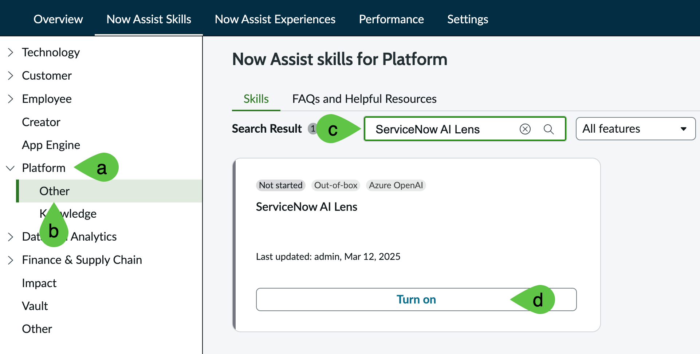<figcaption></figcaption></figure>
3.  Accept defaults and click **Turn on**.

    <figure>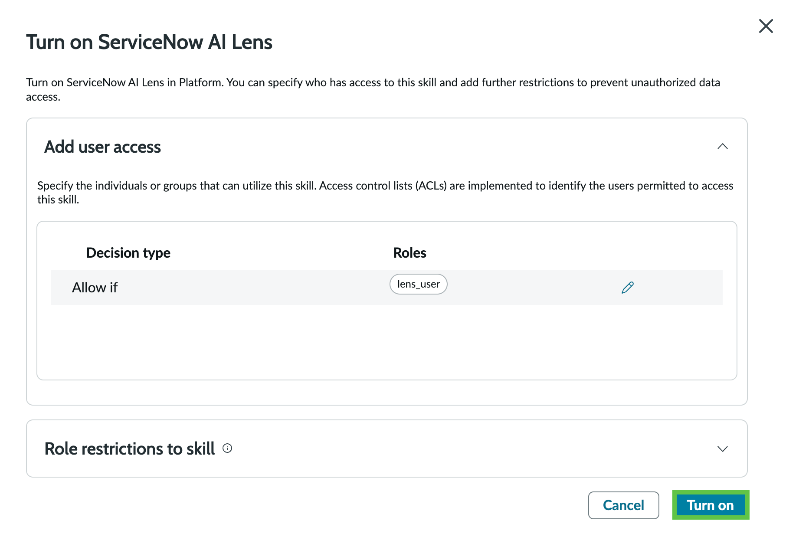<figcaption></figcaption></figure>
4.  A pop-up will appear, click **Back to skills**.

    <figure>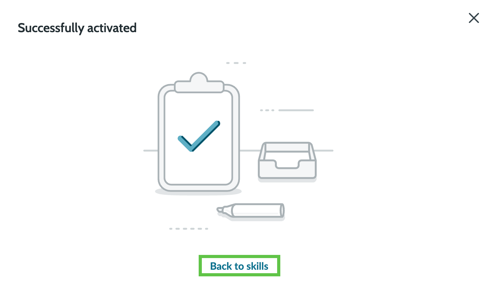<figcaption></figcaption></figure>
5. The **Lens** version in used in the lab is 3.01. If you have already obtained Lens for your own use, skip steps 6 and 7.

### Walkthrough: AI Lens Download

Download and install the Lens application for your device.

1.  Navigate to **All** > <mark style="color:green;">**a.)**</mark> type **ServiceNow AI Lens** > <mark style="color:green;">**b.)**</mark> click on **ServiceNow AI Lens > Downloads**.

    <figure>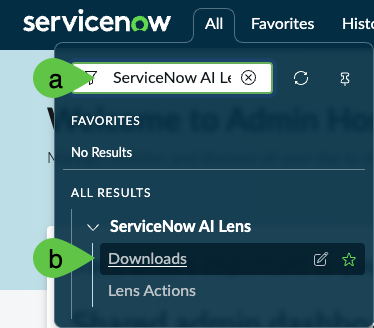<figcaption></figcaption></figure>
2.  Download and install the appropriate Lens installation package for your device. As there are three possible device types, installation steps are not shown in this guide. It is generally safe to follow the default prompts in the installation package.

    <figure>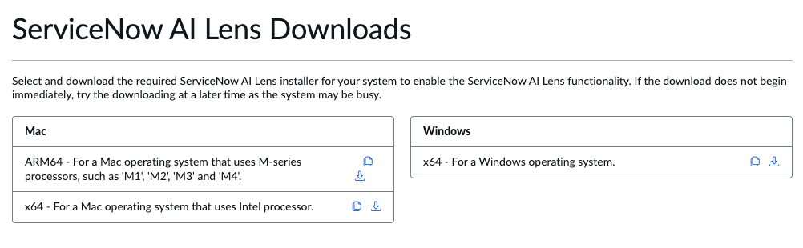<figcaption></figcaption></figure>

### Hands-on: AI Lens Runtime

Obtain the invoice file to attach which is a sample invoice for **PROD\_DE\_2** cost center. File here: [**Invoice\_Injection\_PROD\_DE\_2.pdf**](https://raw.githubusercontent.com/leojacinto/WorkflowDataFabric-TypeA/refs/heads/main/.gitbook/assets/Invoice_Injection_PROD_DE_2.pdf)**.** Open the file once you have downloaded it.

1.  Go to **All** > type **x\_snc\_forecast\_v\_0\_expense\_transaction\_event.list** and hit **Return/Enter ↵**.

    <figure><figcaption></figcaption></figure>
2.  Click **Create with Lens** which can be found at the top right portion of the navigation.

    <figure>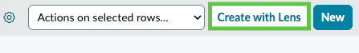<figcaption></figcaption></figure>
3.  This will open a pop-up. <mark style="color:green;">**a.)**</mark> Decide whether you want to always allow your instance to open the app associated with the **Create with Lens button**, i.e. ServiceNow Lens. Having this box ticked or unticked will not affect the Lens app's execution. Then <mark style="color:green;">**b.)**</mark> click **Open ServiceNow AI Lens.app**.

    <figure>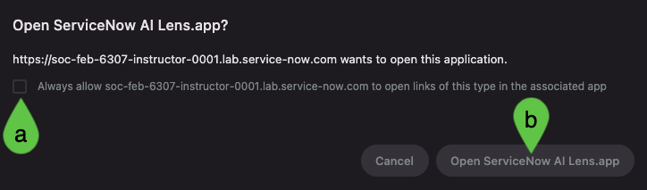<figcaption></figcaption></figure>
4.  This will open the **Lens** app. <mark style="color:green;">**a.)**</mark> Drag the **Lens** app displayed as a frame with green and indigo gradient. You might instinctively drag the app by just clicking at the frame - you don't have to do this! You can also click on the <mark style="color:green;">**b.)**</mark> space inside the frame if you wish to drag it. You can also <mark style="color:green;">**c.)**</mark> resize the frame to capture the relevant area of the document. Click **Analyze** once you are done and wait for a few seconds for Lens to process the document.

    <figure>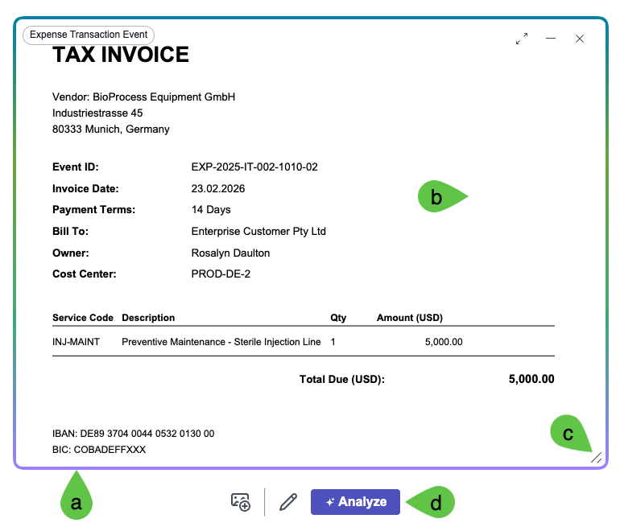<figcaption></figcaption></figure>
5.  Your **Expense Transaction Event** new record in your browser will be populated with the data from the invoice. As with any AI solution, processing time is required which makes important to weigh the benefit of a UI-based document scanner against a backend-friendly solution like Document Intelligence. Click **Submit**.

    <figure>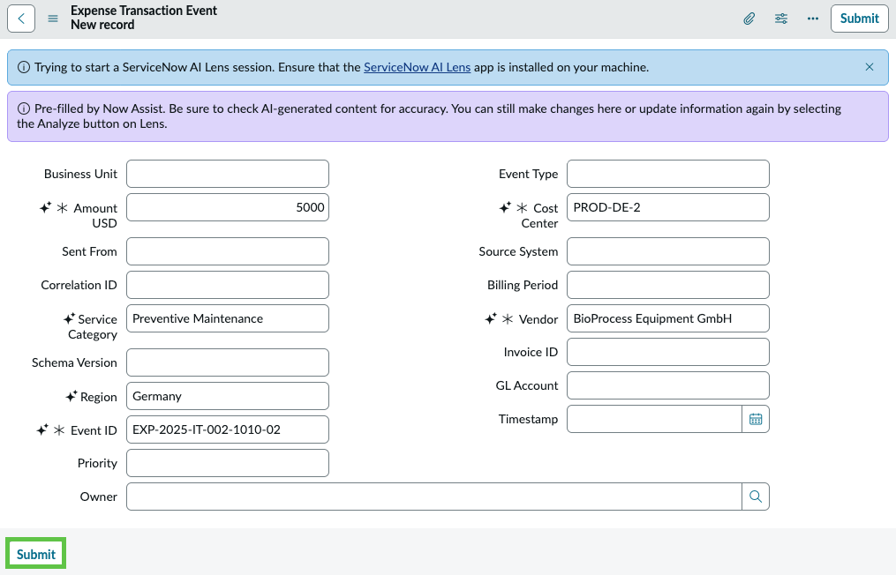<figcaption></figcaption></figure>
6.  The new **Expense Transaction Event** is now saved.

    <figure>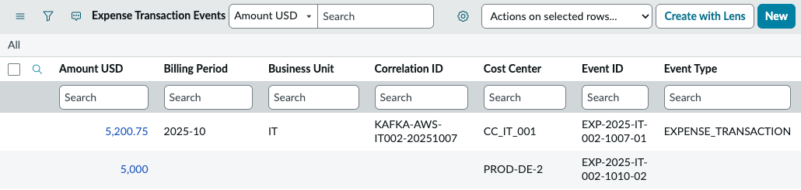<figcaption></figcaption></figure>

## Conclusion

Congratulations! You now have explored the capabilities of both Document Intelligence and AI Lens.

[Take me back to main page](../)
