# Lab Exercise: Stream Connect for Apache Kafka Lab

[Take me back to main page](../)

<figure><picture><source srcset="../.gitbook/assets/wdf_connectors_banner_dark.gif" media="(prefers-color-scheme: dark)"></picture><figcaption></figcaption></figure>

## Business motivation

Real-time visibility and agility are critical for making informed business decisions and delivering exceptional service experiences. Traditional integration methods that rely on scheduled jobs or polling introduce delays, data inconsistencies, and operational inefficiencies.

Stream Connect for Apache Kafka transforms how ServiceNow interacts with external systems by enabling event-driven data exchange. With Stream Connect, ServiceNow can publish and subscribe to data streams, ensuring that key business events such as incident updates, configuration item (CI) changes, or operational alerts are communicated instantly across systems.

This capability empowers organizations to:

* Accelerate decision-making with up-to-the-minute data.
* Reduce integration overhead by eliminating batch processing and manual synchronization.
* Enhance operational resilience through real-time monitoring and automated responses.
* Enable scalable digital transformation by integrating seamlessly with modern event-streaming platforms like Apache Kafka.

## Story so far and persona context

You have already created an [Action](https://servicenow-lf.gitbook.io/the-workflow-data-fabric-loom/main-exercises/lab-exercise-integration-hub#walkthrough-action), a [Flow](https://servicenow-lf.gitbook.io/the-workflow-data-fabric-loom/main-exercises/lab-exercise-integration-hub#hands-on-flow-execution), [Zero Copy Integrations](https://servicenow-lf.gitbook.io/the-workflow-data-fabric-loom/main-exercises/lab-exercise-zero-copy-connectors), and [AI Agents](https://servicenow-lf.gitbook.io/the-workflow-data-fabric-loom/main-exercises/lab-exercise-zero-copy-connectors#walkthrough-custom-forecast-variance-ai-agent) for your [Finance team's proactive budget handling](https://servicenow-lf.gitbook.io/the-workflow-data-fabric-loom). The organization now wants you to get asset data from the various cost centers running in the organization and register them to your CMDB.

In this lab, you’ll step into the role of an Integration Architect or Integration Developer responsible for designing high-performance, event-driven integrations. Your task: configure Stream Connect for Apache Kafka in ServiceNow to ingest CMDB data from Kafka producers, bridging your organization’s ServiceNow environment with its broader data ecosystem.

To have a better idea of the desired outcome, have a look at this demo video of how Stream Connect for Apache Kafka is able to populate CMDB data in real time: [https://www.youtube.com/watch?v=y8N1j\_qbr\_E](https://www.youtube.com/watch?v=y8N1j_qbr_E).

## Outcome

By completing this lab, participants will gain practical experience implementing real-time, scalable integrations that support modern enterprise use cases, enabling faster insights, proactive operations, and a more connected digital business.

Let’s get Streameeey! 🚀

## Acknowledgement

The use case which is the basis of this lab is created by [Kamal Shewakramani](https://www.linkedin.com/in/kamal-shewakramani/).

***

## Access pre-requisites

1. The steps in this lab makes use of hermes1, a ServiceNow instance accessible only to ServiceNow internal employees. If you are a ServiceNow employee, you are able to HOP to hermes1 via this URL: [http://hihop.service-now.com/hop.do?sysparm\_instance=hermes1\&mode=readwrite](http://hihop.service-now.com/hop.do?sysparm_instance=hermes1\&mode=readwrite)
2. This lab would still be useful for non-internal ServiceNow employees as this provides the framework and technical steps to configure Stream Connect for Apache Kafka for a Consumer scenario.
3. Fully provisioned environments with all dependencies pre-configured are available through ServiceNow-led workshops and enablement sessions. Please note that this lab uses the latest ServiceNow components and license for Stream Connect, so provisioning requires lead time. Contact your ServiceNow representative or reach out to the author for availability.

## Set-up pre-requisites

### Recommended Docker option

This will reduce effort in building the Kafka Producer:

1. Get a Docker account which can be created for free via https://www.docker.com/
2. Install Docker Desktop via https://docs.docker.com/desktop/
3.  Open Docker, search for apache/kafka latest image by using the **Search** bar then click **Pull**

    <figure>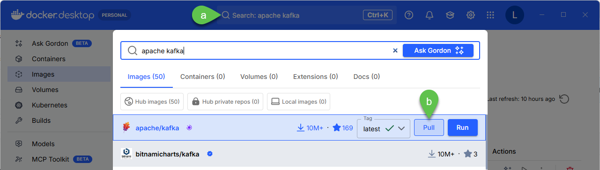<figcaption></figcaption></figure>
4.  Go to **Images**, **Run** the Docker Image, accept defaults

    <figure>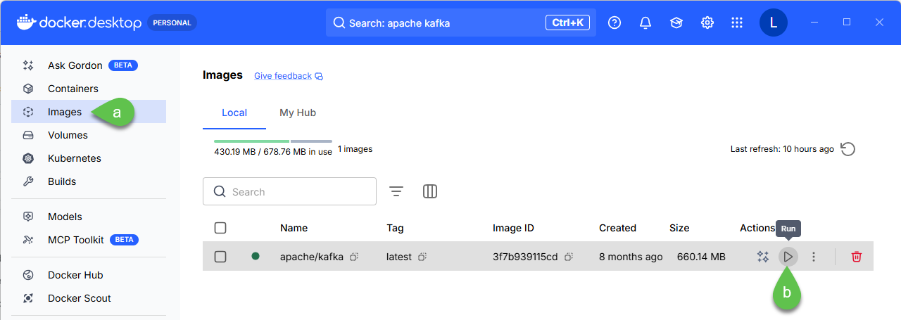<figcaption></figcaption></figure>
5.  Go to Containers and see the newly created container with a randomized name; in the example below, it is vigilant\_bartik and agitated\_ardinghelli

    <figure>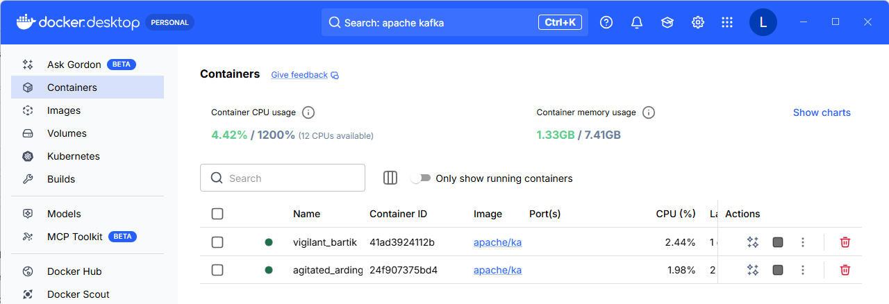<figcaption></figcaption></figure>
6. This will be the image you will use for **Part 5: Sending messages from Kafka Producer**. Alternatively you can execute all of the steps in **Part 4: Setting up a Kafka Producer** in your local machine by setting up Apache Kafka in your local machine

### Alternative local machine option

Kafka can also be set up in your local machine using in this page https://kafka.apache.org/quickstart > **Step 1: Get Kafka** with JVM 17+ installed in your machine

***

## Part 1: Creating a data source

1. Go to All > search for **Data Sources**

<figure>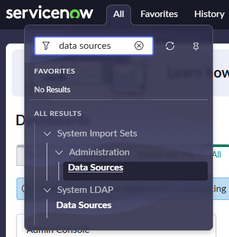<figcaption></figcaption></figure>

2. Click **New**

<figure><figcaption></figcaption></figure>

3. Fill in the details for:

* a. Name, put in a descriptive name like **CMDB Data Array \[Your Initials]**
* b. Import set table label, this will populate the **Import set table name**
* c. Type, select **File**
* d. Format, select **JSON**
* e. Put in **Path for each row** the characters **//**
*   f. Tick **Data in single column**

    <figure>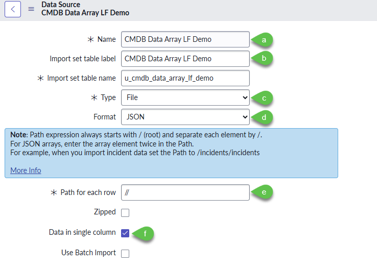<figcaption></figcaption></figure>
*   g. Right click on the header and click **Save**

    <figure>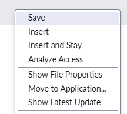<figcaption></figcaption></figure>

4. Create a JSON file which has the structure of the data source. Use the text below and save the file as **cmdb complex data array.json**

```
[{
    "table_name": "cmdb_ci_win_server",
    "site_code": "swmw1",
    "hostname" : "ktesthostname",
    "action": "ADD",
    "sys_class_name":"cmdb_ci_win_server",
    "data": 
    {
        "name": "K3 Complex Server",
        "site_code": "swmw1",
        "class": "Media",
        "entity_type": "media",
        "entity_subtype": "",
        "media_type": "",
        "location_a": "wynnarma",
        "location_z": "wynnarma",
        "last_unit": "00036",
        "first_unit": "00001",
        "mco": "",
        "number_wires": "2",
        "facility_detail": "lg-lgss",
        "sec": "sw1t0001",
        "media_designation": "rd010102"
    }              
}]
```

5. Upload the JSON file you just created

* a. Select the clip icon
*   b. Click **Choose file** and upload the file from your machine

    <figure>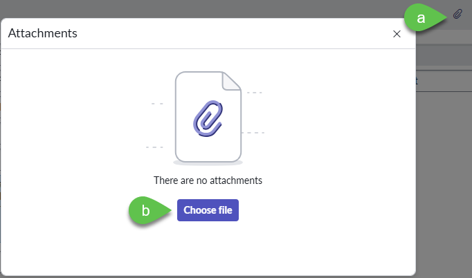<figcaption></figcaption></figure>

6.  Right click on the header and click **Save**

    <figure><figcaption></figcaption></figure>
7.  Under Related Links click on **Test Load 20 Records**

    <figure>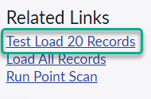<figcaption></figcaption></figure>

***

## Part 2: Creating the transformation (ETL)

1.  Go to **All** > search for **IntegrationHub ETL**

    <figure>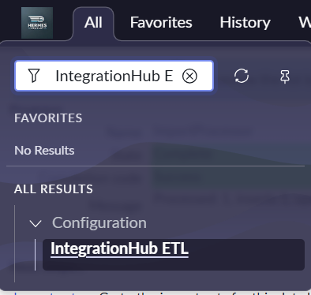<figcaption></figcaption></figure>
2.  In IntegrationHub ETL home screen, click **Create new**

    <figure><figcaption></figcaption></figure>
3.  Under **Specify Basic Details**, click on \*\*Import Source Data and Provide Basic Details \*\*

    <figure>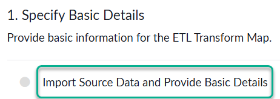<figcaption></figcaption></figure>
4. Fill in the screen **Provide Basic Information for the ETL Transform Map**

* a. **CMDB Application**, select **CMDB Import**
* b. **Name**, put in a descriptive name like **CMDB Complex Nested**
* c. **Data Source**, select the data source created in Part 1
* d. **Sample Import Set** should populate automatically; if it does not, click on the magnifying glass and click the first item
* e. **Preview Size Override**, set to **100**
*   f. Click **Save** then **Mark as Complete**

    <figure>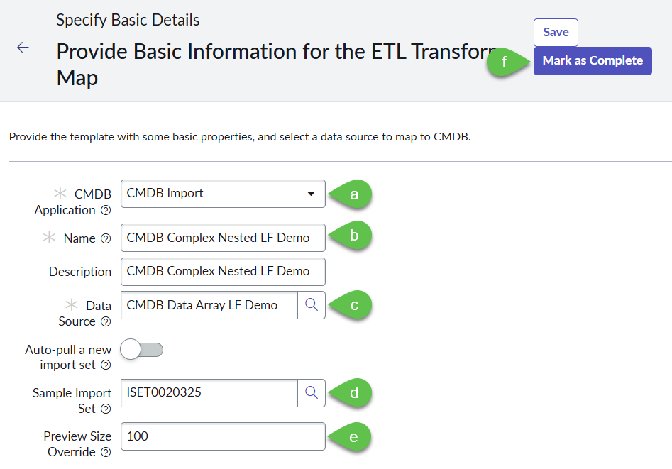<figcaption></figcaption></figure>

5.  **Under Prepare Source Data for Mapping**, click on **Preview and Prepare Data**

    <figure>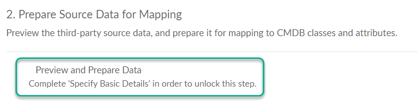<figcaption></figcaption></figure>
6. Fill in the screen **Provide Basic Information for the ETL Transform Map**

*   a. Verify that when clicking on object in the first node of the tree on the left that the fields are similar to the screen here. Sequence is not important.

    <figure>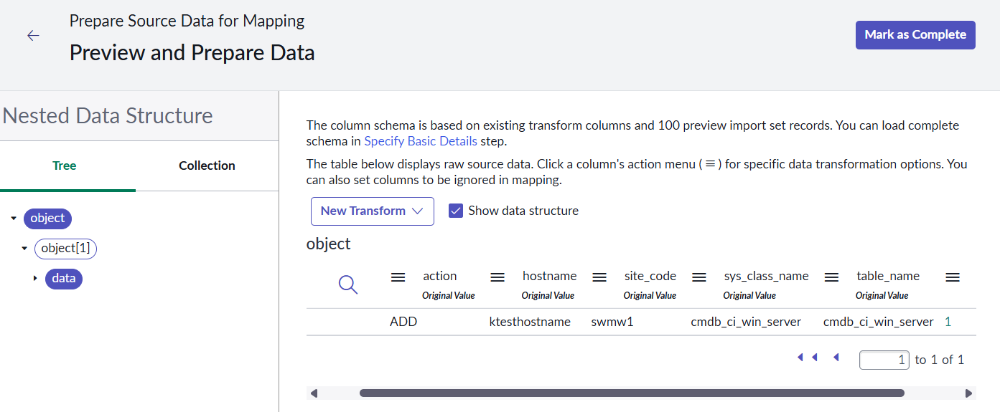<figcaption></figcaption></figure>
* b. Verify that when click on in data in the third node on the tree to the left that the fields are similar to the screen here. This is a wide table so checking the first few fields is sufficient. Sequence is not important.
*   c. Click **Mark as Complete**

    <figure>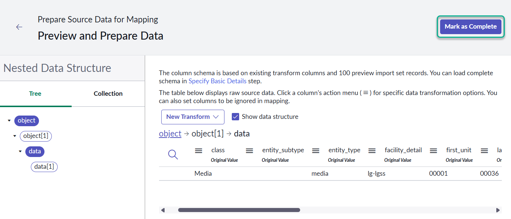<figcaption></figcaption></figure>

7.  Under **Map to CMDB and Add Relationships**, click **Select CMDB Classes to Map Source Data**

    <figure>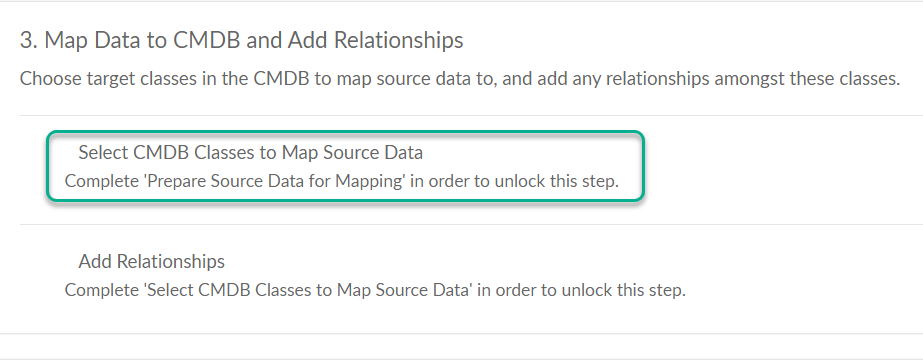<figcaption></figcaption></figure>
8.  Click in **Add Conditional Class**

    <figure><figcaption></figcaption></figure>
9. A new dialog will pop-up

* a. **Collection**, select **object**
* b. Under **If** field, select **object.table\_name** is **cmdb\_ci\_linux\_server**
* c. Under **Then** **Class** field, select **Linux Server**
* d. Click **New Criteria** (not in screenshot)
* e. Under **If** field, select **object.table\_name** is **cmdb\_ci\_win\_server**
* f. Under **Then** **Class** field, select **Windows Server**
*   g. Click **Save**

    <figure>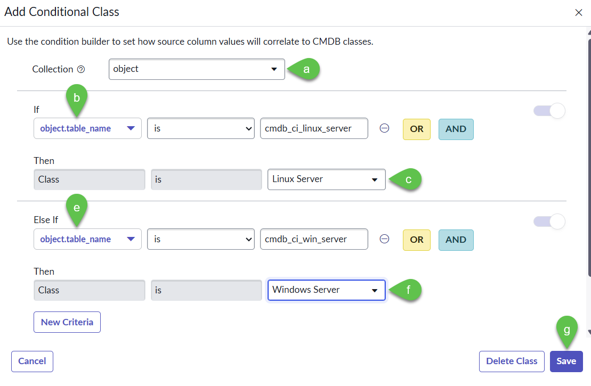<figcaption></figcaption></figure>

10. **Set up Mapping** for Linux Server 1

    <figure>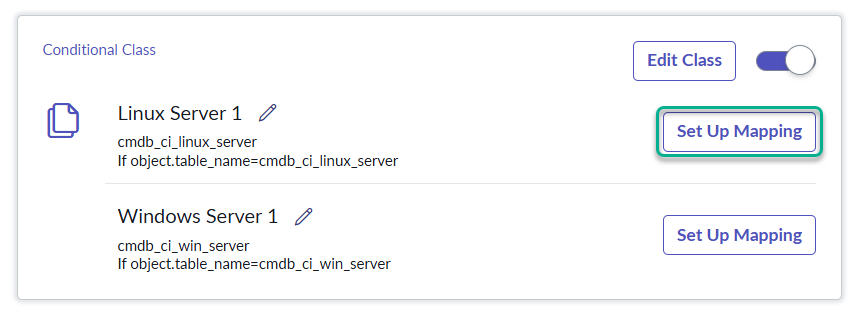<figcaption></figcaption></figure>
11. Fill up the details for Linux Server 1

*   a. **Source Native Key** > **Source Column**, click on mapping button, type and select **hostname**

    <figure>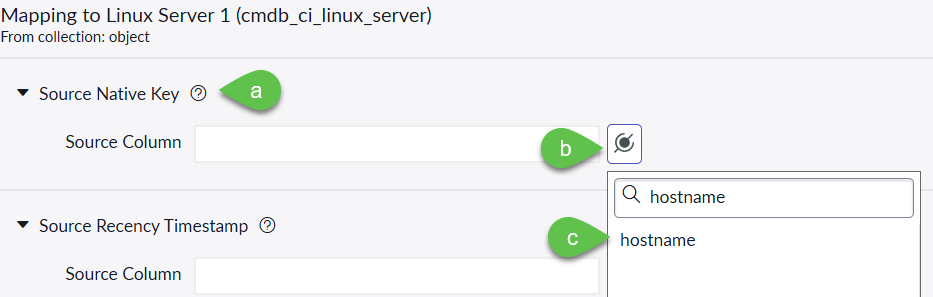<figcaption></figcaption></figure>
*   b. **Name** > **Source Column**, click on mapping button, type **data.name**, click on **data** then click on **name**

    <figure>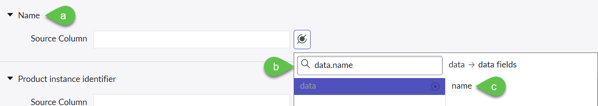<figcaption></figcaption></figure>
* c. Using the same approach from the PREVIOUS screenshot, go to **Product instance identifier** > **Source Column**, click on mapping button, type **data.name**, click on **data** then click on **name**
* d. Using the same approach from the PREVIOUS screenshot, go to **Serial number** > **Source Column**, click on mapping button, type **data.site\_code**, click on data then click on **site\_code**
*   e. The final output should be similar to below. Click back

    <figure>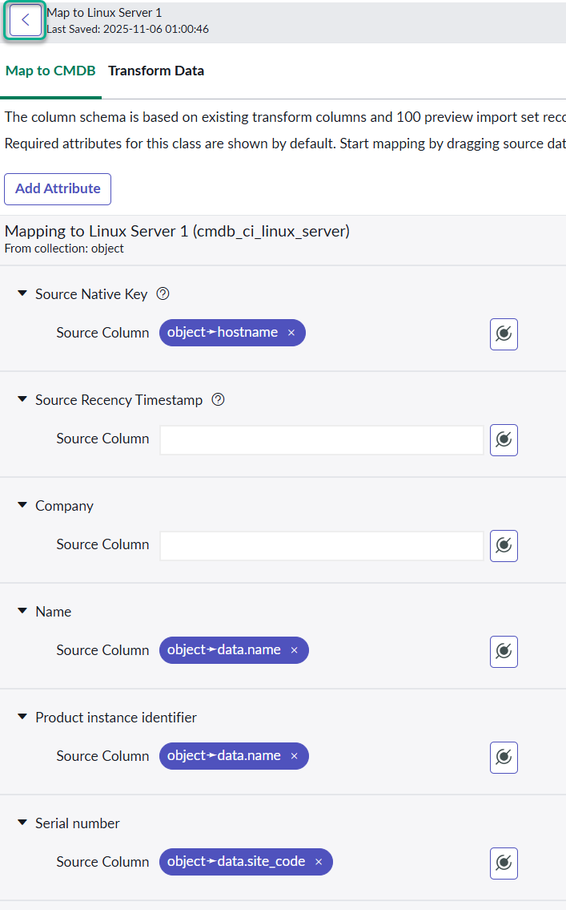<figcaption></figcaption></figure>

12. **Set up Mapping** for Windows Server 1

    <figure>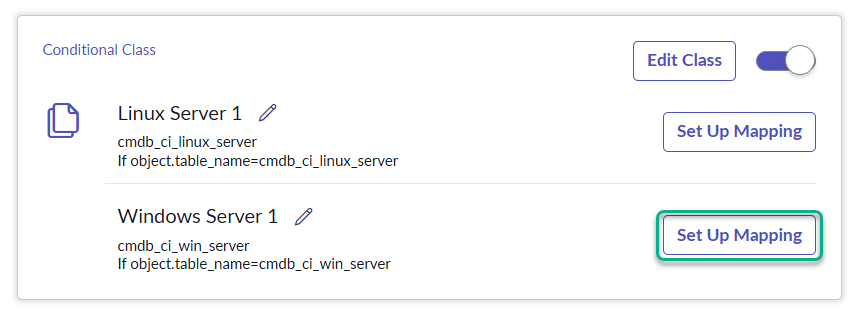<figcaption></figcaption></figure>
13. Do similar steps done for Linux Server 1 for Windows Server 1

* a. **Source Native Key** > **Source Column**, click on mapping button, type and select **hostname**
* b. **Name** > **Source Column**, click on mapping button, type **data.name**, click on **data** then click on **name**
* c. **Product instance identifier** > **Source Column**, click on mapping button, type **data.name**, click on **data** then click on **name**
* d. **Serial number** > **Source Column**, click on mapping button, type **data.site\_code**, click on **data** then click on **site\_code**
*   e. The final output should be similar to below. Click back

    <figure>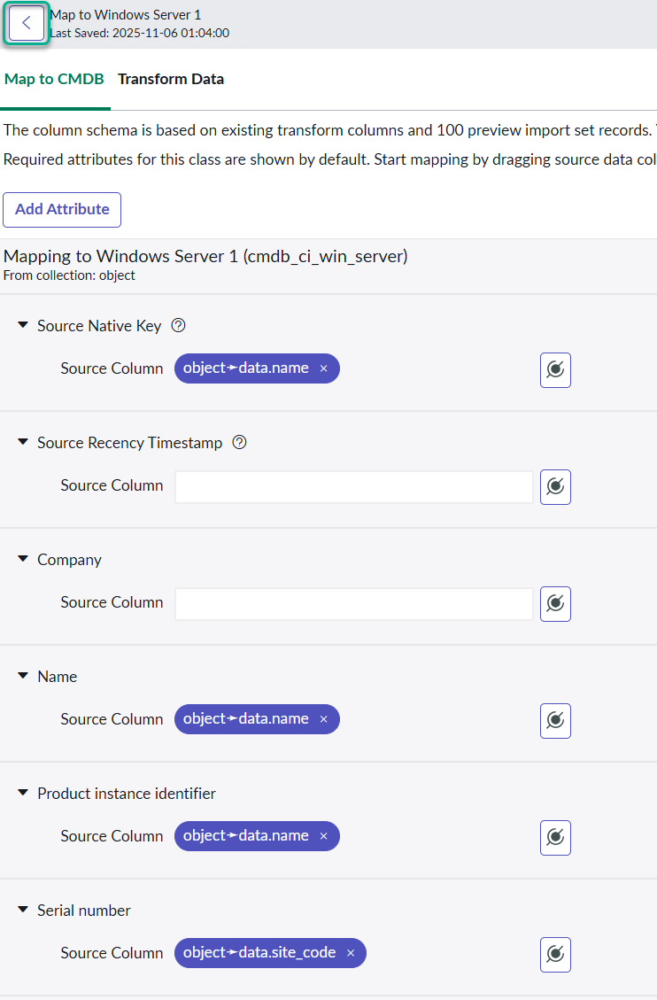<figcaption></figcaption></figure>

14. Click **Mark as Complete** to finish Select CMDB Classes to Map Source Data

<figure>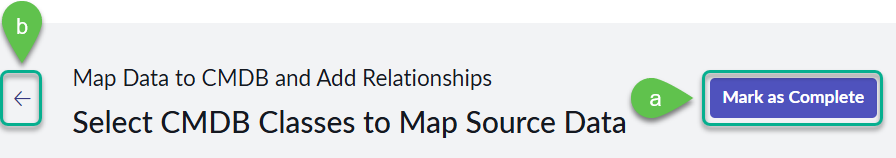<figcaption></figcaption></figure>

15. Under **Map to CMDB and Add Relationships**, click **Add Relationships**

    <figure>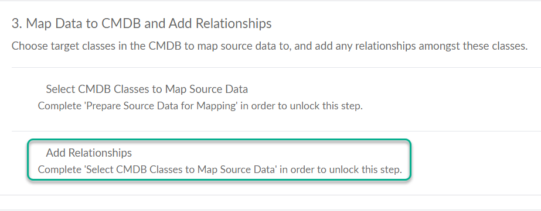<figcaption></figcaption></figure>
16. Click **Add Relationships**

* a. Leave this blank; this is just to show the option to add Class Relationships if needed
*   b. Click back

    <figure>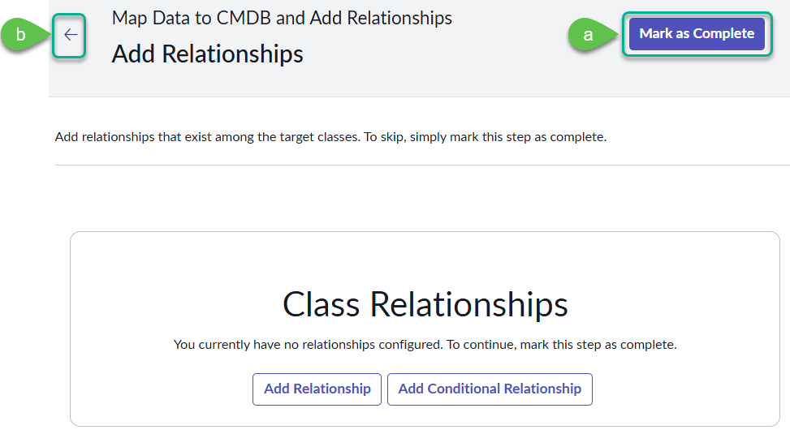<figcaption></figcaption></figure>

17. Under **Preview Sample Integration Results and Schedule Import**, click **Test and Rollback Integration Results**

<figure>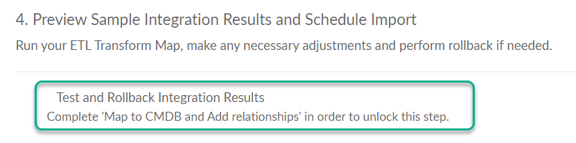<figcaption></figcaption></figure>

18. Run an integration test

*   a. Click **Run Integration**

    <figure>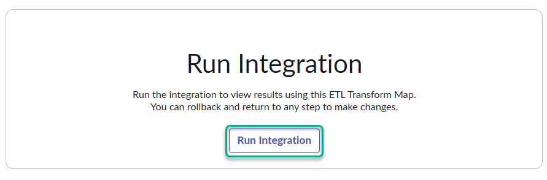<figcaption></figcaption></figure>
*   b. The results should be similar to below

    <figure>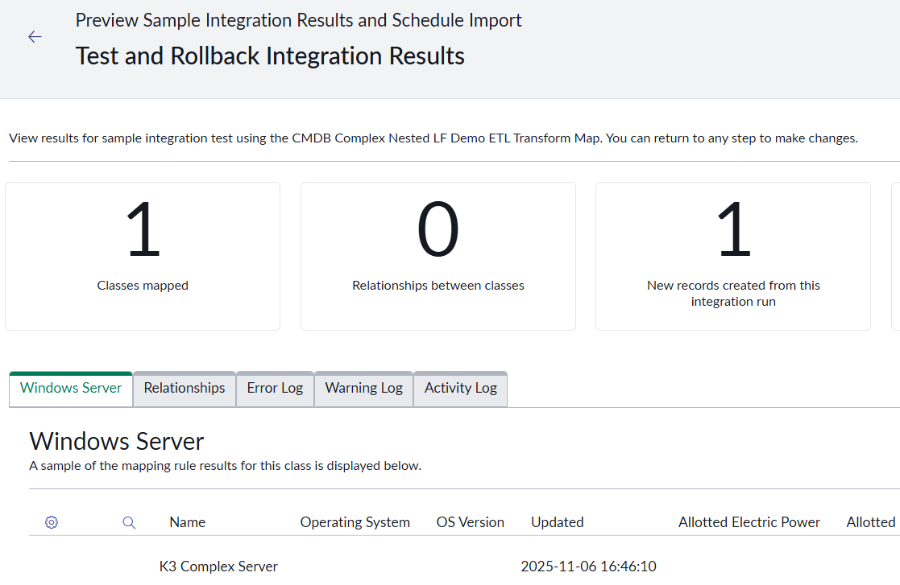<figcaption></figcaption></figure>
*   c. Click back then click **Perform Rollback**

    <figure>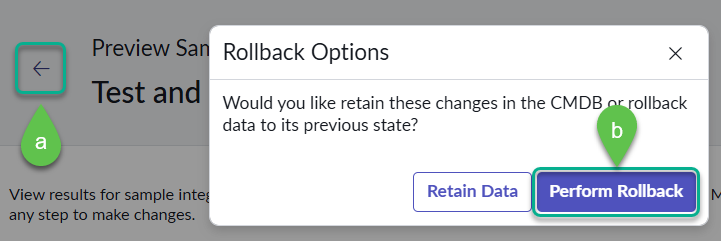<figcaption></figcaption></figure>

14. Set up of ETL Transform Map is complete, click back

    <figure>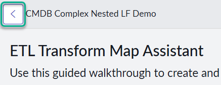<figcaption></figcaption></figure>

***

## Part 3: Setting up the consumer in Stream Connect

1. Go to All > search for **Stream Connect Home**

<figure>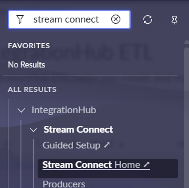<figcaption></figcaption></figure>

2. Go to **Consumers** then click **Create**

<figure>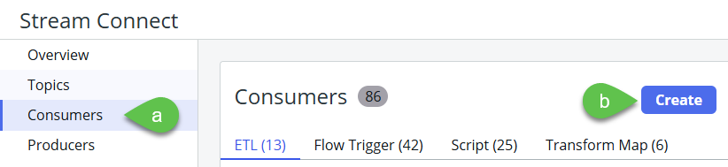<figcaption></figcaption></figure>

3. Select **ETL Consumer**

<figure>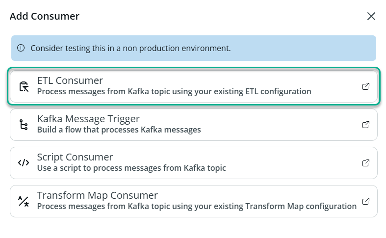<figcaption></figcaption></figure>

4. Provide the details of the RTE consumer

* a. **Name**, put a descriptive name
* b. **Robust import set transformer**, select the Integration Hub ETL created in Part 2

<figure>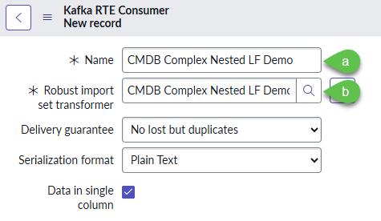<figcaption></figcaption></figure>

5. Right click on the header and click **Save**

<figure><figcaption></figcaption></figure>

6. At the bottom part of the **Kafka RTE Consumer** screen within the **Kafka Streams** box , click **New**

<figure>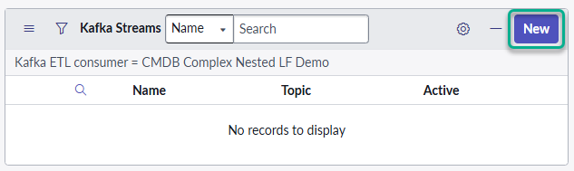<figcaption></figcaption></figure>

7. Provide the details of the Kafka Stream

* a. **Name**, put a descriptive name
* b. **Topic**, select wdftosn
* c. Click **Activate**

<figure><figcaption></figcaption></figure>

8. Right click on the header and click **Save**

<figure><figcaption></figcaption></figure>

9. If everything is configured correctly, the bottom of the Kafka Streams screen Subscriptions box will show an active stream with details similar to below

<figure>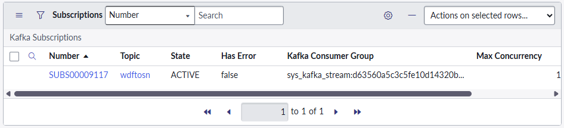<figcaption></figcaption></figure>

10. In the header, press back

<figure><figcaption></figcaption></figure>

11. In the **Kafka RTE Consumer** screen, the Kafka Stream created will show as active. Press back

<figure>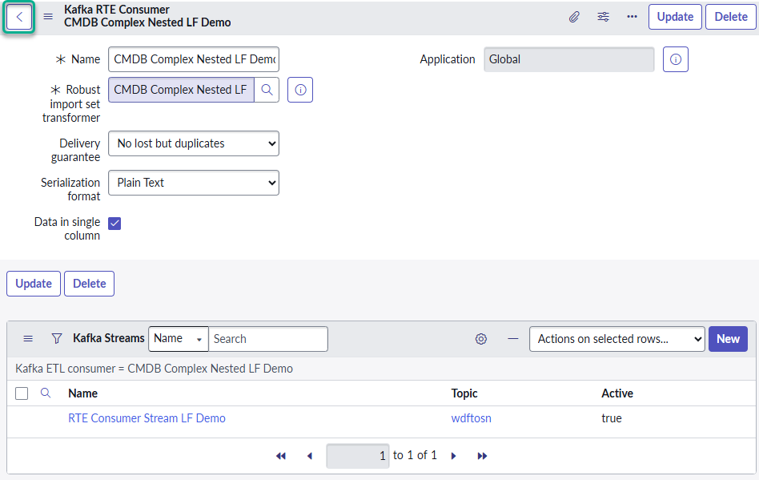<figcaption></figcaption></figure>

12. In the **Stream Connect** screen > **Consumers** section, the ETL created will show as active. Click on the consumer name

<figure>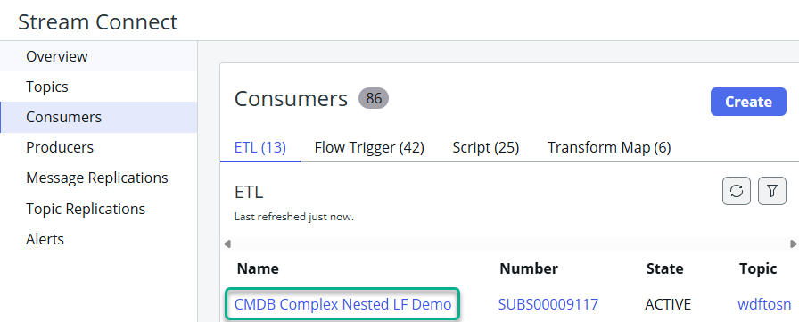<figcaption></figcaption></figure>

13. This will show statistics of the consumer; optionally clicking on **Manage RTE** will show the configurations created from steps 4 to 11

<figure>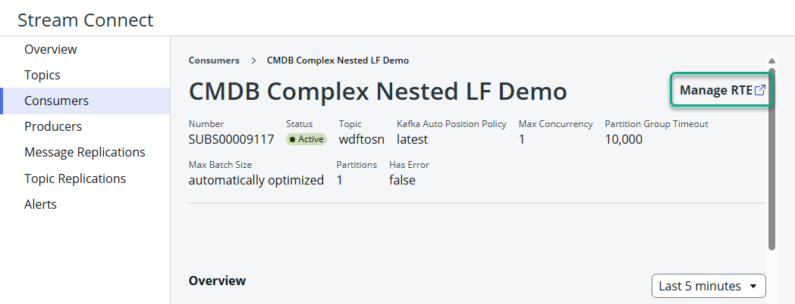<figcaption></figcaption></figure>

***

## **Part 4: Setting up a Kafka Producer**

1. Go to All > search for **Instance PKI Certificate Generator**

<figure>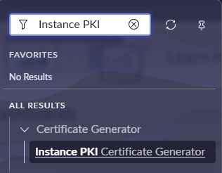<figcaption></figcaption></figure>

2. Set up the certificate password and ACL

* a. Provide a password with a minimum of 8 characters. For the example used in this lab, it will be **streamconnect**
* b. Click **Configure Acl**

<figure>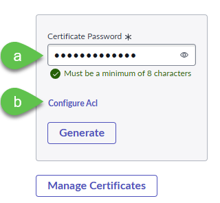<figcaption></figcaption></figure>

3. In the **Namespaces** section by clicking the radio button of the same name, select all of the namespaces to avoid any authorization issues. In a real environment, it is necessary to identify the correct namespace

<figure>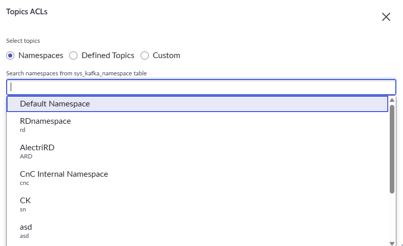<figcaption></figcaption></figure>

4. Once the namespaces are selected, it should look similar to the screen below

<figure>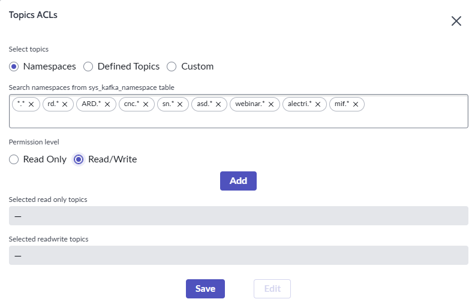<figcaption></figcaption></figure>

5. In the **Defined Topics** section by clicking the radio button of the same name, select **wdftosn**

<figure>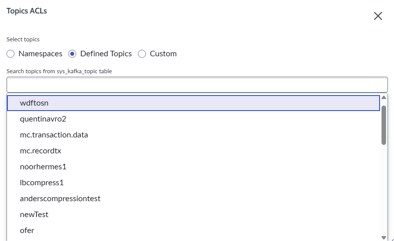<figcaption></figcaption></figure>

6. Once the topic selected, it should look similar to the screen below. Click **Save**

<figure>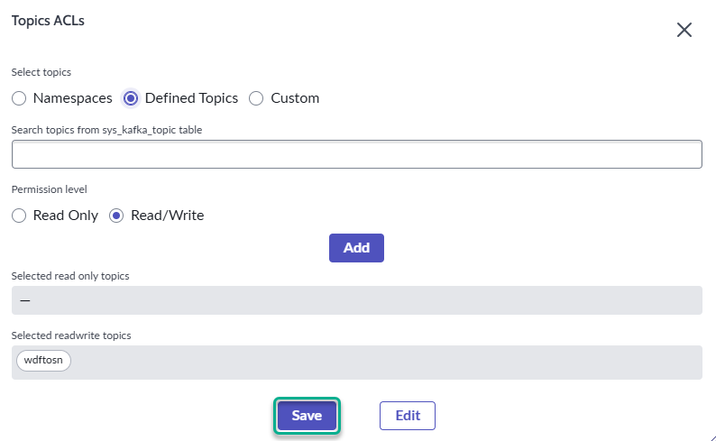<figcaption></figcaption></figure>

7. Generate the certificate

<figure>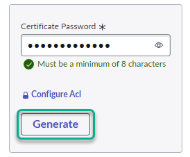<figcaption></figcaption></figure>

8. After a few seconds, the certificates are ready to download. Click on **Download Keystore** and **Download Truststore** to obtain the respective files

<figure>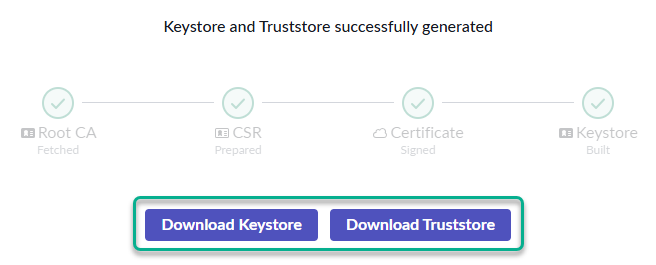<figcaption></figcaption></figure>

9. Put the downloaded files into a folder called **servicenow\_certs**. Doing this will avoid permission issues in the next steps.
10. The next steps can be done in docker desktop or in your own machine. Steps 11 to 17 shows how it can be done in docker and the docker-specific steps can be omitted if this is done in your local machine.
11. Open docker desktop, go to Containers, ensure the image created in part **Pre-requisites: Recommended** has been started indicated by a green dot beside it. If not, click on the **Start** button (play icon). In this example, the image name is awesome\_cerf. You will have a randomized image name

<figure>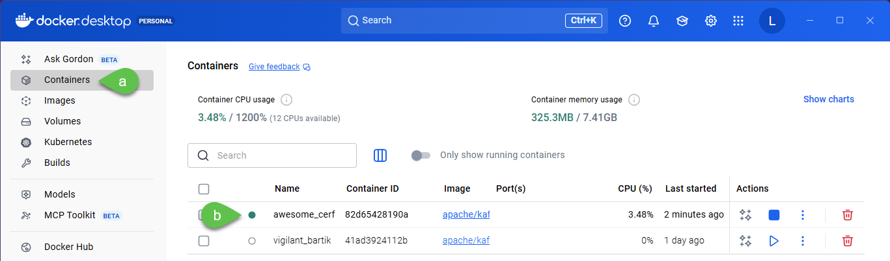<figcaption></figcaption></figure>

12. Go to **Files** > in the file browser navigate to the path opt > kafka > config > **producer.properties** > click **Open file editor**

<figure>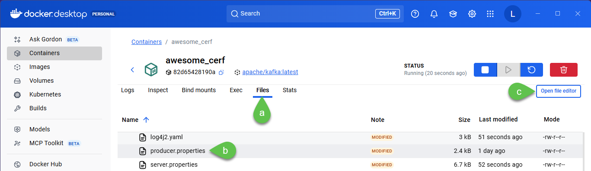<figcaption></figcaption></figure>

13. Paste the text below in the **producer.properties** file. Notice the path of the file in the screenshot as well as the placement of the text in the screenshot below in case of any doubt.

**Note** that the certificates generated in the earlier steps are not uploaded to the docker image yet at this stage

**Note** that the password below should be adjusted to the password that you used in **step 4**!

```
bootstrap.servers=hermes1.service-now.com:4000,hermes1.service-now.com:4001,hermes1.service-now.com:4002,hermes1.service-now.com:4003

security.protocol=SSL
ssl.keystore.location=/opt/kafka/config/kafka.server.keystore.p12
ssl.keystore.password=streamconnect
ssl.keystore.type=PKCS12

ssl.truststore.location=/opt/kafka/config/kafka.server.truststore.p12
ssl.truststore.password=streamconnect
ssl.truststore.type=PKCS12
```

<figure>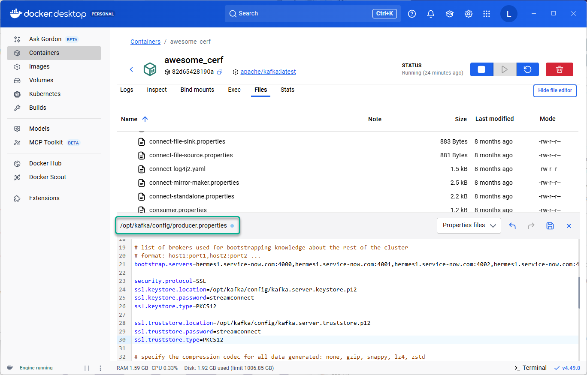<figcaption></figcaption></figure>

14. Staying in the **Files** section of your container, navigate to opt > kafka > config, right click on _any_ file then click "Import"

<figure>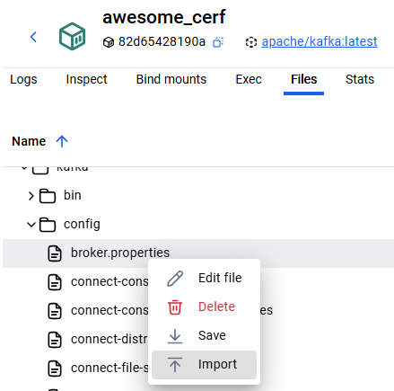<figcaption></figcaption></figure>

15. Navigate to the servicenow\_certs created in step 9 which contains the certificates from the ServiceNow instance then select the folder (**DO NOT** double-click)

<figure>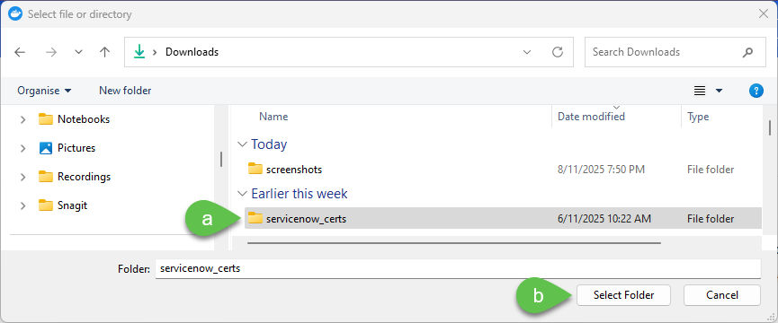<figcaption></figcaption></figure>

16. Go to the **Exec** portion of the docker image

<figure>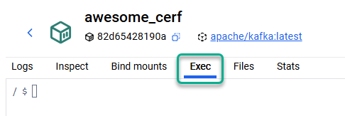<figcaption></figcaption></figure>

17. Execute the commands below to copy the certificates downloaded form the ServiceNow instance. Take careful note of the filenames as the filenames of the downloaded certificates from the ServiceNow instance may vary

```
cp /opt/kafka/config/servicenow_certs/keystore.p12 /opt/kafka/config/kafka.server.keystore.p12

cp /opt/kafka/config/servicenow_certs/truststore.p12 /opt/kafka/config/kafka.server.truststore.p12
```

18. The Kafka Producer is now ready to securely connect with the ServiceNow instance.

***

## **Part 5: Sending messages from Kafka Producer**

1. Continue working in the **Exec** portion of the docker image and connect to ServiceNow Stream Connect with the command below.

```
/opt/kafka/bin/kafka-console-producer.sh \
  --topic snc.hermes1.sn_streamconnect.wdftosn \
  --producer.config /opt/kafka/config/producer.properties \
  --bootstrap-server hermes1.service-now.com:4000,hermes1.service-now.com:4001,hermes1.service-now.com:4002,hermes1.service-now.com:4003
```

2. If everything is working correctly, a line with the character **>** and a blinking cursor will appear

<figure>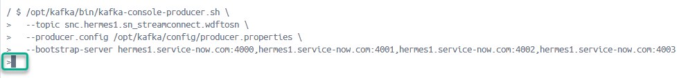<figcaption></figcaption></figure>

3. Send a message to be processed by Stream Connect with the docker image as the Kafka producer. See the sample message below and modify the body with your intials and the date to make the message unique. The template is as below. This will execute a task that sends messages to Stream Connect through your Kafka Producer. In a productive environment, these can be generated from automated sources. The intent of this example is to manually trigger sending of a Kafka message from the Producer in the docker image

```
{"table_name":"cmdb_ci_win_server","site_code":"k1smwmw1","hostname":"ktitesthostname","action":"ADD","sys_class_name":"cmdb_ci_win_server","data":{"name":"[Your Initials] [Date] K2 Complex Server","site_code":"[Your Initials and/or Random Word]","class2":"Media","entity_type":"media","entity_subtype":"","media_type":"","location_a":"wynnarma","location_z":"wynnarma","last_unit":"00036","first_unit":"00001","mco":"mco","number_wires":"2","facility_detail":"lg-lgss","sec":"swt0001","media_designation":"rd010102"}}
```

In the text above, take note of the portions below which you should replace with your details and date so you can check successful sending of your Kafka message

```
"name":"[Your Initials] [Date] K2 Complex Server","site_code":"[Your Initials and/or Random Word]"
```

4. If the sending of message is successful, a line with the character **>** and a blinking cursor will appear

<figure>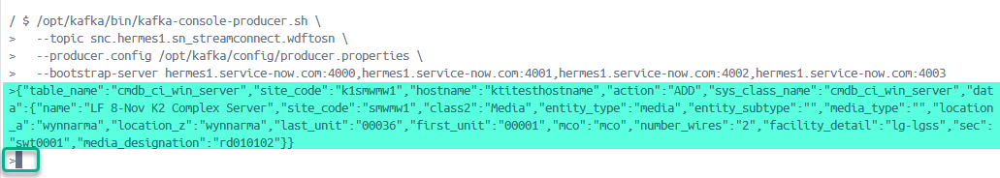<figcaption></figcaption></figure>

5. Go back to the ServiceNow instance > All > type **cmdb\_ci\_win\_server.list** and hit **Enter ↵**

<figure>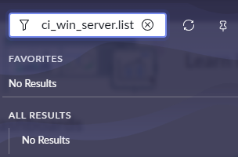<figcaption></figcaption></figure>

6. This should show the details of the Windows server created in step 3

* a. Add the field **Updated** using **Update Personalized List** (gear icon)
* b. Sort the **Updated** field as descending (down arrow)
* c. Look for the Windows server created in step 3

<figure>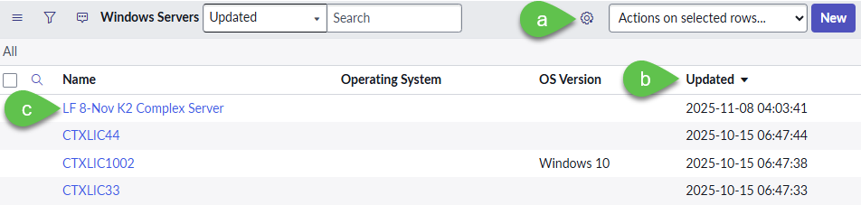<figcaption></figcaption></figure>

7. If everything is successful, go back to the docker image. Press **Command + C** in Mac or **Ctrl + C** in Windows to cancel your message sending session

* a. If everything is working normally, this will result in the prompt displaying **^C/ $** and a blinking cursor like below
* b. Stop the image. If needed, it can be deleted (bin icon), and if you have no further use for docker desktop, you can remove it from your machine

<figure>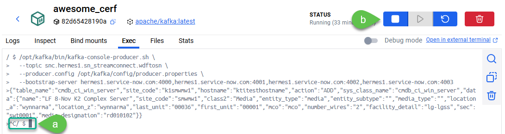<figcaption></figcaption></figure>

8. Congratulations on building your Kafka Stream Connect integration with ServiceNow!

***

## **Part 6: Additional Resources**

* [Stream Connect for Apache Kafka Data Sheet](https://www.servicenow.com/au/standard/resource-center/data-sheet/ds-stream-connect-for-apache-kafka.html)
* [Stream Connect for Apache Kafka Overview](https://learning.servicenow.com/lxp/en?id=learning_course_prev\&course_id=0a25082c473ae950123f3975d36d43d6)
* [Stream Connect Quick Start Guide](https://www.servicenow.com/docs/bundle/zurich-integrate-applications/page/administer/integrationhub/concept/stream-connect-quick-start.html)

[Take me back to main page](../)
