# Lab Exercise: Fundamentals

[Take me back to main page](../)

Not a fan of complicated schematics and the [Data and Flow Diagrams](../data-and-flow-diagrams.md) not to your liking? Check out a the simplified architectural view of the solution that you will be building below.

<figure>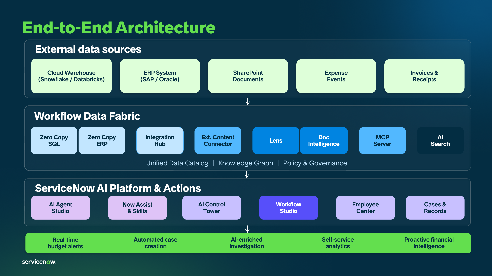<figcaption></figcaption></figure>

This lab will walk you through creation of the scoped tables needed to interact with the external system integrations.

<figure>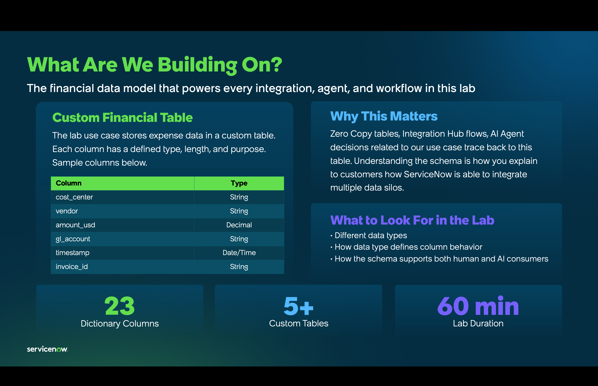<figcaption></figcaption></figure>

## Data flow

The data flow below shows how ServiceNow will consume REST API endpoints via Integration Hub Spokes then further processed by a Flow so the entries will be written in the scoped table.

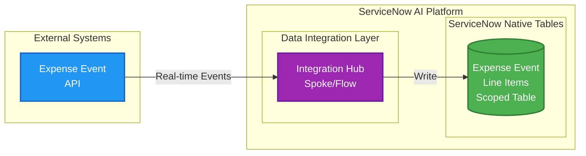

> **Color Legend:** 🟣 Workflow Data Fabric | 🟢 Platform | 🔵 External Systems
>
> [📊 View High-Resolution Diagram](https://raw.githubusercontent.com/leojacinto/WorkflowDataFabric-TypeB/main/.gitbook/assets/dataflow_fundamentals.png)

## Lab story

While you have the power of CMDB at your fingertips, the process we are solving for here does not concern CI data. You will need to create a scoped table which will store information from an expense event API. This can come from cloud services such as AWS or Azure.

The table you will create here will not be used for the rest of the lab and serves mainly to introduce how target tables for REST API endpoints are created for ServiceNow.

## Steps

### <mark style="color:$warning;">**\[Skip if already done for AI Day 1]**</mark> Install Lab Dependencies

This contains critical steps to prepare your Demo Hub Instance.

1.  Ensure you are at least in Zurich Patch 6. Go to **All** > type **stats.do** and hit Return/Enter ↵. Ensure that it is empty.

    <figure>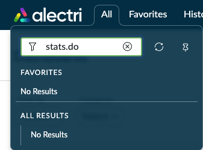<figcaption></figcaption></figure>
2.  You should get a build tag with Zurich and the needed patch name.

    <figure>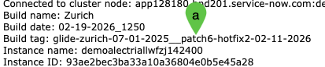<figcaption></figcaption></figure>
3. If you have not done so yet, log in to [Demo Hub](https://demohub.service-now.com/) then go to the [APAC End-to-End AI Workshop ](https://demohub.service-now.com/edsp?id=sc_cat_item\&sys_id=8bb12066fb2f761042e1f57675efdc85\&sysparm_category=f2d15f6893429250e0d5b3aa6aba105a)catalog item to install the lab dependencies in your instance.
4.  Provide your <mark style="color:green;">**a.)**</mark> Zurich Patch 6 or newer **Instance** name, <mark style="color:green;">**b.)**</mark>**&#x20;Admin User ID**, and <mark style="color:green;">**c.)**</mark> **Password**, then <mark style="color:green;">**d.)**</mark> click **Submit**.

    <figure>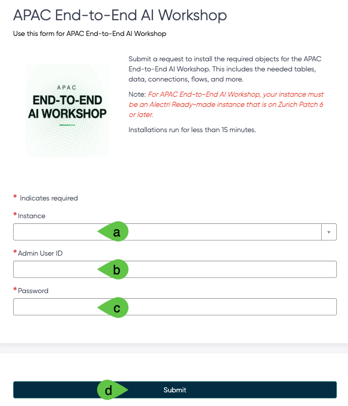<figcaption></figcaption></figure>
5. Wait for 10 to 15 minutes.
6. Once completed, you will get an email indicating that the import of update sets is successful.

<figure>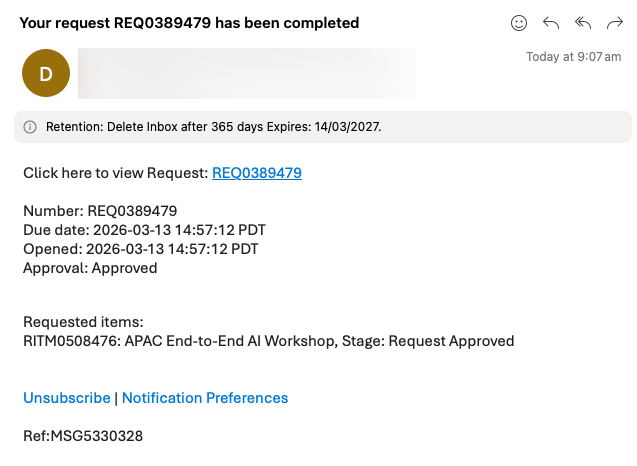<figcaption></figcaption></figure>

### Hands on: Create a Scope

Create a dummy scope. This activity is meant to make you familiar with scope creation, the scope you will create here will not be used in the lab. If you are familiar with scope creation, you can skip this exercise as this is not a dependency in the exercises.

1. Go to the top right portion of your navigation and click on the <mark style="color:green;">**a.)**</mark> **globe icon** then **arrow** **>** the <mark style="color:green;">**b.)**</mark> **list icon** to create new scope.

<figure>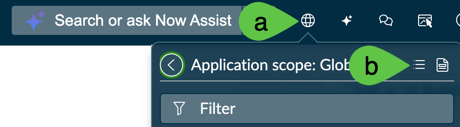<figcaption></figcaption></figure>

2.  In the succeeding screen, click **New**.

    <figure><figcaption></figcaption></figure>
3.  Go to section **Start from Scratch** and click **Create**

    <figure>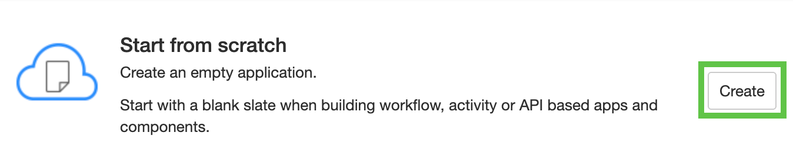<figcaption></figcaption></figure>
4.  Provide the scope details with <mark style="color:green;">**a.)**</mark> name <mark style="color:$warning;">**Lab**</mark> <mark style="color:$warning;">**\<YOUR INITIALS>**</mark>**&#x20;Forecast Variance** and the <mark style="color:green;">**b.)**</mark> scope. Click <mark style="color:green;">**c.)**</mark> Create. Note that the scope is a technical name and is automatically populated but you have the option to change it. In this example, the scope is **x\_snc\_lab\_lfr**. The scope here will not be used in the exercise and is only meant to serve as guide in demonstrating the fundamental steps. Click **Back to list** once done. <mark style="color:red;">**Note:**</mark> you may get an error that your scope cannot be created; this is because Demo Hub uses a central App Repository and that someone with a similar initials has already created their scope.

    <figure>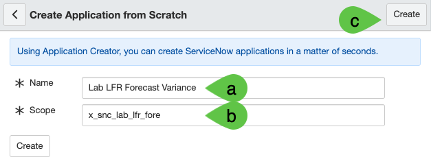<figcaption></figcaption></figure>
5.  Verify that you are in the correct scope after you have created it. Being in the correct scope as you proceed with the lab will avoid scope access and object management issues. Do this by a.) clicking on the <mark style="color:green;">**a.)**</mark> scope (globe icon) and ensuring that has the value of the <mark style="color:green;">**b.)**</mark> <mark style="color:$warning;">**Lab**</mark> <mark style="color:$warning;">**\<YOUR INITIALS>**</mark>**&#x20;Forecast Variance** label you created.

    <figure>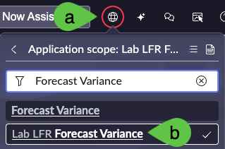<figcaption></figcaption></figure>
6.  <mark style="color:red;">**THIS NEXT STEP IS CRITICAL**</mark> to ensure you are working in the correct scope in which the objects for this lab are linked to. You will need to change scope after you have created the simulation scope. Click on the <mark style="color:green;">**a.)**</mark> **scope** (globe icon) and <mark style="color:green;">**b.)**</mark> **Forecast Variance**, this time <mark style="color:red;">**WITHOUT**</mark> your initials. This will be the scope you will use throughout the lab.

    <figure>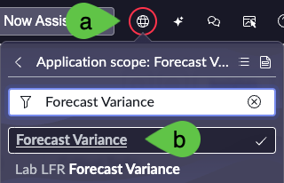<figcaption></figcaption></figure>
7.  Now that you are in the right scope, you are ready to create the scoped table. Navigate to All > <mark style="color:green;">**a.)**</mark> type **System Definition** > <mark style="color:green;">**b.)**</mark> search for **Tables**

    <figure>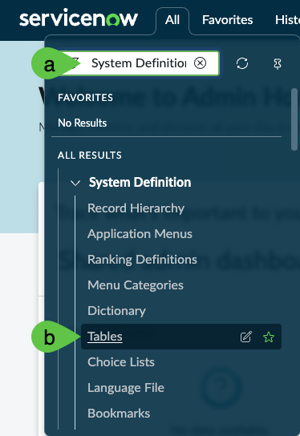<figcaption></figcaption></figure>
8. <mark style="color:$warning;">**Note:**</mark> the table you will create in the next steps will NOT be used for the rest of the lab and serves mainly to introduce how target tables for REST API endpoints are created for ServiceNow.
9.  Go to the top right section of the navigation and click **New**.

    <figure><figcaption></figcaption></figure>
10. Provide the <mark style="color:green;">**a.)**</mark> **Label** as **Expense Transaction Event \<your initials>**. The <mark style="color:green;">**b.)**</mark> **Name** which is a technical identifier will automatically be populated and can be modified to suit your requirement. Finally, <mark style="color:green;">**c.)**</mark> **untick Create module**.

    <figure>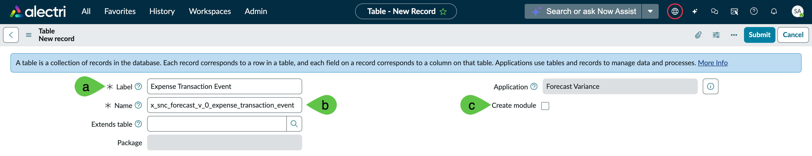<figcaption></figcaption></figure>
11. Right click on the header and click **Save**.

    <figure>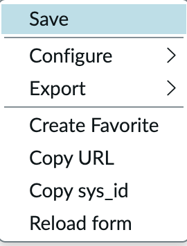<figcaption></figcaption></figure>
12. Staying in the same screen, an option to create fields for the table will be available. In the tab **Columns** click on **New**.

    <figure>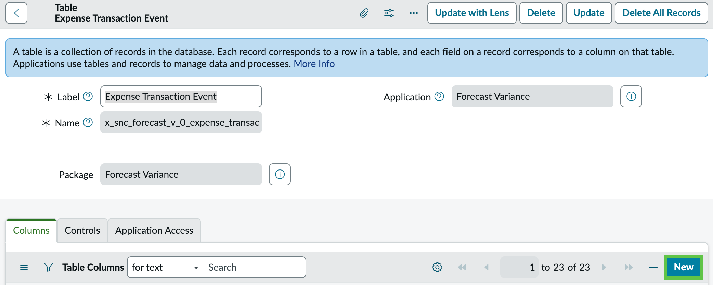<figcaption></figcaption></figure>
13. Let us use one column as an example. Provide the <mark style="color:green;">**a.)**</mark> **Type**, in this case **String**. Provide the <mark style="color:green;">**b.)**</mark> **Column label**, in this example, **Cost Center** which will automatically populate the <mark style="color:green;">**c.)**</mark> **Column name**. Since this is the string, provide the <mark style="color:green;">**d.)**</mark> **Max length** of **40**. Finally, right click on then header and <mark style="color:green;">**e.)**</mark> **Save**.

    <figure>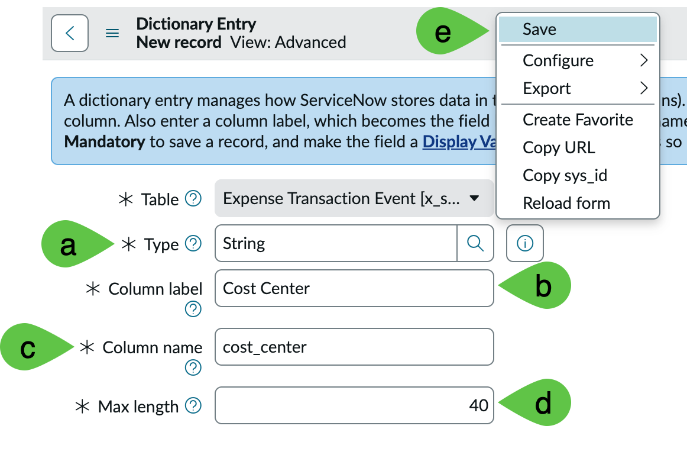<figcaption></figcaption></figure>
14. Do the same steps for all of the 16 other fields below. Note that the **Column label**, **Column name**, **Type**, **Max length** vary across some columns. For now, keep **Display** as **false** across all fields. Notice that these 16 fields are expense, invoice, or finance related, specifically tied to the business process problem we are solving for. Correct data foundations are critical to ensure that agents have the correct context and structure especially when delivering enterprise use cases.

    <figure>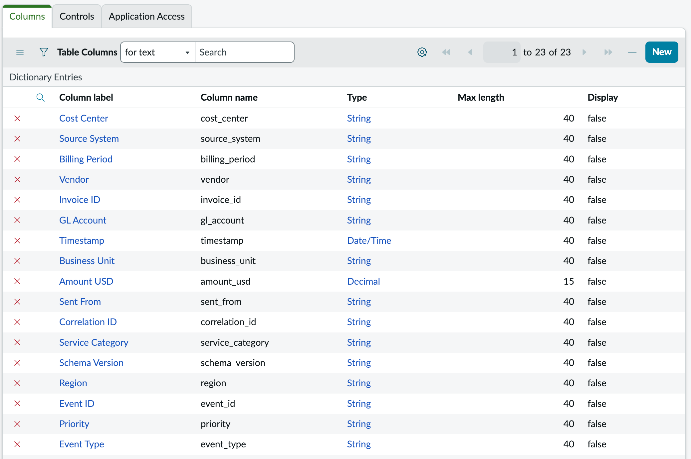<figcaption></figcaption></figure>

## Conclusion

Congratulations! You have created the destination table within ServiceNow for the external REST API sources. As a recap, the table you created will **NOT** be used for the rest of the steps and serves mainly to introduce how target tables for REST API endpoints are created for ServiceNow.

## Next step

Let us continue building the data foundations for the use case. Next up is creation of the Data Fabric tables which will be used by AI Agents. Let us work on AI Agents' ability to use REST API connectivity by proceeding with the [Integration Hub configuration](https://servicenow-lf.gitbook.io/the-workflow-data-fabric-loom/main-exercises/lab-exercise-integration-hub).

[Take me back to main page](../)
