# Lab Exercise: Integration Hub

## Where we are in this workshop

<figure><picture><source srcset="../.gitbook/assets/dataflow_outcome_agent_flow_integration_hub_dark.png" media="(prefers-color-scheme: dark)">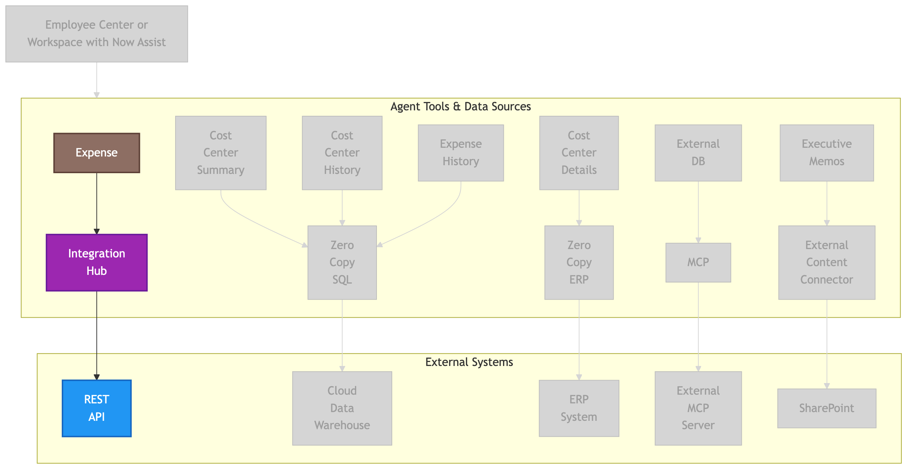</picture><figcaption></figcaption></figure>

> **Legend:** 🟤 Data | 🟣 Workflow Data Fabric | 🔵 External Systems | ↓ Takes data from

## Lab Exercise: Integration Hub

[Take me back to main page](../)

This lab will walk you through the configuration and usage of **Actions** and **Flows** to get expense data from an external source periodically or ad hoc and trigger an agent which will evaluate the expense data and create a Finance case if the involved cost center will be over budget.

There are dedicated Integration Hub and Flow Designer labs; hence, the focus of this exercise is to walk through the configurations in AI Agent Studio and Flow Designer. There is an exercise at the end for you to configure an **Action**, which aims to provide an understanding on how the AI Agents are triggered.

<figure>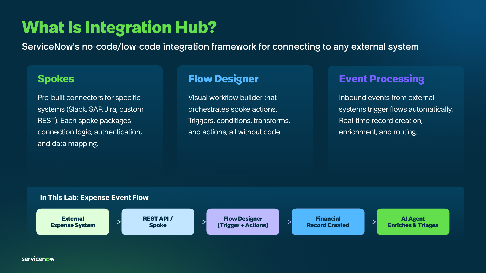<figcaption></figcaption></figure>

<figure>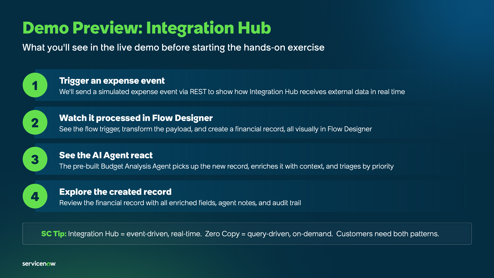<figcaption></figcaption></figure>

### Lab Sections and Objectives

<table><thead><tr><th width="83">Step</th><th width="106">Who</th><th>Description</th></tr></thead><tbody><tr><td><a href="lab-exercise-integration-hub.md#data-flow">1</a></td><td>Facilitator</td><td><strong>Context Setting:</strong> Review the data flow diagram. Understand how ServiceNow consumes REST API endpoints via Integration Hub, processes them through a Flow, triggers an AI Agent, and creates a Finance Case automatically.</td></tr></tbody></table>

**Preparation**

<table><thead><tr><th width="83">Step</th><th width="106">Who</th><th>Description</th></tr></thead><tbody><tr><td><a href="lab-exercise-integration-hub.md#preparation-platform-configuration">2</a></td><td>Student</td><td><strong>Platform Configuration:</strong> Set up scope, authorization (<code>sn_aia.admin</code> role), and Now Assist configurations including Assistant Designer and Now Assist Admin panel settings.</td></tr><tr><td><a href="lab-exercise-integration-hub.md#preparation-initial-checks">3</a></td><td>Student</td><td><strong>Initial Check:</strong> Verify Now Assist panel is accessible. Navigate to the Expense Transaction Event table and verify it's empty. Delete entry/entries if there are any.</td></tr><tr><td><a href="lab-exercise-integration-hub.md#hands-on-connection-setup">4</a></td><td>Student</td><td><strong>Connection Setup:</strong> Navigate to Connection &#x26; Credential Aliases. Open the pre-configured "Get Expense Event" alias. Create a new Connection pointing to the REST API endpoint.</td></tr></tbody></table>

**AI Agent Configuration**

<table><thead><tr><th width="83">Step</th><th width="106">Who</th><th>Description</th></tr></thead><tbody><tr><td><a href="lab-exercise-integration-hub.md#walkthrough-custom-forecast-variance-ai-agent">5</a></td><td>Student</td><td><strong>AI Agent Walkthrough:</strong> Open AI Agent Studio > Forecast Variance Integration Hub Trigger. Explore: Define the specialty (plain English instructions), Add tools (Search retrievals + Subflows), Define security controls (Dynamic user + admin role).</td></tr><tr><td><a href="lab-exercise-integration-hub.md#hands-on-configure-ai-agent-trigger">6</a></td><td>Student</td><td><strong>Configure the Trigger:</strong> Delete any existing trigger. Create new trigger: Table = Expense Transaction Event, Field = Vendor, Condition = is not empty. Toggle trigger ON. Verify Select channels and status. Verify Now Assist panel is toggled on and Now Assist in Virtual Agent is added. Save.</td></tr></tbody></table>

**Action and Subflow**

<table><thead><tr><th width="83">Step</th><th width="106">Who</th><th>Description</th></tr></thead><tbody><tr><td><a href="lab-exercise-integration-hub.md#walkthrough-action">7</a></td><td>Student</td><td><strong>Action Walkthrough:</strong> Open Flow Designer > Actions > Get Expense Event. Explore the Base URL, Imported Specifications, and Output mappings. Understand how REST response maps to table fields.</td></tr><tr><td><a href="lab-exercise-integration-hub.md#hands-on-flow-execution">8</a></td><td>Student</td><td><strong>Run the Flow:</strong> Open Flow Designer > Subflows > Get Expense Event. Click Test > Run Test. Wait for completion. Click execution details link. Verify all steps show Completed or Evaluated - True.</td></tr></tbody></table>

**AI Agent and Finance Operations Workspace**

<table><thead><tr><th width="83">Step</th><th width="106">Who</th><th>Description</th></tr></thead><tbody><tr><td><a href="lab-exercise-integration-hub.md#walkthrough-agent-runtime">9</a></td><td>Student</td><td><strong>Watch the AI Agent React:</strong> Return to AI Agent Studio browser window. Look for the Now Assist badge. Open Now Assist chat. Expand to Modal view. Explore: planning steps, event ID extraction, RAG search results, budget analysis, Finance Case link.</td></tr><tr><td><a href="lab-exercise-integration-hub.md#completion-verify-finance-case">10</a></td><td>Student</td><td><strong>Verify the Finance Case:</strong> Navigate to Finance Operations Workspace. Find the case created by the agent. Confirm it contains the cost center, vendor, and budget analysis.</td></tr></tbody></table>

<table><thead><tr><th width="83">Step</th><th width="106">Who</th><th>Description</th></tr></thead><tbody><tr><td><a href="lab-exercise-integration-hub.md#conclusion">11</a></td><td>Facilitator</td><td><strong>Conclusion:</strong> Walk through the complete data flow chain. External event triggers proactive financial intelligence with zero human intervention.</td></tr></tbody></table>

### Data flow

The data flow below shows how ServiceNow will consume REST API endpoints via Integration Hub Spokes then further processed by a Flow so the entries will be written in the scoped table.

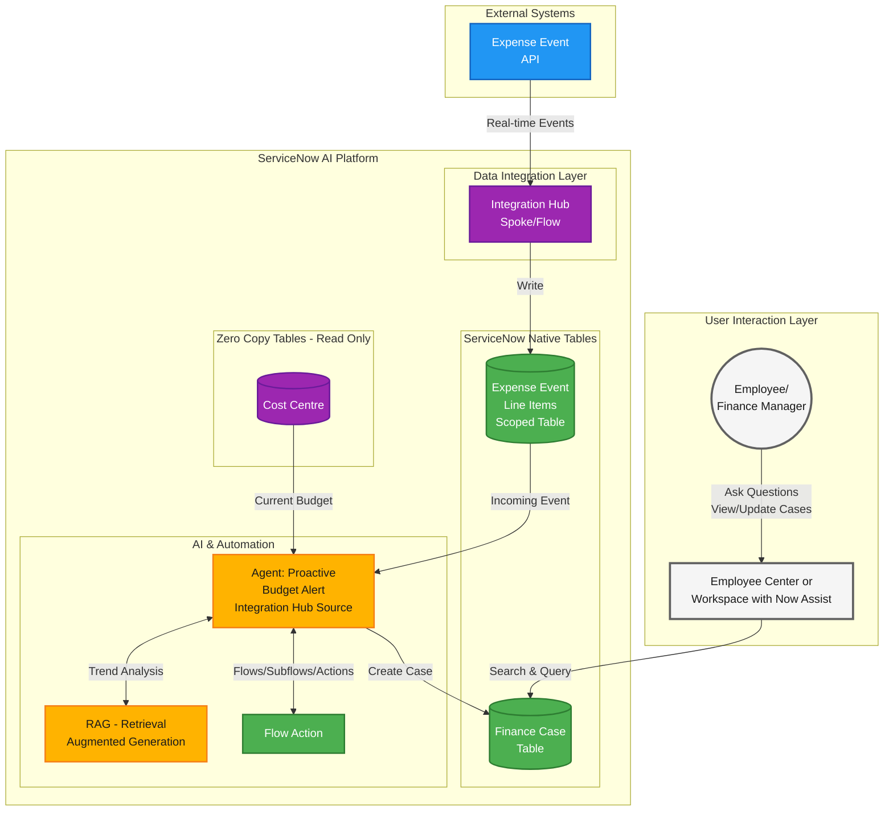
```mermaid
graph TB
    subgraph "User Interaction Layer"
        Employee((Employee/<br/>Finance Manager))
        EC[Employee Center or<br/> Workspace with Now Assist]
    end

    subgraph "External Systems"
        ExpenseAPI[Expense Event<br/>API]
    end

    subgraph "ServiceNow AI Platform"
        subgraph "Data Integration Layer"
            IntHub[Integration Hub<br/>Spoke/Flow]
        end

        subgraph "Zero Copy Tables - Read Only"
            ZCCC[(Cost Centre)]
        end

        subgraph "ServiceNow Native Tables"
            ExpenseTable[(Expense Event<br/>Line Items<br/>Scoped Table)]
            FinCase[(Finance Case<br/>Table)]
        end

        subgraph "AI & Automation"
            Agent2[Agent: Proactive<br/>Budget Alert<br/>Integration Hub Source]
            RAG[RAG - Retrieval<br/>Augmented Generation]
            FlowAction[Flow Action]
        end
    end

    %% Data Flow Connections
    ExpenseAPI -->|Real-time Events| IntHub
    IntHub -->|Write| ExpenseTable

    %% Agent 2 Workflow - Integration Hub Source
    ExpenseTable -->|Incoming Event| Agent2
    ZCCC -->|Current Budget| Agent2
    Agent2 -->|Create Case| FinCase
    Agent2 <-->|Trend Analysis| RAG
    Agent2 <-->|Flows/Subflows/Actions| FlowAction

    %% User Interaction Connections
    Employee -->|Ask Questions<br/>View/Update Cases| EC
    EC -->|Search & Query| FinCase

    %% Styling
    classDef external fill:#2196F3,stroke:#1565C0,stroke-width:2px,color:#fff
    classDef user fill:#F5F5F5,stroke:#616161,stroke-width:3px,color:#1a1a1a
    classDef nowassist fill:#FFB300,stroke:#F57F17,stroke-width:2px,color:#1a1a1a
    classDef platform fill:#4CAF50,stroke:#2E7D32,stroke-width:2px,color:#fff
    classDef wdf fill:#9C27B0,stroke:#6A1B9A,stroke-width:2px,color:#fff

    class ExpenseAPI external
    class IntHub wdf
    class ZCCC wdf
    class ExpenseTable,FinCase platform
    class Agent2,RAG nowassist
    class FlowAction platform
    class Employee,EC user
```

> **Color Legend:** 🟡 Now Assist | 🟢 Platform | 🟣 Workflow Data Fabric | 🔵 External Systems | ⚪ User Interaction
>
> [📊 View High-Resolution Diagram](https://raw.githubusercontent.com/leojacinto/WorkflowDataFabric-TypeB/main/.gitbook/assets/dataflow_integration_hub.png)

### Preparation

#### Preparation: Platform Configuration

These are required preparation steps in platform level. These are cross configurations that affect instance behaviour (across applications).

1. As **admin** user, this preparation section includes setting up of the scope, authorisation and Now Assist configurations.
2.  Ensure you are in the correct scope. Click on the <mark style="color:green;">**a.)**</mark> **scope** (globe icon) and <mark style="color:green;">**b.)**</mark> **Forecast Variance**, this time <mark style="color:red;">**WITHOUT**</mark> your initials.

    <figure>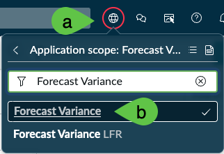<figcaption></figcaption></figure>
3.  Navigate to **All** > <mark style="color:green;">**a.)**</mark> type **Users and Groups** > <mark style="color:green;">**b.)**</mark> click on **Users and Groups > Users**.

    <figure>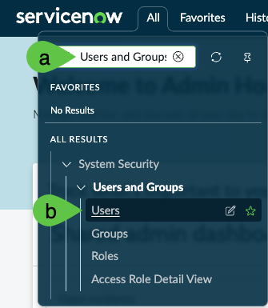<figcaption></figcaption></figure>
4.  Search for <mark style="color:green;">**a.)**</mark> **System Administrator** then hit **Return/Enter ↵** > <mark style="color:green;">**b.)**</mark> click on **admin**.

    <figure>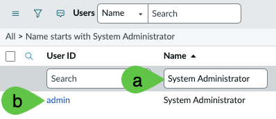<figcaption></figcaption></figure>
5.  In the **Roles** tab, click **Edit**.

    <figure>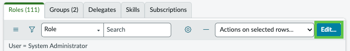<figcaption></figcaption></figure>
6.  Search for <mark style="color:green;">**a.)**</mark> **sn\_aia.admin** > <mark style="color:green;">**b.)**</mark> click on **sn\_aia.admin** > <mark style="color:green;">**c.)**</mark> click on **>** to move the role to the right panel > then <mark style="color:green;">**d.)**</mark> click **Save**. You will notice that there are also roles for integration and viewer purposes which can be assigned for users who will need less privileges.

    <figure>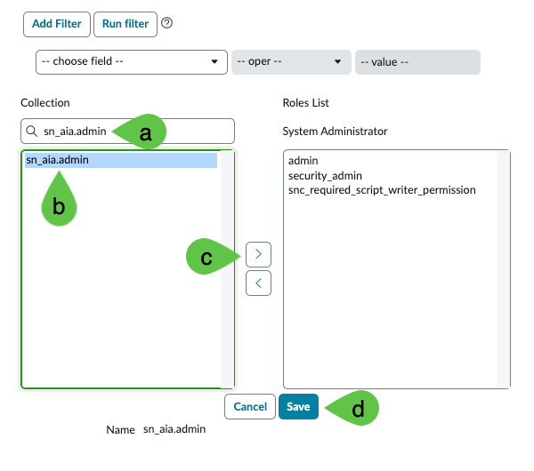<figcaption></figcaption></figure>
7.  Right-click on the top panel and click **Save**.

    <figure>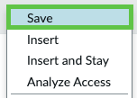<figcaption></figcaption></figure>
8.  <mark style="color:red;">**IMPORTANT**</mark>. Log out and log back in.

    <figure>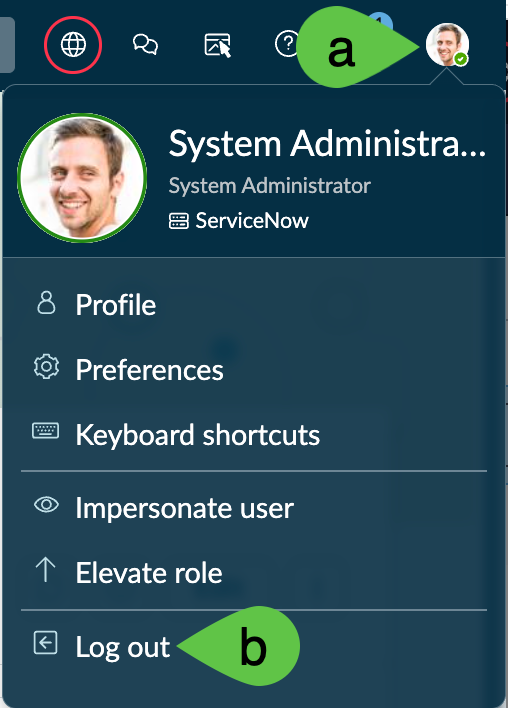<figcaption></figcaption></figure>

#### Preparation: Initial Checks

Verify Now Assist panel is accessible. Navigate to the Expense Transaction Event table and verify it's empty. Delete entry/entries if there are any.

1.  If you have set up the Now Assist Panel correctly, you should see the Now Assist icon on the top right.

    <figure><figcaption></figcaption></figure>
2.  Ensure you are in the correct scope. Click on the <mark style="color:green;">**a.)**</mark> **scope** (globe icon) and <mark style="color:green;">**b.)**</mark> **Forecast Variance**, this time <mark style="color:red;">**WITHOUT**</mark> your initials.

    <figure><figcaption></figcaption></figure>
3.  Go to **All** > type **x\_snc\_forecast\_v\_0\_expense\_transaction\_event.list** and hit **Return/Enter ↵**. Ensure that it is empty.

    <figure>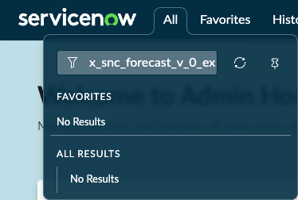<figcaption></figcaption></figure>
4. This list **SHOULD** be **EMPTY** for the AI agent to work. If it is **NOT** empty, <mark style="color:green;">**a.)**</mark> click on all the items by clicking the **top-rightmost check box** > <mark style="color:green;">**b.)**</mark> click **Action on selected rows...** > <mark style="color:green;">**c.)**</mark> click **Delete** > <mark style="color:green;">**d.)**</mark> click **Delete** again. The flow does not have robust exception handling for this lab so this manual step is required to ensure that the scripts will run properly.

<figure><figcaption></figcaption></figure>

#### Hands-on: Connection Setup

Navigate to Connection & Credential Aliases. Open the pre-configured "Get Expense Event" alias. Create a new Connection pointing to the REST API endpoint.

1.  Navigate to **All** > <mark style="color:green;">**a.)**</mark> type **Connection & Credential Aliases** then <mark style="color:green;">**b.)**</mark> click **Connections & Credentials > Connection & Credential Aliases**.

    <figure>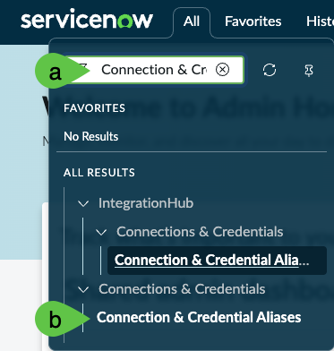<figcaption></figcaption></figure>
2.  Search for <mark style="color:green;">**a.)**</mark>**&#x20;Get Expense Even**t then <mark style="color:green;">**b.)**</mark> click on **Get Expense Event**. This is a pre-configured alias to reduce the rewiring needed for this lab exercise.

    <figure>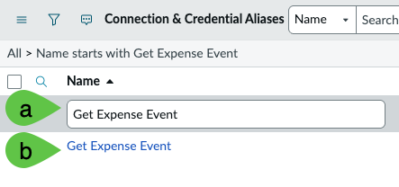<figcaption></figcaption></figure>
3.  In the next screen, navigate to **Connections** > **New**. In this alias, we are creating a new connection which will get data from the REST API endpoint and serve as trigger for our AI Agent.

    <figure>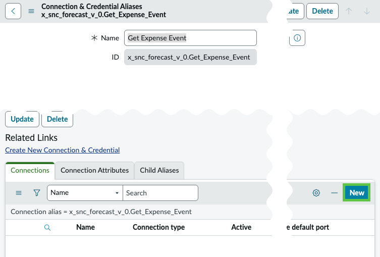<figcaption></figcaption></figure>
4.  Provide <mark style="color:green;">**a.)**</mark> **Name** as **Get Expense Event**, <mark style="color:green;">**b.)**</mark>**&#x20;Connection URL** as [**https://expense-event.free.beeceptor.com**](https://expense-event.free.beeceptor.com) then <mark style="color:green;">**c.)**</mark> click **Submit**. The structure of the table in [Lab Exercise: Fundamentals](https://servicenow-lf.gitbook.io/the-workflow-data-fabric-loom/lab-exercise-fundamentals) is based on the data coming from this REST API endpoint. The data from this endpoint will be written into the scoped table through a scoped **Action**.

    <figure>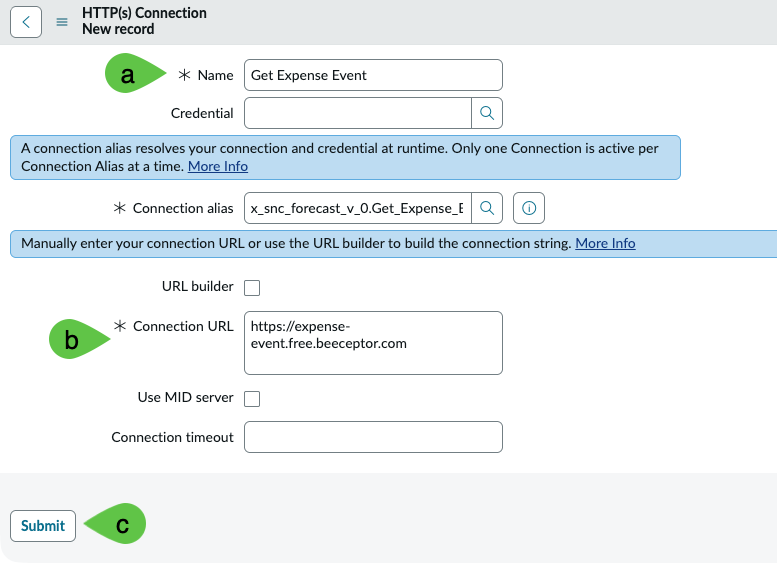<figcaption></figcaption></figure>

### AI Agent Configuration

#### Walkthrough: Custom Forecast Variance AI Agent

This is a walk through of how an AI agent equipped with both deterministic and probabilistic capabilities can automate research and validation of cost center history and expenses; as well as creation of Finance Cases should cost centers be above their budget allocations. <mark style="color:red;">**Note:**</mark> this is a custom AI agent pre-configured in the lab instance provided in ServiceNow-led lab sessions; this is not an OOTB agent.

For this section: Open AI Agent Studio > Forecast Variance Integration Hub Trigger. Explore: Define the specialty (plain English instructions), Add tools (Search retrievals + Subflows), Define security controls (Dynamic user + admin role).

1. Navigate to **All** > <mark style="color:green;">**a.)**</mark> type **AI Agent Studio** > <mark style="color:green;">**b.)**</mark> click on **Create and Manage**.

<figure><figcaption></figcaption></figure>

2.  This will go to the list of Agentic workflows and AI agents. Go to **AI agents** tab > <mark style="color:green;">**a.)**</mark> click **Conditions** > <mark style="color:green;">**b.)**</mark> select **Field** as **Name** <mark style="color:green;">**c.)**</mark> **Operator** as **is** and for <mark style="color:green;">**d.)**</mark> Value type **Forecast Variance** **Integration Hub Trigger** and hit **Return/Enter ↵**. Click on the <mark style="color:green;">**e.)**</mark> result.

    <figure>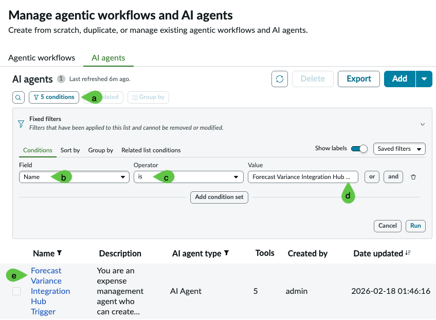<figcaption></figcaption></figure>
3. Click on **Define the specialty**. This shows all the instructions for this AI Agent created in plain English. The **List of steps** describes the sequence, purpose, and nuances of the tools configured, which are shown in the next section. No further action is required in this section.

<figure>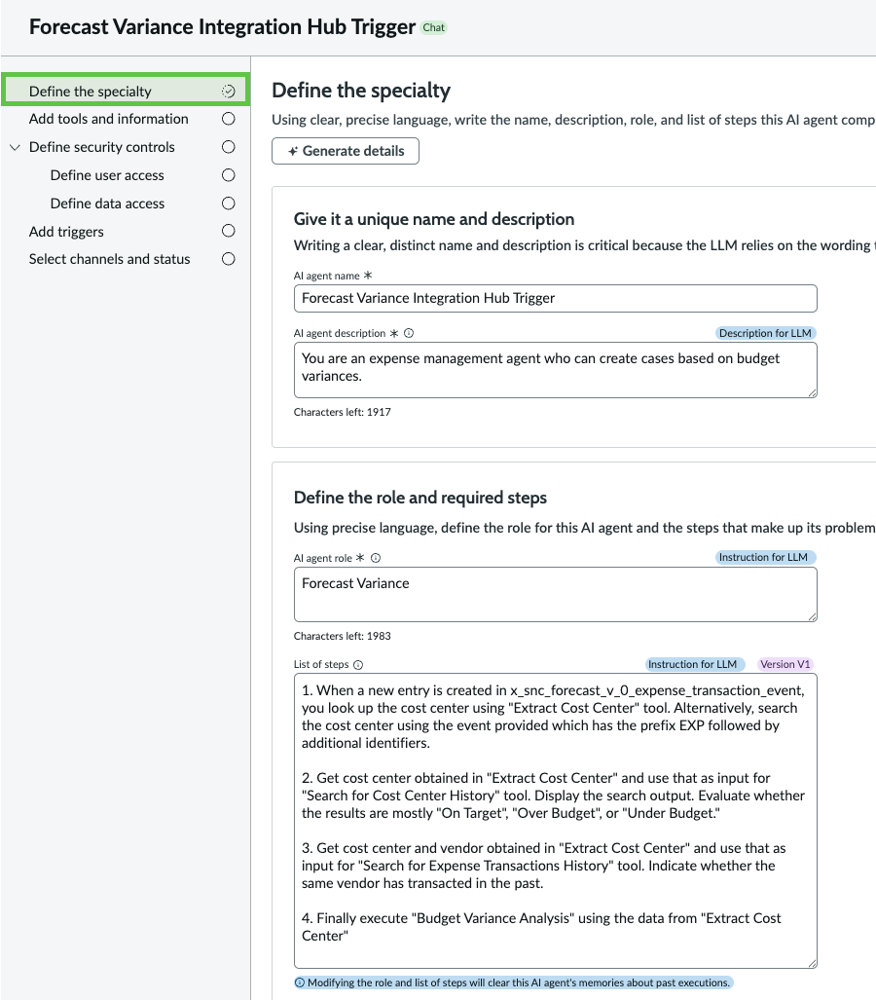<figcaption></figcaption></figure>

4. Next, click on **Add tools and information**. This is a collection of **Search retrievals** and **Subflows** that are used by the agent. The purpose and sequence of these tools are also described in the section **Define the specialty**. No further action is required in this section but feel free to explore the configurations of each of the tools. Below is a brief description of the tools configured for this agent:

**a.) Extract Event ID:** Gets the event ID from the Expense Transaction Event table (x\_snc\_forecast\_v\_0\_expense\_transaction\_event) from the entry created by the action Get Expense event (via REST).

**b.) Extract Cost Center:** gets the cost center from the expense event that is written into the Expense Transaction Event table (x\_snc\_forecast\_v\_0\_expense\_transaction\_event).

**c.) Search Cost Center History:** a RAG based tool which gets the history of a cost center; i.e., is the cost center frequently exceeding its budget? Output serves as reference for the Finance team without the need pull out data for themselves or opening requests to data teams.

**d.) Search for Expense Transactions History:** a RAG based tools which gets the expenses/invoices from a cost center to provide even more granular detail. Output serves as reference for the Finance team without the need pull out data for themselves or opening requests to data teams.

**e). Budget Variance Analysis:** a deterministic flow that assesses whether the latest expense event caused the relevant cost center to be over-budget; if over-budget, creates a Finance Case.

<figure>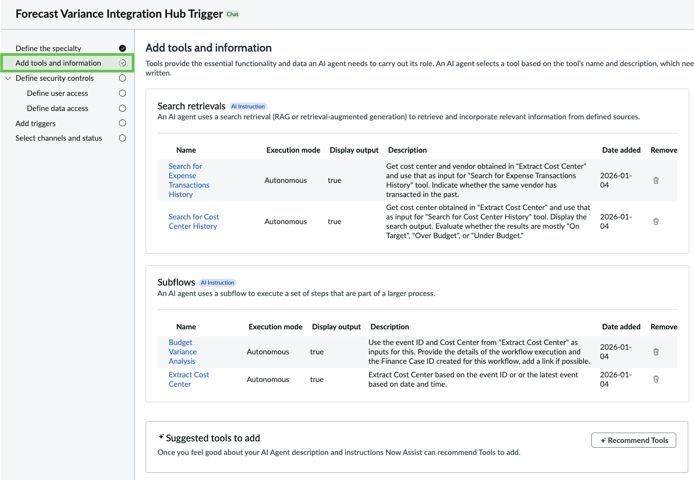<figcaption></figcaption></figure>

5. Under **Define security controls** > <mark style="color:green;">**a.)**</mark> click **Define data access** > <mark style="color:green;">**b.)**</mark> select **Dynamic user** from the drop down then > <mark style="color:green;">**c.)**</mark> add **admin** user as the **Approved role** if the field is not filled out yet. For this exercise we are using permissive authorisations but this is where you can tighten authorisations for your agents allowing mechanisms such as inheriting the authorisations of logged in user (Dynamic identity type) or a predefined set of access (AI User identity type).

<figure>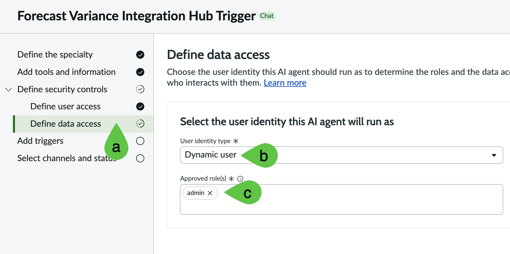<figcaption></figcaption></figure>

#### Hands-on: Configure AI Agent Trigger

Delete any existing trigger. Create new trigger: Table = Expense Transaction Event, Field = Vendor, Condition = is not empty. Toggle trigger ON. Save.

1. Next, click on **Define trigger**, which is a key part of this exercise.

<figure>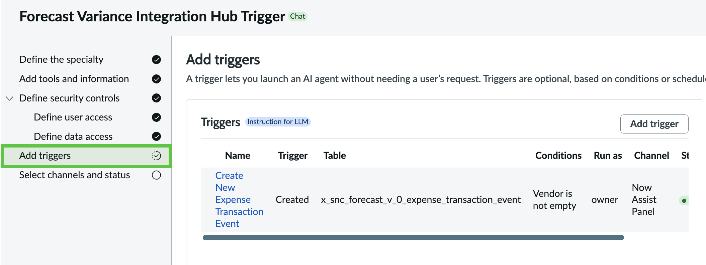<figcaption></figcaption></figure>

2. <mark style="color:red;">**\[IMPORTANT STEP]**</mark> Due to a bug related to the update set for this lab, if there is an existing trigger, you will need to delete that and **re-create**. Click the <mark style="color:green;">**a.)**</mark> **delete** icon then <mark style="color:green;">**b.)**</mark> click **Add trigger**.

<figure>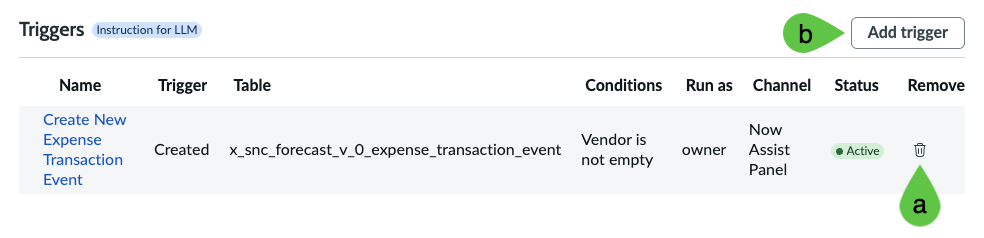<figcaption></figcaption></figure>

3. Enter the details below for the trigger. These are basic information to identify your trigger. When the parameters in the trigger are satisfied, this will fire off the AI agent.

<mark style="color:green;">**a.)**</mark> **Select trigger**: **Created**

<mark style="color:green;">**b.)**</mark> **Name**: **Create New Expense Transaction Event \<YOUR INITIALS>**

<mark style="color:green;">**c.)**</mark> **Trigger**: toggle **ON**

<mark style="color:green;">**d.)**</mark> Scroll down

<figure>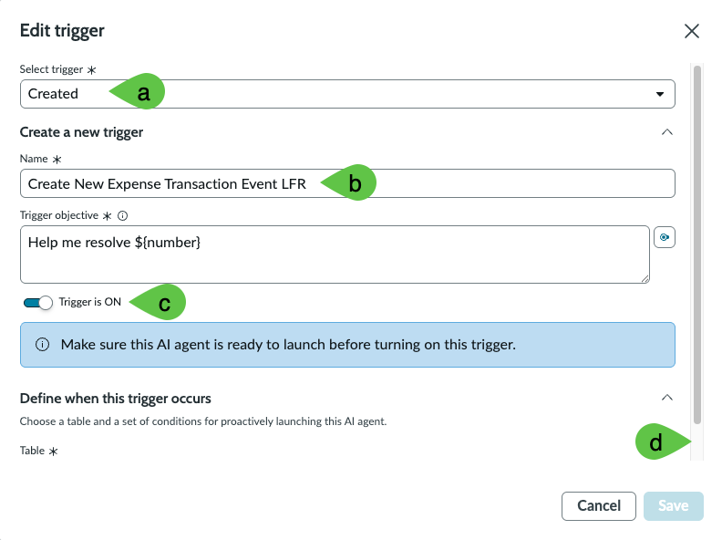<figcaption></figcaption></figure>

4. More details to add below before finally saving the trigger configuration. These configurations include the target table and field and condition that needs to be satisfied to fire off the trigger, as well as logging.

<mark style="color:green;">**a.)**</mark> **Table**: **Expense Transaction Event**

<mark style="color:green;">**b.)**</mark> **Field**: **Vendor**

<mark style="color:green;">**c.)**</mark> **Condition** > **Operator**: **is not empty**

<mark style="color:green;">**d.)**</mark> **Sys\_user**: **Owner**

<mark style="color:green;">**e.)**</mark> **Save**

<figure>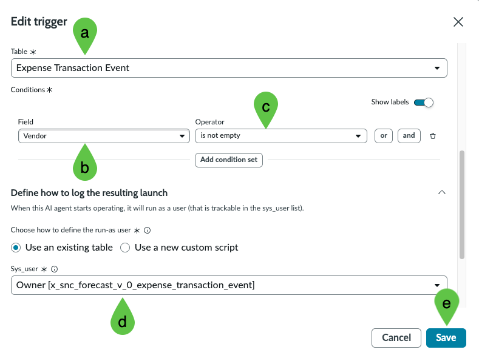<figcaption></figcaption></figure>

5. Click **Save and Continue**.

<figure><figcaption></figcaption></figure>

6. Finally, click on <mark style="color:green;">**a.)**</mark> **Select channels and status**. This configures the availability of the AI agent. In this case, it is enabled and can be accessed using <mark style="color:green;">**b.)**</mark>**&#x20;Now Assist panel** toggled on as well as via <mark style="color:green;">**c.)**</mark>**&#x20;Now Assist in Virtual Agent** added as chat assistant. Make sure your configuration is set as below. Once done, <mark style="color:green;">**d.)**</mark> click **Save**. <mark style="color:green;">**Keep this browser window open! You will need again it later**</mark>.

<figure>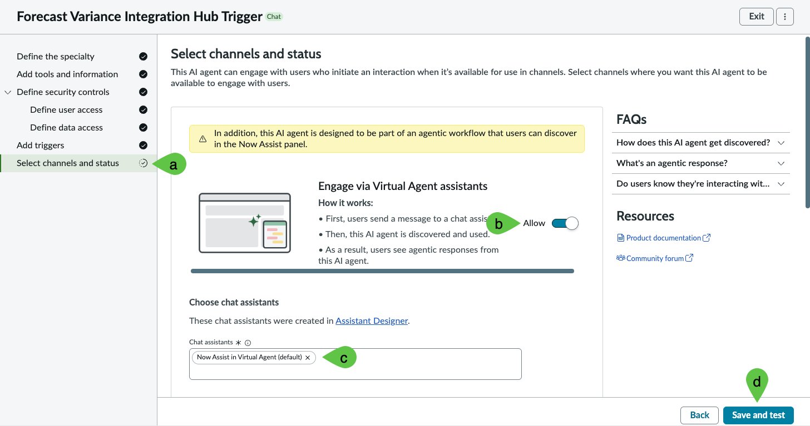<figcaption></figcaption></figure>

### Action and Subflow

#### Walkthrough: Action

The scoped **Action** is a key feature for the trigger that obtains expense data via REST API. If you wish to learn more on how Flows and AI Agents can get more granular and higher throughput of data through streaming, have a look at the bonus exercise on [Stream Connect for Apache Kafka](https://servicenow-lf.gitbook.io/the-workflow-data-fabric-loom/lab-exercise-kafka_stream_connect).

For this section: Open Flow Designer > Action > Get Expense Event to get an idea how Actions are configured and to understand their dependencies with [Connections](https://servicenow-lf.gitbook.io/the-workflow-data-fabric-loom/main-exercises/lab-exercise-integration-hub#hands-on-connection-setup).

This action will populate the expense events coming from the external API endpoint we just configured.

1.  Navigate to All > <mark style="color:green;">**a.)**</mark> type **Flow Designer** and go to <mark style="color:green;">**b.)**</mark> **Process Automation** > **Flow Designer**. This will open the app in a new tab.

    <figure>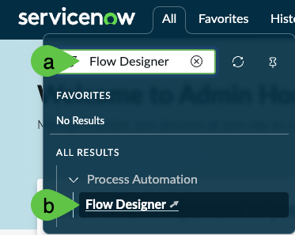<figcaption></figcaption></figure>
2.  In the new **Flow Designer** tab that just opened, <mark style="color:green;">**a.)**</mark> click **Actions** > <mark style="color:green;">**b.)**</mark> **more (vertical three dots)** > <mark style="color:green;">**c.)**</mark> type **Get Expense Event** then <mark style="color:green;">**d.)**</mark> click **Apply**.

    <figure>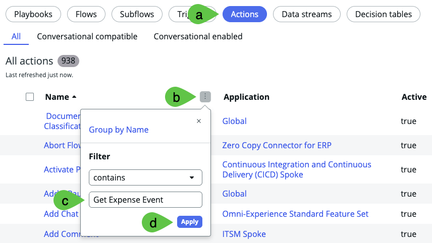<figcaption></figcaption></figure>
3.  Click on Get **Expense Event**. <mark style="color:$warning;">**Note:**</mark> this might take a while to load.

    <figure>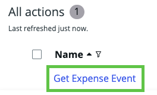<figcaption></figcaption></figure>
4.  In this current version of the lab, we will walk you through the components. Click on <mark style="color:green;">**a.)**</mark> **Get Expense Event**. The <mark style="color:green;">**b.)**</mark> **Base URL** here is coming from a service that creates the expense event and the <mark style="color:green;">**c.)**</mark> **Imported Specifications** are also generated from the same service. No further action is needed in this section.

    <figure>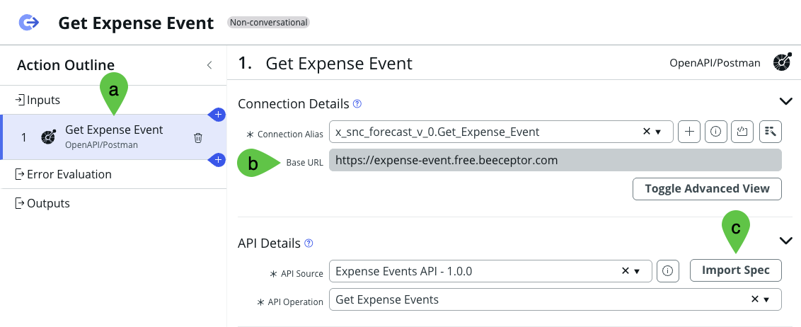<figcaption></figcaption></figure>
5.  Got to <mark style="color:green;">**a.)**</mark> **Outputs** where <mark style="color:green;">**b.)**</mark> **output** is generated based on the Imported Specifications. This makes the table structure in [Lab Exercise: Fundamentals](https://servicenow-lf.gitbook.io/the-workflow-data-fabric-loom/lab-exercise-fundamentals) critical as missing or mismatched fields will cause this **Action** to fail in getting data from the REST endpoint.

    <figure>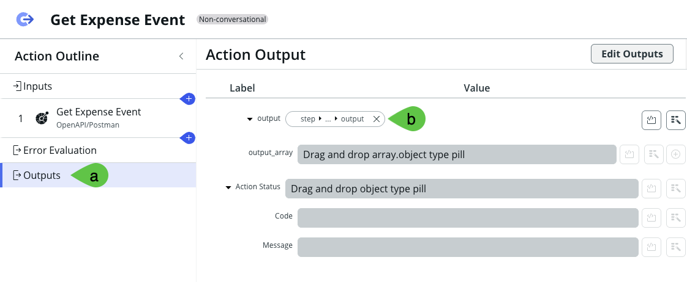<figcaption></figcaption></figure>
6. You now have familiarity of the **Action** used by the **Subflow** needed to trigger the **AI agent**, which is described in the next section.

#### Hands-on: Flow Execution

In the same window of Flow Designer > Subflows > Get Expense Event. Click Test > Run Test. Wait for completion. Click execution details link. Verify all steps show Completed or Evaluated - True.

1.  In a **current browser window**, click Workflow Studio to go back to the application home.

    <figure><figcaption></figcaption></figure>
2. In the new **Flow Designer** tab that just opened, <mark style="color:green;">**a.)**</mark> click **Subflows** > <mark style="color:green;">**b.)**</mark> **more (vertical three dots)** > <mark style="color:green;">**c.)**</mark> type Get Expense Event then <mark style="color:green;">**d.)**</mark> click **Apply**.

<figure><figcaption></figcaption></figure>

3. This will lead to the subflow below. We will not cover the build of this **Flow** in detail in this lab exercise. The key thing to note is that it makes use of the **Action** also called **Get Expense Event** to update the **Transaction Event Record** table which is critical for the automation.

<figure><figcaption></figcaption></figure>

4. On the top right corner of the same **Subflow** screen, click **Test**. This will run an actual execution of the **Get Expense Event** subflow and get the data from the REST API endpoint we created earlier.

<figure>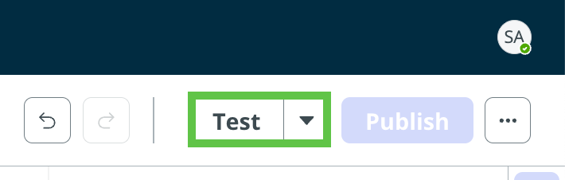<figcaption></figcaption></figure>

5. A pop-up will appear. Click **Run Test**.

<figure><figcaption></figcaption></figure>

6. After a few seconds, a link which states **Your test has finished running. View the subflow execution details.** - click on it.

<figure>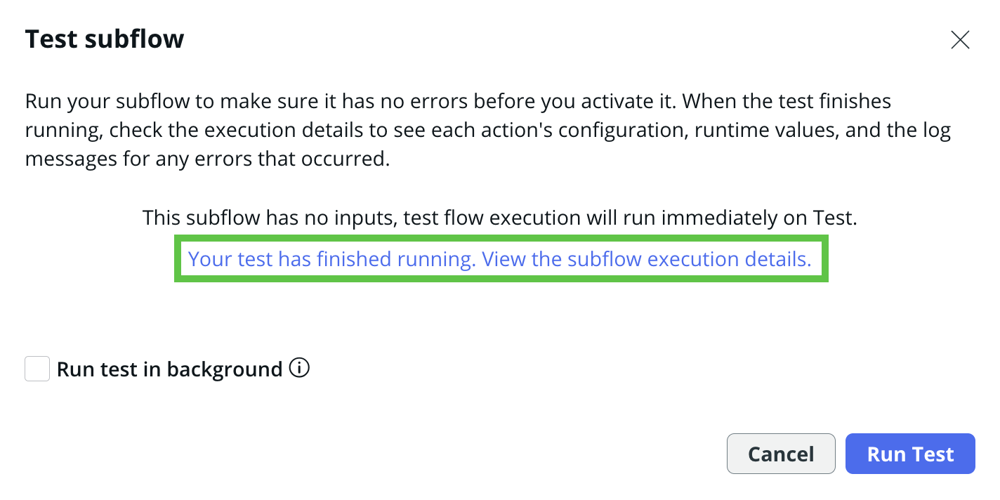<figcaption></figcaption></figure>

7. If everything is working as expected, all the steps would be either <mark style="color:green;">**Completed**</mark> or <mark style="color:green;">**Evaluated - True**</mark>.

<figure>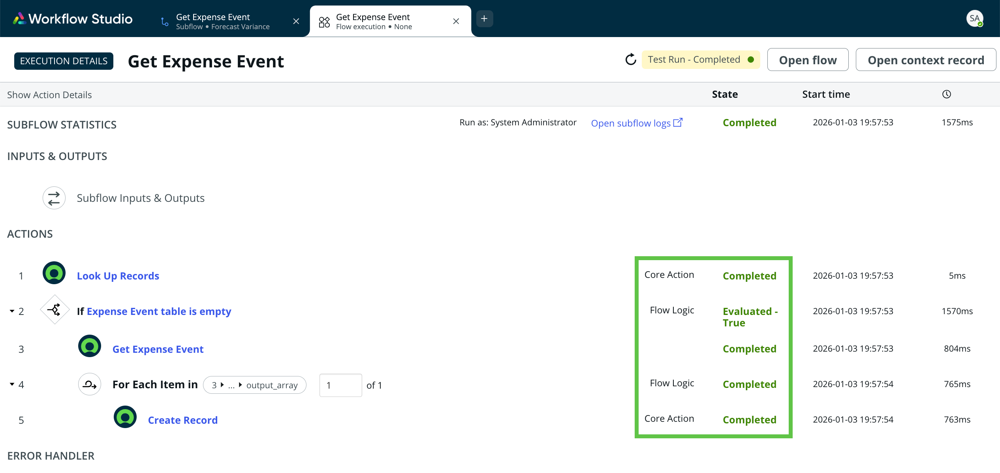<figcaption></figcaption></figure>

### AI Agent and Finance Operations Workspace

#### Walkthrough: Agent Runtime

Return to AI Agent Studio browser window. Look for the Now Assist badge. Open Now Assist chat. Expand to Modal view. Explore: planning steps, event ID extraction, RAG search results, budget analysis, Finance Case link.

1. Go back to the earlier browser window with **AI Agent Studio**. You will notice that there is a new **Now Assist badge**. This is the AI agent at work in the back end because the **Get Expense Event** subflow has triggered a change in the **Expense Transaction Event** table. Click on the **Now Assist icon** with the updated badge count. <mark style="color:$warning;">**Note:**</mark> if the **Now Assist badge** does not appear, simply reload your page. <mark style="color:$warning;">**In some cases the badge won't load at all**</mark> so simply open Now Assist and look for new chats/correspondences.

<figure>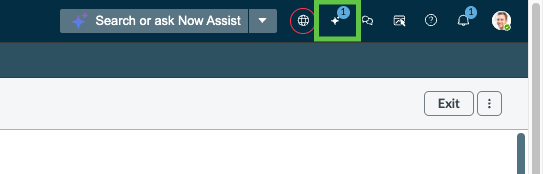<figcaption></figcaption></figure>

2. This will open the **Now Assist** chat. Click on the two-headed diagonal arrow to Enter **Modal**.

<figure>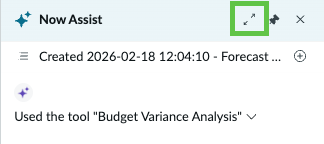<figcaption></figcaption></figure>

3. Here is an overview of the steps that were executed.

<mark style="color:green;">**a.)**</mark> Expand **Planning the next steps** show tools used.

<mark style="color:green;">**b.)**</mark> Note the **event ID** extracted from the expense event.

<mark style="color:green;">**c.)**</mark> Note the **cost\_center** and **vendor** extracted from the expense event.

<mark style="color:green;">**d.)**</mark> The clickable results from the **Retrieval-augmented Generation (RAG) search** are shown. This step helps you check relevant entries for the cost center associated with the expense event so you can do further investigation if needed.

<mark style="color:green;">**e.)**</mark> You can also access the **RAG search** results for the vendors associated with the expense event.

<mark style="color:green;">**f.)**</mark> Finally, if the expense event will lead to the associated cost center being over budget, the total cost center expense and the **Finance Case** created for exceeding the budget for further review and action is listed. In this case it is FINC0010020.

<figure>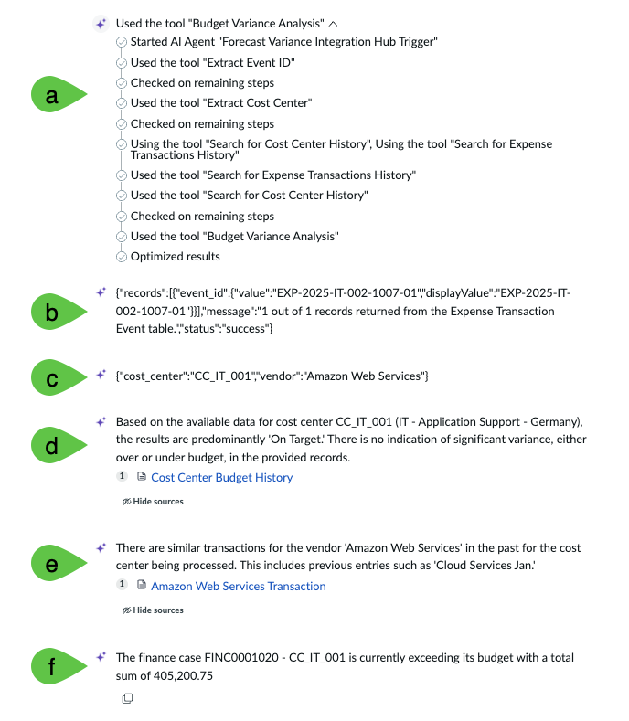<figcaption></figcaption></figure>

#### Completion: Verify Finance Case

Navigate to Finance Operations Workspace. Find the case created by the agent. Confirm it contains the cost center, vendor, and budget analysis.

1. Navigate to Workspaces > <mark style="color:green;">**a.)**</mark> type **Finance Operations Workspace** and click on the <mark style="color:green;">**b.)**</mark> workspace with the same name. We will now check if Finance Case has been created successfully.

<figure>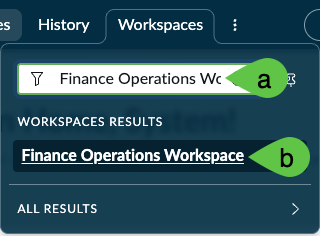<figcaption></figcaption></figure>

2. For this exercise, we are not impersonating a persona so you remain as the System user.

<figure>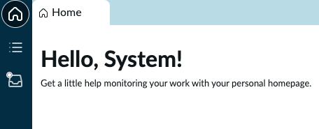<figcaption></figcaption></figure>

3. Go to <mark style="color:green;">**a.)**</mark> **list (list icon)** > <mark style="color:green;">**b.)**</mark> **Lists** > <mark style="color:green;">**c.)**</mark> sort by **Number** descending/ascending > <mark style="color:green;">**d.)**</mark> or look for the Finance case created by the AI agent, FINC0010020 in the example above.

<figure>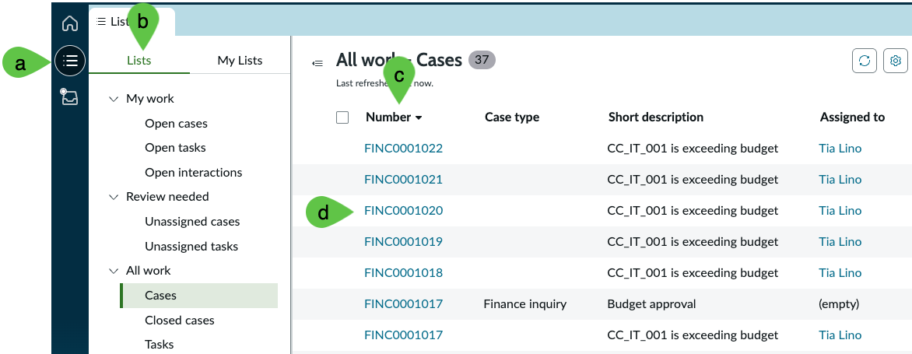<figcaption></figcaption></figure>

### Conclusion

Congratulations! You have created the **Workflow Data Fabric** integrations that powers the **Financial Forecast Variance Agent** allowing proactive creation of cases based on multiple data sources in a complex landscape to allow proactive management of budgets with zero human intervention. The AI Agent is triggered as soon as there are changes in the **Expense Transaction Event** table.

### Next step

Let us continue building the data foundations for AI Agents to use. The next suggested exercise is to go deep dive in the data integrations used by the same agent in this exercise - Zero Copy.

[Take me back to main page](../)
