# Lab Exercise: Zero Copy Connectors

[Take me back to main page](../)

This lab will walk you through integration of data coming from Cloud Data Warehouses and ERP using Zero Copy Connectors (ZCC) for SQL and ERP respectively.

## Lab Sections and Objectives

<table><thead><tr><th width="83">Step</th><th width="106">Who</th><th>Description</th></tr></thead><tbody><tr><td><a href="lab-exercise-zero-copy-connectors.md#data-flow">1</a></td><td>Facilitator</td><td><strong>Context Setting:</strong> Review the data flow diagram showing how ServiceNow consumes data from Cloud Data Warehouses and ERP systems via Zero Copy Connectors for SQL and ERP.</td></tr></tbody></table>

**Preparation**

<table><thead><tr><th width="83">Step</th><th width="106">Who</th><th>Description</th></tr></thead><tbody><tr><td><a href="lab-exercise-zero-copy-connectors.md#preparation-platform-configuration">2</a></td><td>Student</td><td><strong>Platform Configuration:</strong> Complete Integration Hub platform configuration if not done. Assign <code>sn_erp_integration.erp_admin</code> role to admin user.</td></tr></tbody></table>

**Zero Copy Connector for ERP**

<table><thead><tr><th width="83">Step</th><th width="106">Who</th><th>Description</th></tr></thead><tbody><tr><td><a href="lab-exercise-zero-copy-connectors.md#walkthrough-explore-zcc-for-erp-workspace">3</a></td><td>Student</td><td><strong>ZCC for ERP Workspace:</strong> Navigate to Zero Copy Connector for ERP Home. Explore the workspace layout.</td></tr><tr><td><a href="lab-exercise-zero-copy-connectors.md#hands-on-clone-erp-data-product-for-cost-center">4</a></td><td>Student</td><td><strong>Clone ERP Data Product:</strong> Clone the OOTB DP: Cost Center model. Label it SAP Cost Center. Assign ERP system S4D.</td></tr><tr><td><a href="lab-exercise-zero-copy-connectors.md#walkthrough-explore-zcc-for-erp-bapi-entity">5</a></td><td>Student</td><td><strong>ERP BAPI Entity:</strong> Review the BAPI_COSTCENTER_GETDETAIL1 entity. Explore Specify Inputs and Choose Outputs configurations.</td></tr><tr><td><a href="lab-exercise-zero-copy-connectors.md#walkthrough-explore-zcc-for-erp-extraction-tables">6</a></td><td>Student</td><td><strong>ERP Extraction Tables:</strong> Filter and review SAP Cost Center extraction table. Navigate to the target table containing Cost Center Master Data from SAP.</td></tr></tbody></table>

**Zero Copy Connector for SQL**

<table><thead><tr><th width="83">Step</th><th width="106">Who</th><th>Description</th></tr></thead><tbody><tr><td><a href="lab-exercise-zero-copy-connectors.md#reference-cloud-data-warehouse-source">7</a></td><td>Student</td><td><strong>Cloud Data Warehouse Source:</strong> Review screenshot of the Snowflake source table used for Zero Copy for SQL (no backend access provided).</td></tr><tr><td><a href="lab-exercise-zero-copy-connectors.md#walkthrough-navigation-and-review-of-zcc-connection">8</a></td><td>Student</td><td><strong>ZCC Connection Review:</strong> Navigate to Workflow Data Fabric Hub. Review the established Snowflake connection details.</td></tr><tr><td><a href="lab-exercise-zero-copy-connectors.md#hands-on-configure-column-mappings">9</a></td><td>Student</td><td><strong>Configure Column Mappings:</strong> Create a data fabric table from the Snowflake data asset. Set Cost Center as a Reference field to the ERP extraction table. Set GL Account as primary key.</td></tr><tr><td><a href="lab-exercise-zero-copy-connectors.md#walkthrough-open-data-fabric-table">10</a></td><td>Student</td><td><strong>Open Data Fabric Table:</strong> View the data assets created and open the data fabric table contents.</td></tr></tbody></table>

**AI Agent and Finance Operations Workspace**

<table><thead><tr><th width="83">Step</th><th width="106">Who</th><th>Description</th></tr></thead><tbody><tr><td><a href="lab-exercise-zero-copy-connectors.md#walkthrough-custom-forecast-variance-ai-agent">11</a></td><td>Student</td><td><strong>AI Agent Walkthrough:</strong> Open AI Agent Studio. Review the Forecast Variance agent: specialty, tools, security controls, trigger (blank), and channel settings. Save and test.</td></tr><tr><td><a href="lab-exercise-zero-copy-connectors.md#hands-on-test-and-review-custom-ai-agent">12</a></td><td>Student</td><td><strong>Test AI Agent:</strong> Enter test prompt to process an expense event. Review planning steps, cost center and vendor extraction, RAG search results, and Finance Case creation.</td></tr><tr><td><a href="lab-exercise-zero-copy-connectors.md#completion-verify-finance-case">13</a></td><td>Student</td><td><strong>Verify the Finance Case:</strong> Navigate to Finance Operations Workspace. Find the case created by the agent.</td></tr></tbody></table>

<table><thead><tr><th width="83">Step</th><th width="106">Who</th><th>Description</th></tr></thead><tbody><tr><td><a href="lab-exercise-zero-copy-connectors.md#conclusion">14</a></td><td>Facilitator</td><td><strong>Conclusion:</strong> Walk through the complete data flow chain showing how Zero Copy Connectors bring external data into ServiceNow for AI Agent-driven case management.</td></tr></tbody></table>

## Data flow

The data flow below shows how ServiceNow consumes data from the local Expense Transaction Event table populated by REST API events. The events processed can be near-real-time or historical (e.g. transaction events after over a period of time). Aside from local tables, ServiceNow will also consume external data from a Cloud Data Warehouse and an ERP system via ZCC for SQL and ERP respectively. The data taken from the external sources will be used by an agent which will also create Finance Cases for Cost Centers which are going over budget. While majority of the workflow is handled deterministically, AI Agents will provide additional context by searching and comparing expenses and cost center histories to enrich the workflow data that will be used by the personnel in charge of the cost centers.

**Note**: future versions of this lab will include ServiceNow Enterprise Graph which will provide a universal query functionality that brings together the various internal and external data sources. As of Jan-2026, said feature is not globally available and is hence not yet included in this lab.

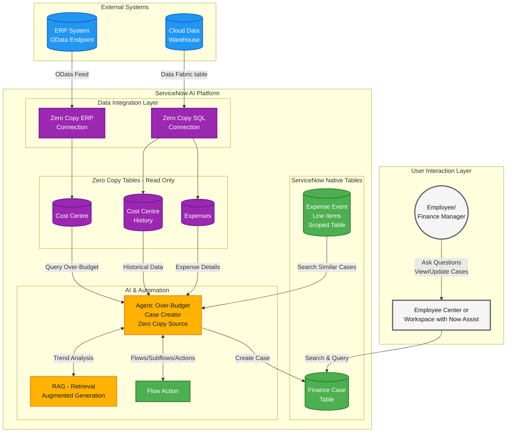
```mermaid
graph TB
    subgraph "User Interaction Layer"
        Employee((Employee/<br/>Finance Manager))
        EC[Employee Center or<br/> Workspace with Now Assist]
    end

    subgraph "External Systems"
        ERP[(ERP System<br/>OData Endpoint)]
        CDW[(Cloud Data<br/>Warehouse)]
    end

    subgraph "ServiceNow AI Platform"
        subgraph "Data Integration Layer"
            ZeroCopySQL[Zero Copy SQL<br/>Connection]
            ZeroCopyERP[Zero Copy ERP<br/>Connection]
        end

        subgraph "Zero Copy Tables - Read Only"
            ZCCC[(Cost Centre)]
            ZCCH[(Cost Centre</br>History)]
            ZCExp[(Expenses)]
        end

        subgraph "ServiceNow Native Tables"
            ExpenseTable[(Expense Event<br/>Line Items<br/>Scoped Table)]
            FinCase[(Finance Case<br/>Table)]
        end

        subgraph "AI & Automation"
            Agent1[Agent: Over-Budget<br/>Case Creator<br/>Zero Copy Source]
            RAG[RAG - Retrieval<br/>Augmented Generation]

            FlowAction[Flow Action]
        end
    end

    %% Data Flow Connections
    ERP -->|OData Feed| ZeroCopyERP
    CDW -->|Data Fabric table| ZeroCopySQL
    ZeroCopyERP --> ZCCC
    ZeroCopySQL --> ZCCH
    ZeroCopySQL --> ZCExp

    %% Agent 1 Workflow - Zero Copy Source
    ZCCC -->|Query Over-Budget| Agent1
    ZCCH -->|Historical Data| Agent1
    ZCExp -->|Expense Details| Agent1
    ExpenseTable -->|Search Similar Cases| Agent1
    Agent1 -->|Create Case| FinCase
    Agent1 <-->|Trend Analysis| RAG
    Agent1 <-->|Flows/Subflows/Actions| FlowAction

    %% User Interaction Connections
    Employee -->|Ask Questions<br/>View/Update Cases| EC
    EC -->|Search & Query| FinCase

    %% Styling
    classDef external fill:#2196F3,stroke:#1565C0,stroke-width:2px,color:#fff
    classDef user fill:#F5F5F5,stroke:#616161,stroke-width:3px,color:#1a1a1a
    classDef nowassist fill:#FFB300,stroke:#F57F17,stroke-width:2px,color:#1a1a1a
    classDef platform fill:#4CAF50,stroke:#2E7D32,stroke-width:2px,color:#fff
    classDef wdf fill:#9C27B0,stroke:#6A1B9A,stroke-width:2px,color:#fff

    class ERP,CDW external
    class ZeroCopySQL,ZeroCopyERP wdf
    class ZCCC,ZCCH,ZCExp wdf
    class ExpenseTable,FinCase platform
    class Agent1,RAG nowassist
    class FlowAction platform
    class Employee,EC user
```

> **Color Legend:** 🟡 Now Assist | 🟢 Platform | 🟣 Workflow Data Fabric | 🔵 External Systems | ⚪ User Interaction
>
> [📊 View High-Resolution Diagram](.gitbook/assets/dataflow_zero_copy_connectors.png)

## Preparation

### Preparation: Platform Configuration

Complete Integration Hub platform configuration if not done. Assign `sn_erp_integration.erp_admin` role to admin user.

1. If you have not done [Lab Exercise: Integration Hub](https://servicenow-lf.gitbook.io/the-workflow-data-fabric-loom/lab-exercise-integration-hub) yet, do the needed [Preparation: Platform Configuration](https://servicenow-lf.gitbook.io/the-workflow-data-fabric-loom/lab-exercise-integration-hub#preparation-platform-configuration) steps.
2. Make sure you are logged in as **admin** user.
3.  Navigate to **All** > <mark style="color:green;">**a.)**</mark> type **Users and Groups** > <mark style="color:green;">**b.)**</mark> click on **Users and Groups > Users**.

    <figure><figcaption></figcaption></figure>
4.  Search for <mark style="color:green;">**a.)**</mark> **System Administrator** then hit **Return/Enter ↵** > <mark style="color:green;">**b.)**</mark> click on **admin**.

    <figure><figcaption></figcaption></figure>
5.  In the **Roles** tab, click **Edit**.

    <figure><figcaption></figcaption></figure>
6.  Search for <mark style="color:green;">**a.)**</mark> **sn\_erp\_integration.erp\_admin** > <mark style="color:green;">**b.)**</mark> click on **sn\_erp\_integration.erp\_admin** > <mark style="color:green;">**c.)**</mark> click on **>** to move the role to the right panel > then <mark style="color:green;">**d.)**</mark> click **Save**.

    <figure>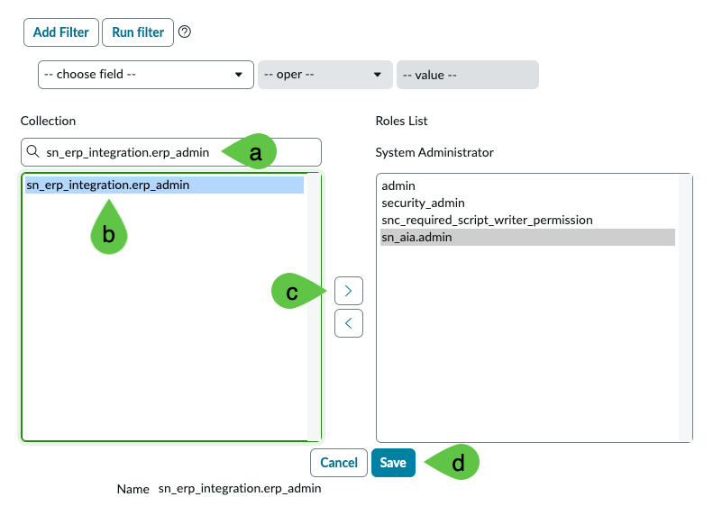<figcaption></figcaption></figure>
7.  You will get <mark style="color:green;">**a.)**</mark> messages such as **Adding Role decision\_table\_reader to admin**, there will be 4 of such messages > <mark style="color:green;">**b.)**</mark> right-click on the top panel and click **Save**.

    <figure>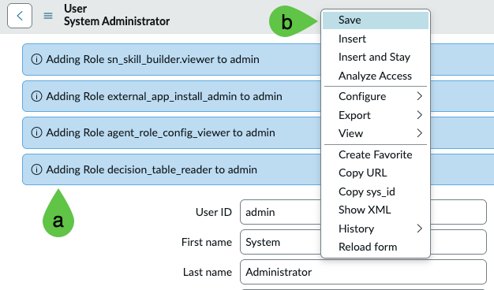<figcaption></figcaption></figure>
8.  <mark style="color:red;">**IMPORTANT**</mark>. Log out and log back in.

    <figure><figcaption></figcaption></figure>

## Zero Copy Connector for ERP

### Walkthrough: Explore ZCC for ERP Workspace

This provides the steps needed to connect ServiceNow to the ERP system to obtain Cost Center Master data.

1.  Navigate to All > <mark style="color:green;">**a.)**</mark> type **Zero Copy Connector for ERP Home** > <mark style="color:green;">**b.)**</mark> click **Zero Copy Connector for ERP Home**.

    <figure>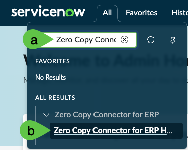<figcaption></figcaption></figure>
2.  The **Zero Copy Connector for ERP Home** is a workspace which has the layout as below.

    <figure>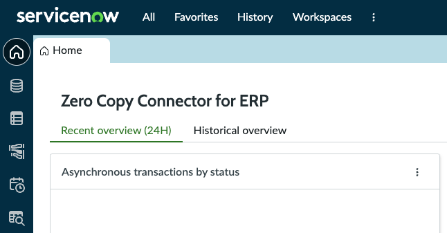<figcaption></figcaption></figure>

### Hands-on: Clone ERP Data Product for Cost Center

Clone the OOTB DP: Cost Center model. Label it SAP Cost Center. Assign ERP system S4D.

1.  Click on <mark style="color:green;">**a.)**</mark> **Models (database icon)** > <mark style="color:green;">**b.)**</mark> click **Model Name** > **more (vertical three dots)** > <mark style="color:green;">**c.)**</mark> type **DP: Cost Center** > <mark style="color:green;">**d.)**</mark> click **Apply**. We will replicate the structure of this OOTB data model.

    <figure>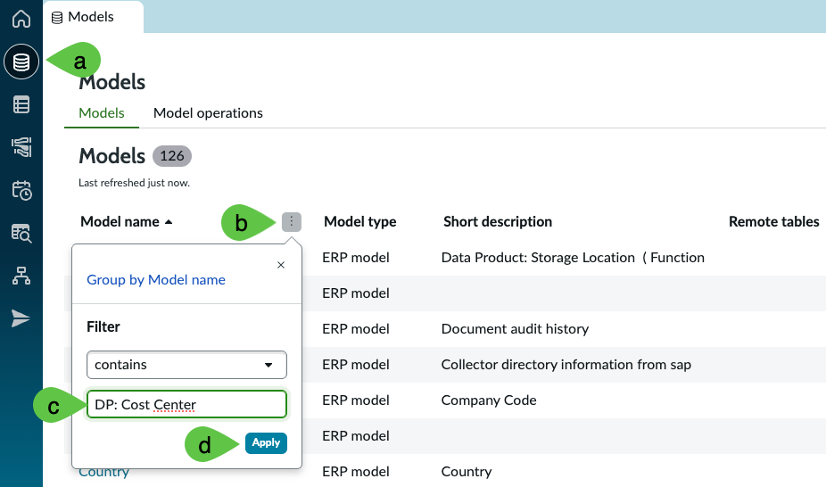<figcaption></figcaption></figure>
2.  Click on **DP: Cost Center** with Short Description **Data Product: Cost Center ( Function Call )**.

    <figure>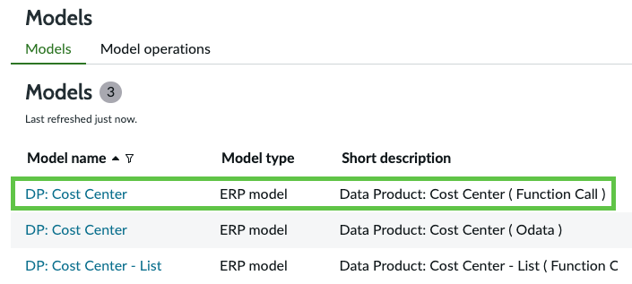<figcaption></figcaption></figure>
3.  Note the <mark style="color:green;">**a.)**</mark> popup that indicates that you are opening an **ERP Data Product** which is delivered as OOTB templates that customers can use to ramp-up creation of ERP models, which means it cannot be edited. Click <mark style="color:green;">**b.)**</mark> **Clone** to create a copy of this model.

    <figure>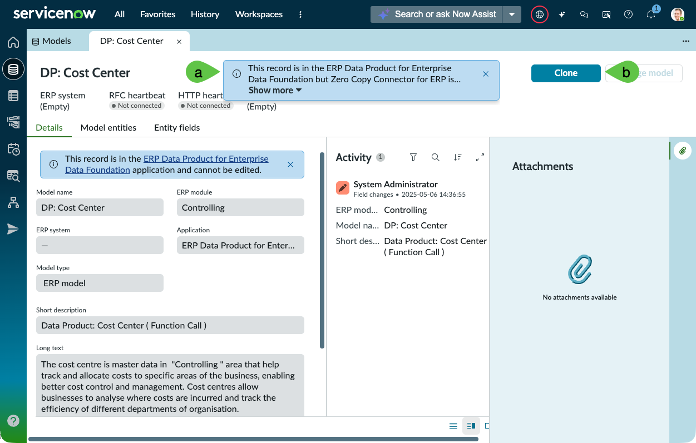<figcaption></figcaption></figure>
4.  Provide the label for the cloned model as <mark style="color:green;">**a.)**</mark> **SAP Cost Center Lab** and take note of the Target application which should be <mark style="color:green;">**b.)**</mark> **Forecast Variance**. Click <mark style="color:green;">**c.)**</mark> Clone this model once done.

    <figure>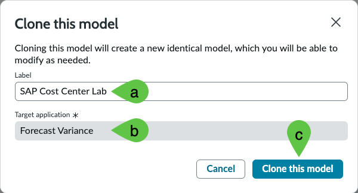<figcaption></figcaption></figure>
5.  After cloning the model you will be directed to its configuration screen. Assign the <mark style="color:green;">**a.)**</mark> ERP system name as S4D then <mark style="color:green;">**b.)**</mark> click Save. This will set up your model to use an ERP system that the ServiceNow instance is integrated to via Connections & Credentials. Then, <mark style="color:green;">**c.)**</mark> click **Manage model**.

    <figure>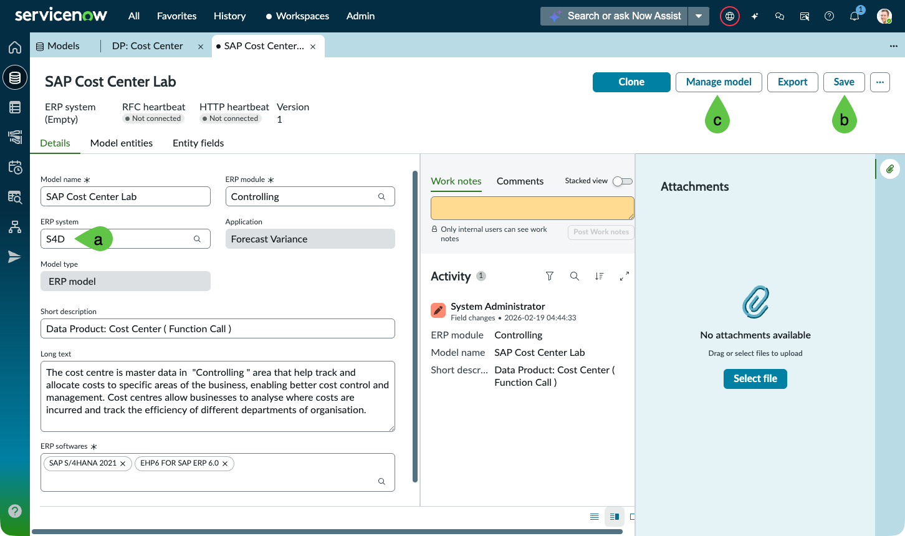<figcaption></figcaption></figure>

### Walkthrough: Explore ZCC for ERP BAPI Entity

Review the BAPI\_COSTCENTER\_GETDETAIL1 entity. Explore Specify Inputs and Choose Outputs configurations.

1.  Click **Read** to use a read-only operation configured in the model. ZCC for ERP models can also perform **Update** and **Create** actions.

    <figure>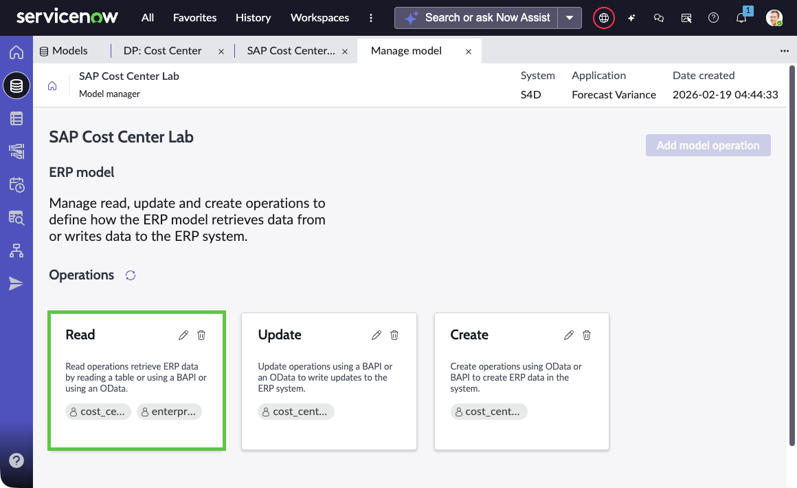<figcaption></figcaption></figure>
2.  There is a BAPI already included in the **DP: Cost Center** model you have cloned earlier. The entity **BAPI\_COSTCENTER\_GETDETAIL1** is already configured here so you do not have to do anything. As mentioned earlier, there are other ways to obtain master data from SAP (whether it is Cost Center, Materials, etc.) such as RFC table reads or OData endpoints.

    <figure>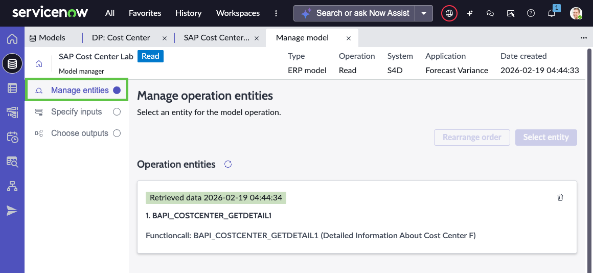<figcaption></figcaption></figure>
3.  Click on **Specify Inputs**. You do not need to do anything in this screen. The intent is to provide an overview of what can be configured as fields for selections when extracting or displaying information from the ERP system. If the table, BAPI, or OData endpoint supports it, this screen can also be left blank which is an equivalent of selecting all rows/records when executing the **Read** action.

    <figure>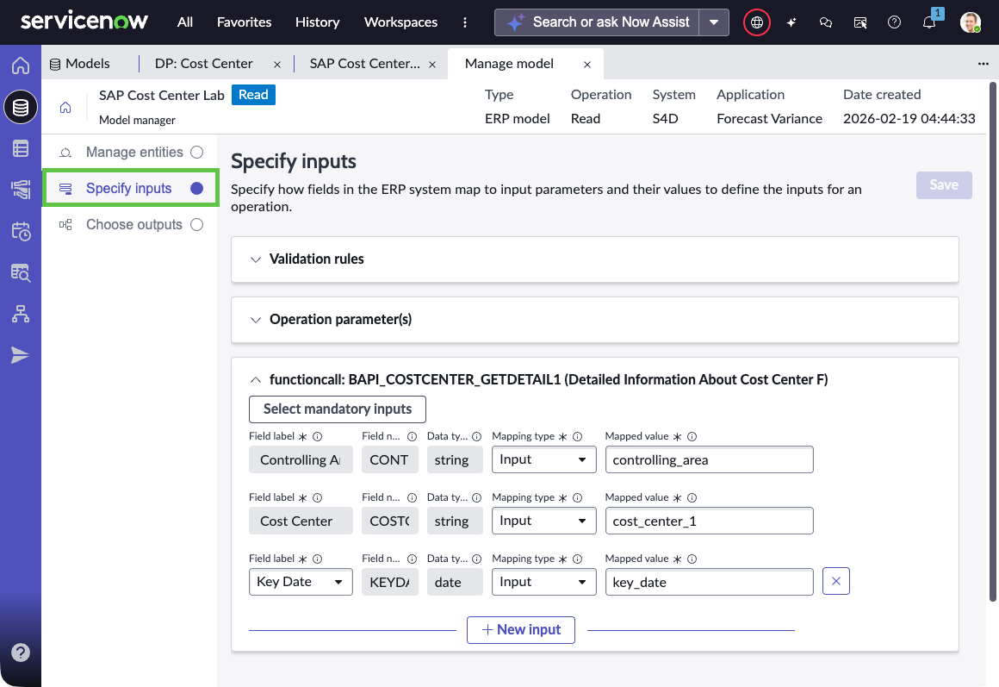<figcaption></figcaption></figure>
4.  Click on **Choose outputs**. You do not need to do anything in this screen. The intent is to provide an overview of what can be configured as the output for your selection or extraction. Both **Specify inputs** and **Choose outputs** sections can be intimidating for non-SAP practitioners which led to the creation of the **Data Product** we cloned in **Step 5**. Find out more about [**ERP Data Products here**](https://store.servicenow.com/store/app/9a0ad9f41b19e650396216db234bcba9).

    <figure>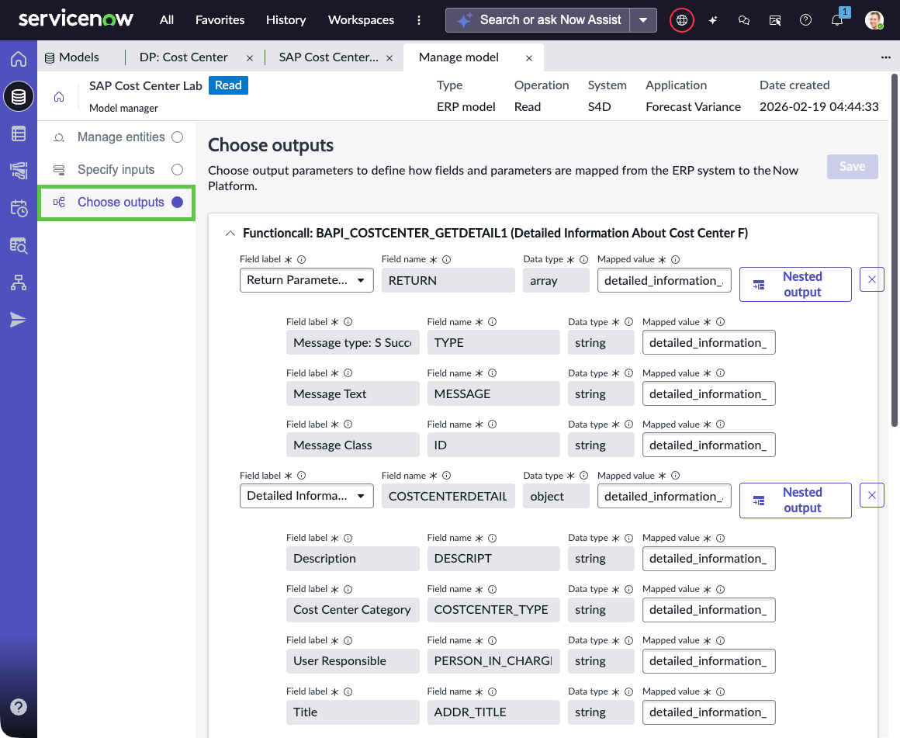<figcaption></figcaption></figure>

### Walkthrough: Explore ZCC for ERP Extraction Tables

Filter and review SAP Cost Center extraction table. Navigate to the target table containing Cost Center Master Data from SAP.

1.  Go to <mark style="color:green;">**a.)**</mark> **Extraction tables (Sankey diagram icon)** and click <mark style="color:green;">**b.)**</mark> **Name** > **more (vertical three dots)** > <mark style="color:green;">**c.)**</mark> type **SAP Cost Center** and <mark style="color:green;">**d.)**</mark> click **Apply**. **Extraction tables** are used as persistence layer for **ERP models**, i.e. data is stored here from Extract Transform Load (ETL) processes as an alternative to reading ERP data via Zero Copy. This is useful especially if the ERP table you are connecting to has millions of rows OR are not frequently updated. In our use case, while cost center master data is relatively small in many customer environments, they do not change frequently.

    <figure>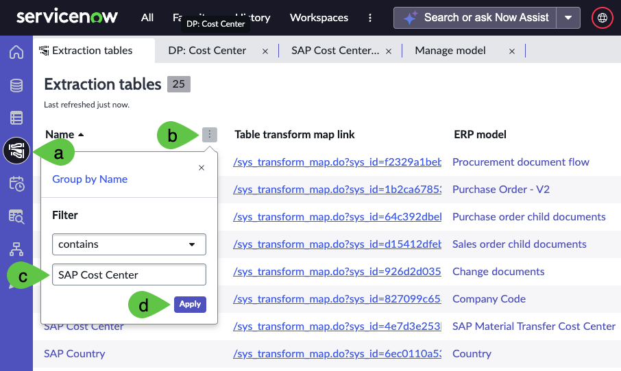<figcaption></figcaption></figure>
2.  Click on **SAP Cost Center**.

    <figure>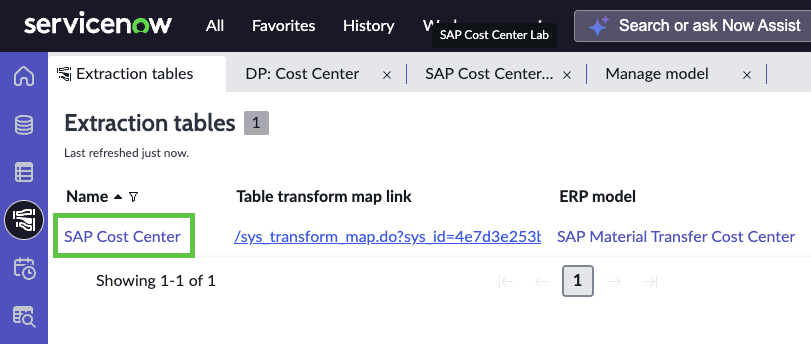<figcaption></figcaption></figure>
3.  There is a notification stating that <mark style="color:green;">**a.)**</mark> the object is in the **Zero Copy Connector for ERP application**, this is expected. Note that the <mark style="color:green;">**b.)**</mark> **ERP model** used here is different from what you have created earlier, this uses **SAP Material Transfer Cost Center**, this configuration is expected. This discrepancy is because we are not connected to a live SAP system for this exercise. The tools and configurations you have used are representative of a real SAP integration. Finally, <mark style="color:green;">**c.)**</mark> click on the **Target table link** which is **sn\_erp\_integration\_cost\_center\_list.do**.

    <figure>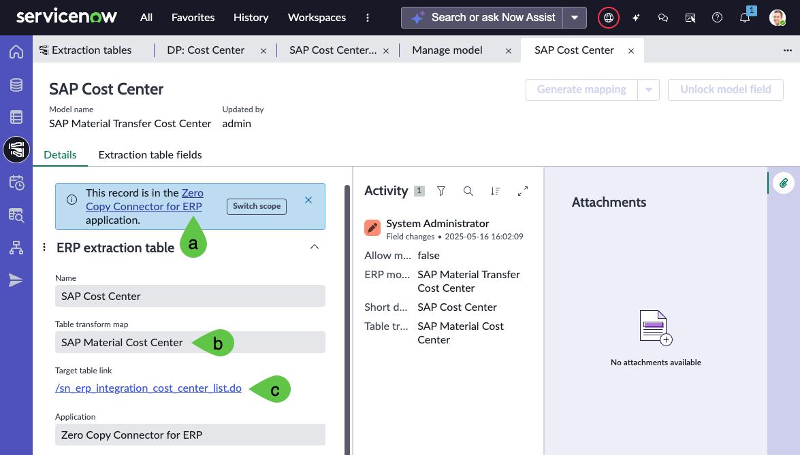<figcaption></figcaption></figure>
4. This will lead to the extraction table which contains **Cost Center Master Data** from SAP. This exercise uses an extraction scenario where data from SAP is stored in ServiceNow.

<figure>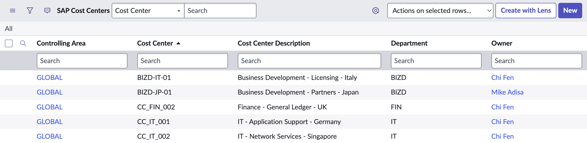<figcaption></figcaption></figure>

5. Congratulations! You have set-up the integration to a Cloud Data Warehouse using Zero Copy Connector for ERP.

### Additional Reading: Direct online read for ZCC for ERP

1. Direct online read is also possible with more details found on the blog post [Zero Copy Connector for ERP guide by Leo Francia in the ServiceNow community](https://www.servicenow.com/community/app-engine-for-erp-blogs/part-1-of-4-intelligent-erp-workflows-get-sap-data-into/ba-p/3192800).

## Zero Copy Connector for SQL

### Reference: Cloud Data Warehouse Source

This provides the steps needed to connect ServiceNow to the Cloud Data Warehouse and get summary data needed for workflow context and logic.

1. For reference purposes only, the table which will be used as source for Zero Copy for SQL coming from Snowflake is shown below. No action needs to be done for this step.

<figure>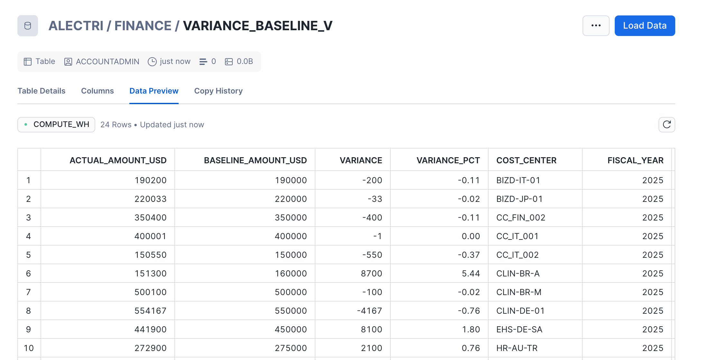<figcaption></figcaption></figure>

### Walkthrough: Navigation and Review of ZCC Connection

Navigate to Workflow Data Fabric Hub. Review the established Snowflake connection details.

2.  In the ServiceNow navigation, go to All > <mark style="color:green;">**a.)**</mark> type **Workflow Data Fabric Hub** > <mark style="color:green;">**b.)**</mark> go to **Workflow Data Fabric Hub**.

    <figure>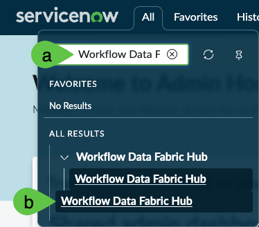<figcaption></figcaption></figure>
3.  In the landing page, go to **Established connections** > **Snowflake Connection (S)**. <mark style="color:red;">**Note:**</mark> this established connection is configured specifically for instances used in ServiceNow-led labs.

    <figure>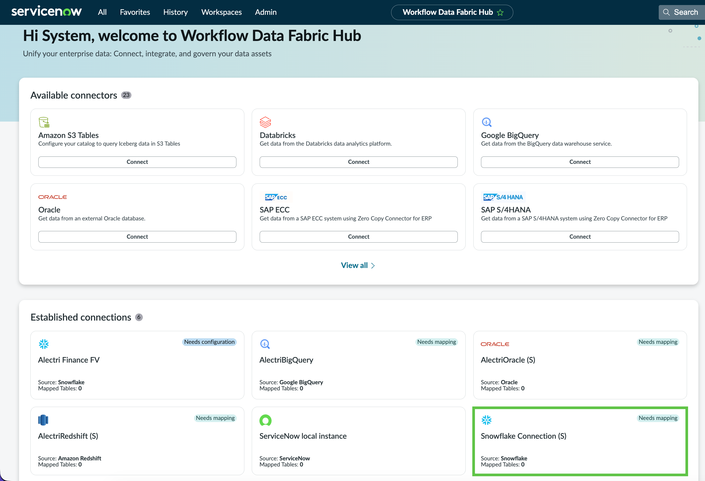<figcaption></figcaption></figure>
4.  In the **Connection details** tab of the screen that immediately follows, the established connection is configured as shown in the screenshot below. No action needs to be done for this step. You might also get a notification stating **This connection is read-only in the 'Forecast Variance' application scope...** which can be ignored.

    <figure>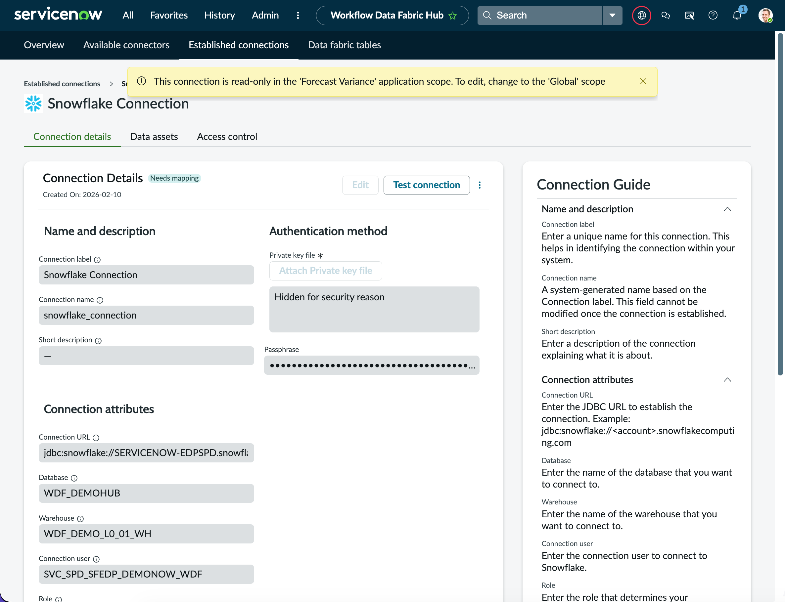<figcaption></figcaption></figure>

### Hands-on: Configure Column Mappings

Create a data fabric table from the Snowflake data asset. Set Cost Center as a Reference field to the ERP extraction table. Set GL Account as primary key.

2.  Go to <mark style="color:green;">**a.)**</mark> Data assets > <mark style="color:green;">**b.)**</mark> beside **u\_lab\_cc\_summary** click **Create data fabric table**. This screen shows the data assets available for the **Database** and **Warehouse** you configured in the previous screen. In this example, only two tables exist in the database **WDF\_DEMOHUB**.

    <figure>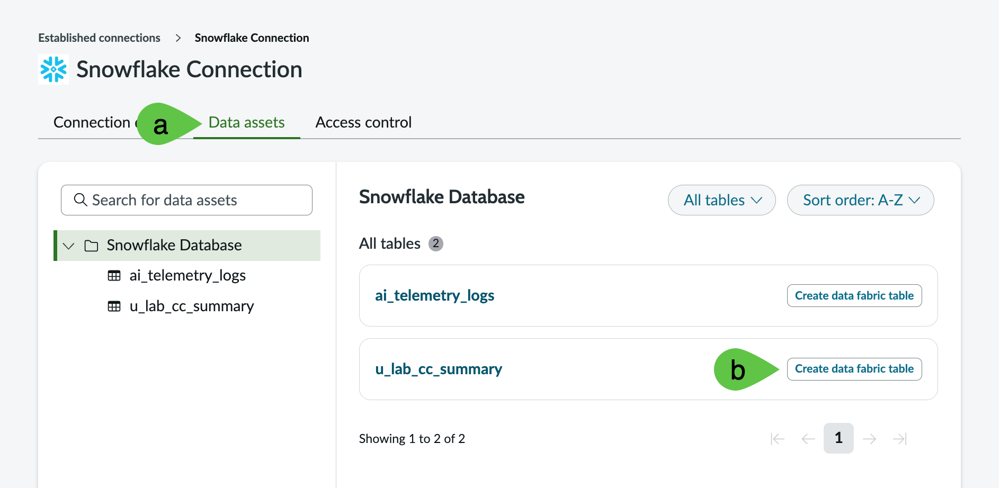<figcaption></figcaption></figure>
3.  Provide the information needed for <mark style="color:green;">**a.)**</mark> the **Label** e.g. **cc\_summ\_\<your initials>** and the <mark style="color:green;">**b.)**</mark> **Name** which will automatically provided. <mark style="color:red;">**Note:**</mark> keep the name length not more than 35 characters such as what is listed below, e.g. **x\_snc\_forecast\_v\_0\_df\_cc\_summ\_lfr**. Click <mark style="color:green;">**c.)**</mark> **Continue** once done. This will create the data fabric table (hence the df prefix) which will contain only the field and mapping information to the Snowflake table, it will not store the data from Snowflake into ServiceNow. While the intent of setting this up is mainly to show Zero Copy capability, this has multiple advantages such as ensuring cost center summary data from source is up to date as well as avoiding offline copies of the same information (e.g. via managed file transfer) which can result into data breaches.

    <figure>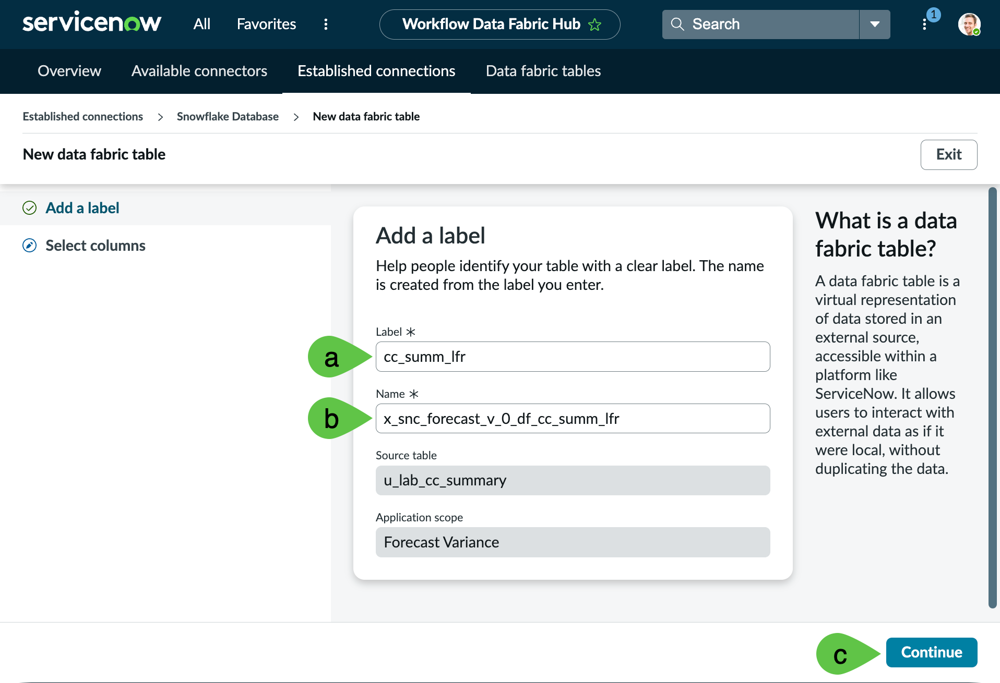<figcaption></figcaption></figure>
4.  In the screen that immediate follows, click on the tick box beside **Name** and this will include all the fields from the Snowflake data asset to the data fabric table being configured. Customers also have the option to select only the columns needed to speed up loading of data fabric tables.

    <figure>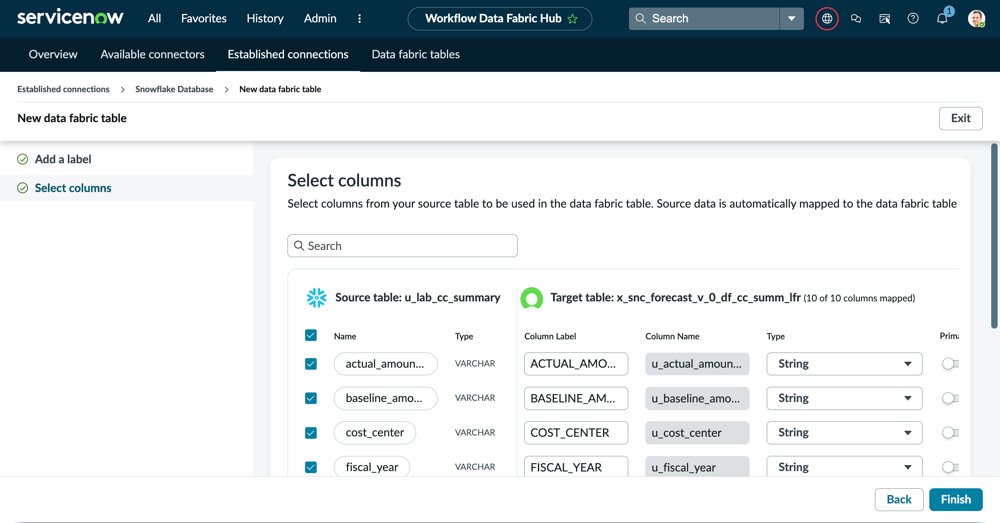<figcaption></figcaption></figure>
5.  Look for **Cost center** column > change the data type from **String** to <mark style="color:green;">**a.)**</mark> **Reference** and click <mark style="color:green;">**b.)**</mark> **Reference** to set the table from which **Cost center** column will refer to. A **Reference** field points to a record in an existing table, so users select from a controlled set instead of typing freehand. This keeps your data consistent and traceable, which matters most when the field drives downstream process logic.

    <figure>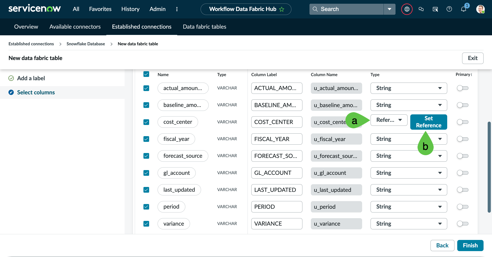<figcaption></figcaption></figure>
6. In the modal pop-up that appears, select the table **sn\_erp\_integration\_cost\_center** which you have set-up in the ZCC for ERP lab exercise.

<figure>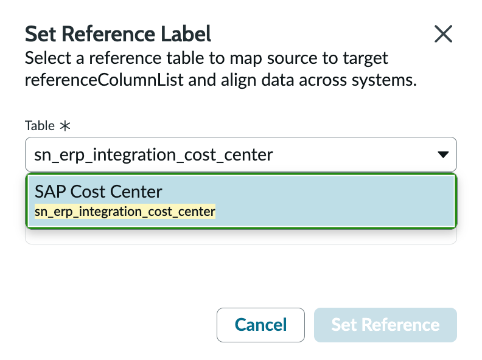<figcaption></figcaption></figure>

7. In the same modal pop-up, select **Cost Center**.

<figure>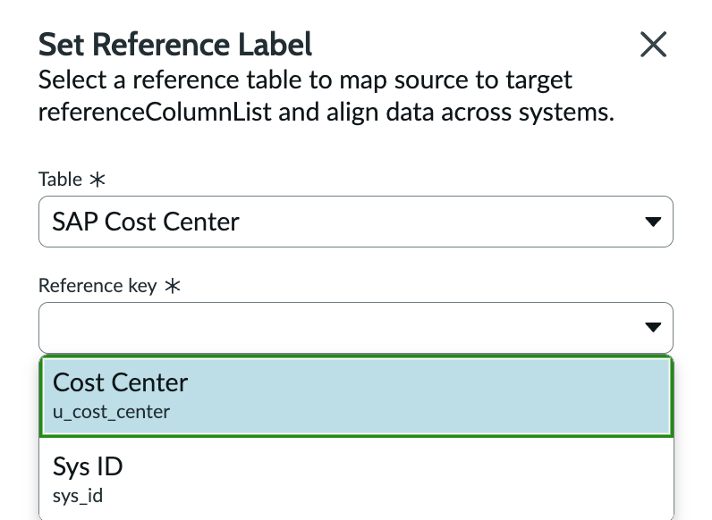<figcaption></figcaption></figure>

8. Once completed, click **Set Reference**. This will create the reference to the cost center details from SAP.

<figure>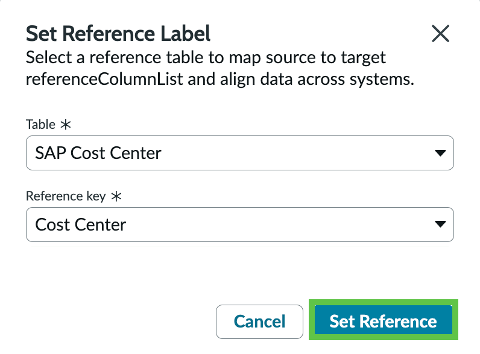<figcaption></figcaption></figure>

9. Finally, set GL account as the **Primary** key as shown in the <mark style="color:green;">**a.)**</mark> toggle below. Click <mark style="color:green;">**b.)**</mark> **Finish** once done.

<figure>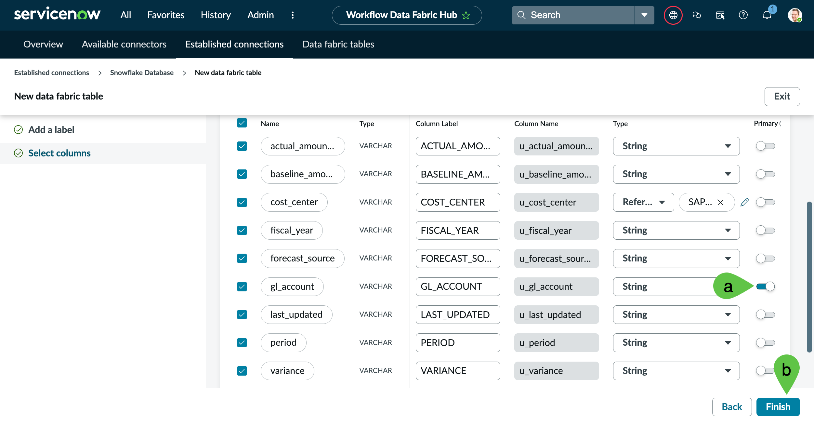<figcaption></figcaption></figure>

10. A pop-up dialog indicating that a primary key has been defined. Click **Confirm**. A primary key lets you distinguish unique records from the source data warehouse, which becomes important in complex analysis.

<figure>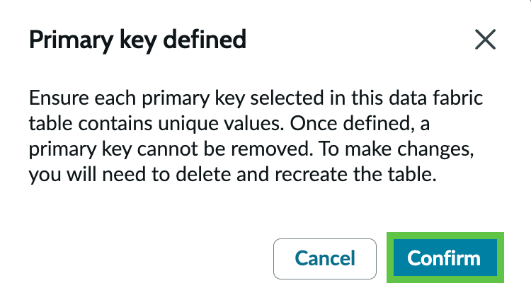<figcaption></figcaption></figure>

### Walkthrough: Open Data Fabric Table

View the data assets created and open the data fabric table contents.

1. This will lead you to a screen showing the data assets created. In the same screen, click on the <mark style="color:green;">**a.)**</mark> three vertical dots then <mark style="color:green;">**b.)**</mark> **Open list** to see the contents of the table.

<figure>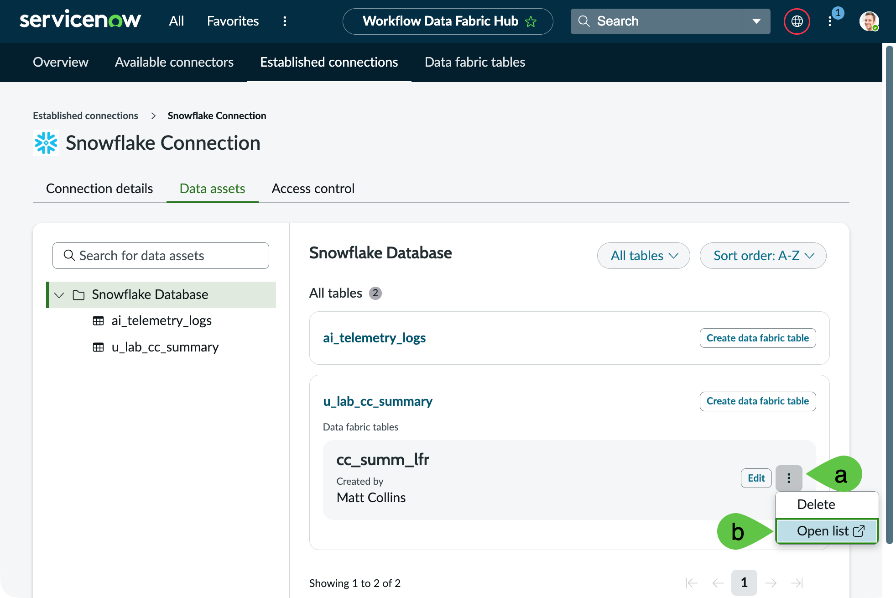<figcaption></figcaption></figure>

2. This will lead you to the data fabric table.

<figure>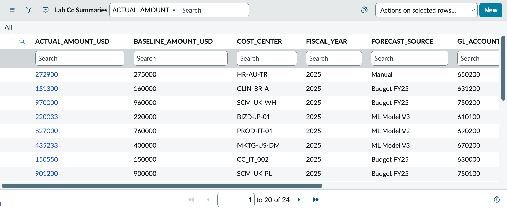<figcaption></figcaption></figure>

3. Congratulations! You have set-up the integration to a Cloud Data Warehouse using Zero Copy Connector for SQL.

## AI Agent and Finance Operations Workspace

### Walkthrough: Custom Forecast Variance AI Agent

This is a walk through of how an AI Agent equipped with both deterministic and probabilistic capabilities can automate research and validation of cost center history and expenses as well as creation of Finance Cases should cost centers be above their budget allocations. <mark style="color:red;">**Note:**</mark> this is a custom AI agent pre-configured in the lab instance provided in ServiceNow-led lab sessions; this is not a pre-built agent.

1. Go to All > type **x\_snc\_forecast\_v\_0\_expense\_transaction\_event.list** and hit **Return/Enter ↵**.

<figure><figcaption></figcaption></figure>

2. This will lead to the screen below. Note that this is the table created in [Lab Exercise: Fundamentals](lab-exercise-fundamentals.md) and populated with the data from [Lab Exercise: Integration Hub](lab-exercise-integration-hub.md).

<figure>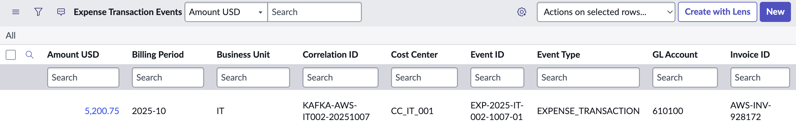<figcaption></figcaption></figure>

3.  After reviewing the table, navigate to All > <mark style="color:green;">**a.)**</mark> type **AI Agent Studio** > <mark style="color:green;">**b.)**</mark> click on **Create and Manage**.

    <figure>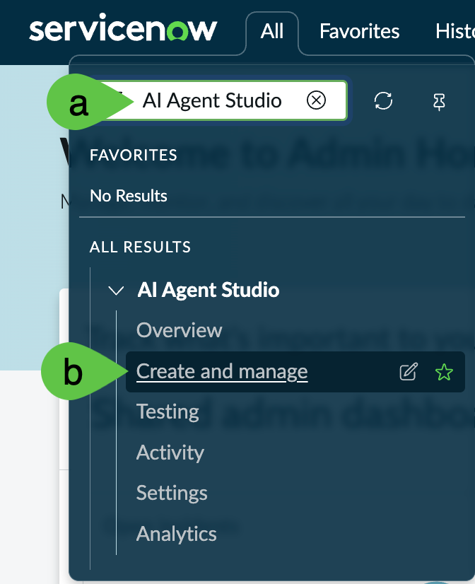<figcaption></figcaption></figure>
4.  Go to **AI agents** tab > <mark style="color:green;">**a.)**</mark> click **Conditions** > <mark style="color:green;">**b.)**</mark> select **Field** as **Name** <mark style="color:green;">**c.)**</mark> **Operator** as **is** and for <mark style="color:green;">**d.)**</mark> Value type **Forecast Variance** and hit **Return/Enter ↵**. Click on the <mark style="color:green;">**e.)**</mark> result.

    <figure><figcaption></figcaption></figure>
5.  Click on **Define the specialty**. This shows all the instructions for this AI Agent created in plain English. The **List of steps** describes the sequence, purpose, and nuances of the tools configured, which are shown in the next section. No further action is required in this section.

    <figure>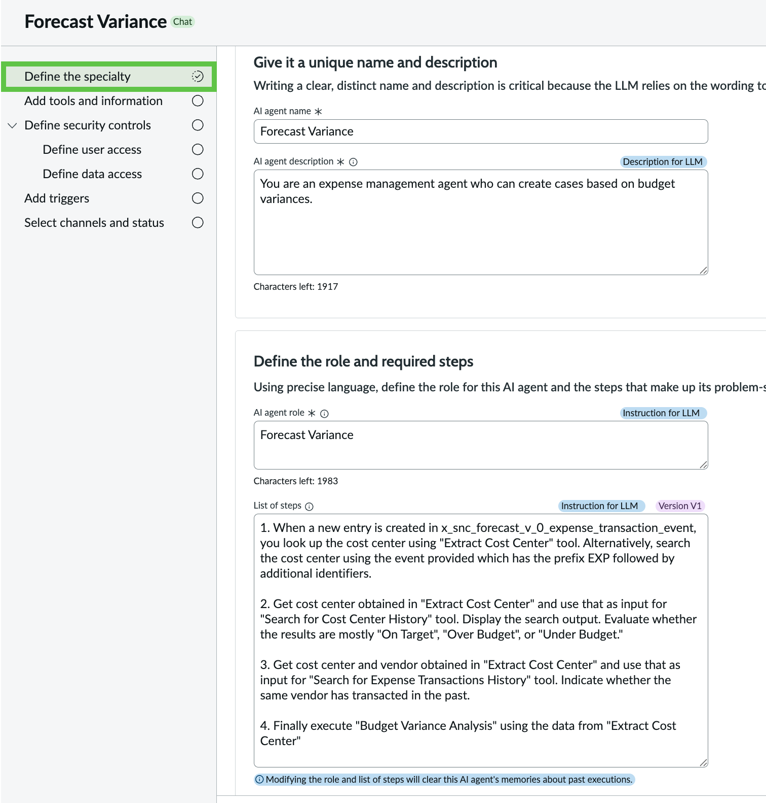<figcaption></figcaption></figure>
6.  Next, click on **Add tools and information**. This is a collection of **Search retrievals** and **Subflows** that are used by the agent. The purpose and sequence of these tools are also described in the section **Define the specialty**. No further action is required in this section but feel free to explore the configurations of each of the tools.

    <figure>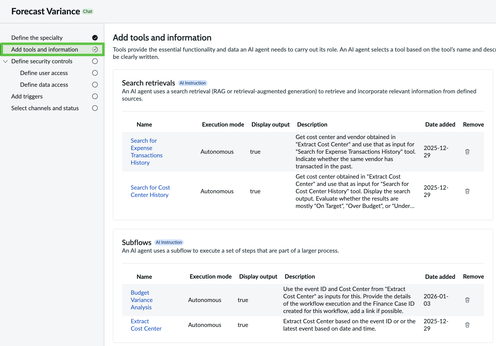<figcaption></figcaption></figure>
7.  Under **Define security controls** > <mark style="color:green;">**a.)**</mark> click **Define data access** > <mark style="color:green;">**b.)**</mark> select **Dynamic user** from the drop down then > <mark style="color:green;">**c.)**</mark> add **admin** user as the approved role. For this exercise we are using permissive authorisations but this is where you can tighten authorisations for your agents allowing mechanisms such as inheriting the authorisations of logged in user (Dynamic identity type) or a predefined set of access (AI User identity type).

    <figure>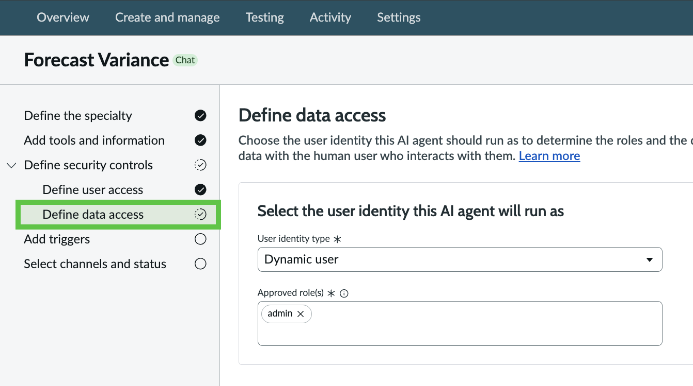<figcaption></figcaption></figure>
8.  Next, click on **Define trigger**, which is kept blank. You can add the triggers for the AI Agent here but for the exercise, the AI Agent will be triggered manually to be able to show the detail chat responses and debugging. No further action is required in this section.

    <figure>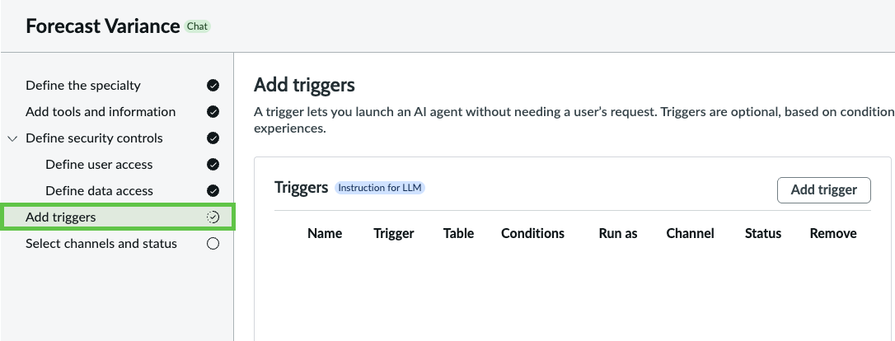<figcaption></figcaption></figure>
9.  Finally, click on <mark style="color:green;">**a.)**</mark> **Select channels and status**. This configures the availability of the AI Agent. In this case, it is enabled and can be accessed using <mark style="color:green;">**b.)**</mark>**&#x20;Now Assist panel** toggled on as well as via <mark style="color:green;">**c.)**</mark>**&#x20;Now Assist in Virtual Agent** added as chat assistant. Click <mark style="color:green;">**d.)**</mark>**&#x20;Save and test**. <mark style="color:$warning;">**Note:**</mark> if Chat Assistants (step <mark style="color:green;">**10.c.**</mark>) does not give you options, check and execute the steps in [Lab Exercise: Integration Hub > Platform Configuration](https://servicenow-lf.gitbook.io/the-workflow-data-fabric-loom/main-exercises/lab-exercise-integration-hub#preparation-platform-configuration) > Steps 9 to 18; esp. if you are doing this lab standalone or have skipped the [Lab Exercise: Integration Hub](https://servicenow-lf.gitbook.io/the-workflow-data-fabric-loom/main-exercises/lab-exercise-integration-hub) portion.

    <figure>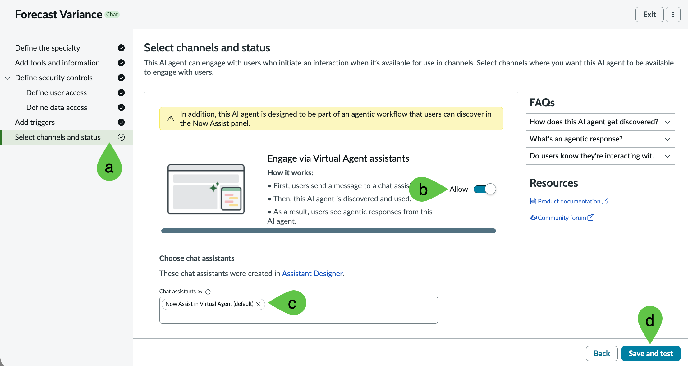<figcaption></figcaption></figure>

### Hands-on: Test and review Custom AI Agent

Enter test prompt to process an expense event. Review planning steps, cost center and vendor extraction, RAG search results, and Finance Case creation.

1. You will be directed to the Test AI reasoning tab. To proceed with testing, <mark style="color:green;">**a.)**</mark> type **Help me process EXP-2025-IT-002-1007-01** and <mark style="color:green;">**b.)**</mark> click **Continue to Test Chat Response**.

<figure>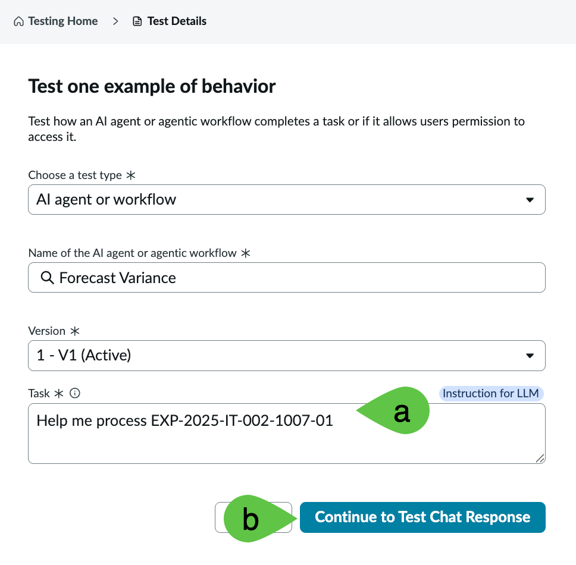<figcaption></figcaption></figure>

2. Wait for the test to complete which is indicated by an <mark style="color:green;">**End**</mark> with a check mark. Once that is completed, you can explore the following sections. These automations help assess and review cost centers which are exceeding budget proactively instead of waiting at the end of reporting cycles.

<mark style="color:green;">**a.)**</mark> Expand **Planning the next steps** to see the tools used.

<mark style="color:green;">**b.)**</mark> Note the **cost\_center** and **vendor** extracted from the expense event.

<mark style="color:green;">**c.)**</mark> You can access the result of the **Retrieval-augmented Generation (RAG) search** and click on the links if you wish. This step helps you check relevant entries for the cost center associated with the expense event so you can do further investigation if needed.

<mark style="color:green;">**d.)**</mark> You can also access the **RAG search** results for the vendors associated with the expense event.

<mark style="color:green;">**e.)**</mark> Finally, if the expense event will lead to the associated cost center being over budget, the total cost center expense and the **Finance Case** created for exceeding the budget for further review and action is listed. In this case it is FINC0010003.

<figure>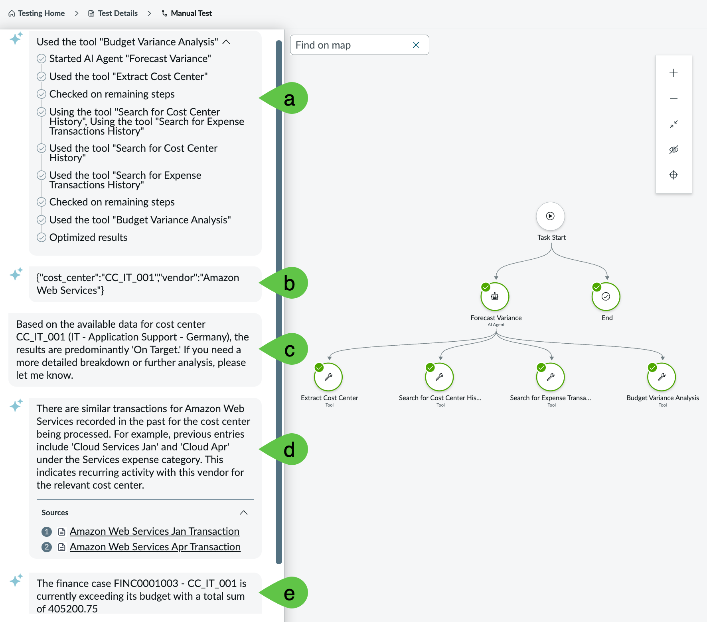<figcaption></figcaption></figure>

3. The right panel of the same screen shows the **AI agent decision logs** for debugging purposes.

<figure>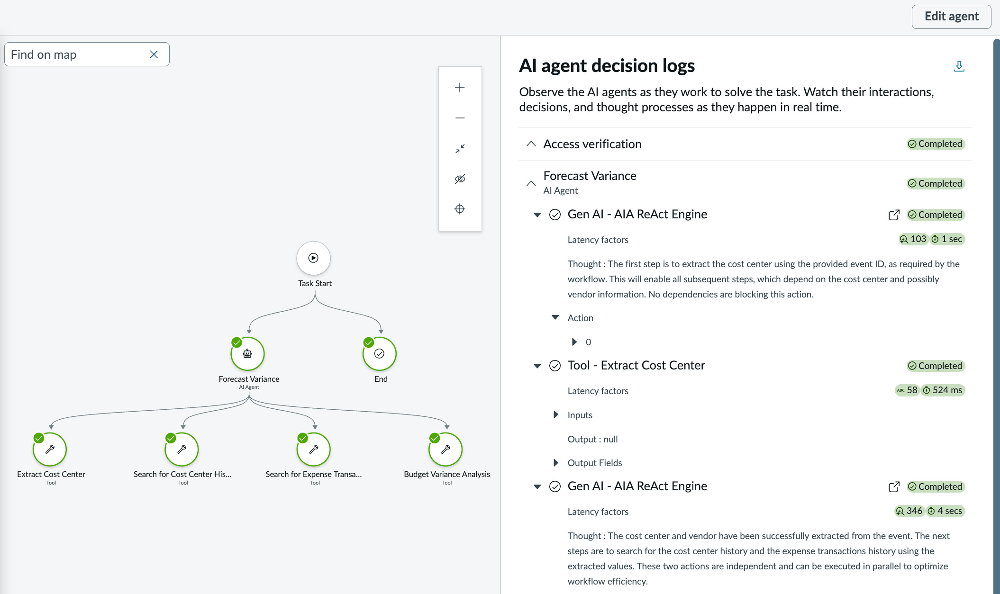<figcaption></figcaption></figure>

### Completion: Verify Finance Case

Navigate to Finance Operations Workspace. Find the case created by the agent.

1. Navigate to Workspaces > <mark style="color:green;">**a.)**</mark> type **Finance Operations Workspace** and click on the <mark style="color:green;">**b.)**</mark> workspace with the same name.

<figure><figcaption></figcaption></figure>

2. For this exercise, we are not impersonating a persona so you remain as the System user.

<figure><figcaption></figcaption></figure>

3. Go to <mark style="color:green;">**a.)**</mark> **list (list icon)** > <mark style="color:green;">**b.)**</mark> **Lists** > <mark style="color:green;">**c.)**</mark> sort by **Number** descending/ascending > <mark style="color:green;">**d.)**</mark> or look for the Finance case created by the AI Agent, FINC0010003 in the example above.

<figure>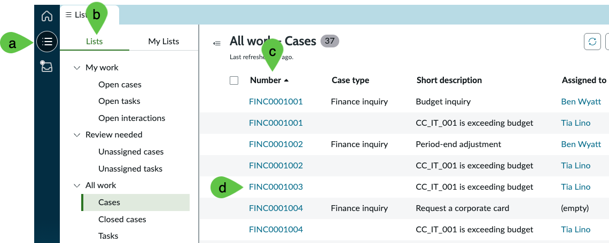<figcaption></figcaption></figure>

## Conclusion

Congratulations! You have created the **Workflow Data Fabric** integrations that powers the **Financial Forecast Variance Agent** allowing proactive creation of cases based on multiple data sources in a complex landscape to allow proactive management of budgets.

## Next step

Let us continue building the data foundations for AI Agents to use. The next suggested exercise is the creation of the External Content Connector to SharePoint.

[Take me back to main page](../)
