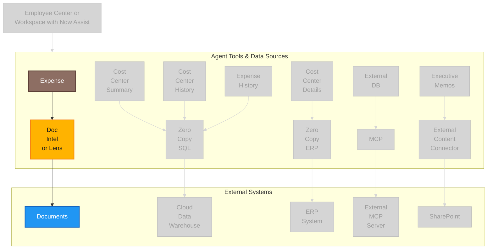

# Outcome: Agent Flow — Document Intelligence Highlight

Greyed-out variant with Expense → Doc Intel or Lens → Documents highlighted. First column replaces Integration Hub/REST API with Doc Intel or Lens/Documents.
Used in `extended-exercises/lab-exercise-servicenow-lens-and-document-intelligence.md`.

