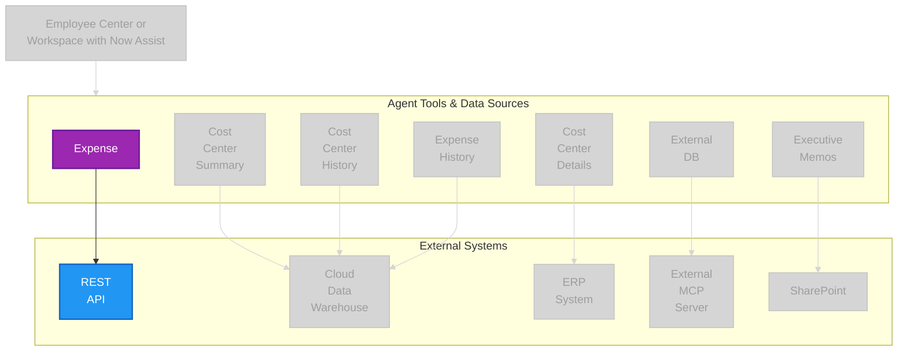

# Outcome: Agent Flow — Integration Hub Highlight

Greyed-out variant of outcome-agent-flow.md with only Expense → REST API highlighted.
Used in `main-exercises/lab-exercise-integration-hub.md`.

```mermaid
graph TD

    EC[Employee Center or<br/>Workspace with Now Assist]
  
    subgraph TOOLS["Agent Tools & Data Sources"]
        T1["Expense<br/>"]
        T2["Cost<br/>Center<br/>Details"]
        T3["Cost<br/>Center<br/>Summary"]        
        T4["Cost<br/>Center<br/>History"]
        T5["Expense<br/>History"]
        T6["External<br/>DB"]
        T7["Executive<br/>Memos"]
    end

    subgraph EXT["External Systems"]
        API["REST<br/>API"]
        CDW["Cloud<br/>Data<br/>Warehouse"]
        ERP["ERP<br>System"]
        MCP_EXT["External<br/>MCP<br/>Server"]
        SharePoint["SharePoint"]
    end
    
    EC --> TOOLS
    T1 --> API
    T2 --> ERP
    T3 --> CDW
    T4 --> CDW
    T5 --> CDW
    T6 --> MCP_EXT
    T7 --> SharePoint

    %% Styling
    classDef external fill:#2196F3,stroke:#1565C0,stroke-width:2px,color:#fff
    classDef wdf fill:#9C27B0,stroke:#6A1B9A,stroke-width:2px,color:#fff
    classDef greyed fill:#D5D5D5,stroke:#BDBDBD,stroke-width:1px,color:#9E9E9E

    %% Highlight only Expense and REST API
    class T1 wdf
    class API external

    %% Grey out everything else
    class EC,T2,T3,T4,T5,T6,T7 greyed
    class CDW,ERP,MCP_EXT,SharePoint greyed

    %% Grey out non-highlighted edges
    linkStyle 0 stroke:#D5D5D5,stroke-width:1px
    linkStyle 2 stroke:#D5D5D5,stroke-width:1px
    linkStyle 3 stroke:#D5D5D5,stroke-width:1px
    linkStyle 4 stroke:#D5D5D5,stroke-width:1px
    linkStyle 5 stroke:#D5D5D5,stroke-width:1px
    linkStyle 6 stroke:#D5D5D5,stroke-width:1px
    linkStyle 7 stroke:#D5D5D5,stroke-width:1px
```
