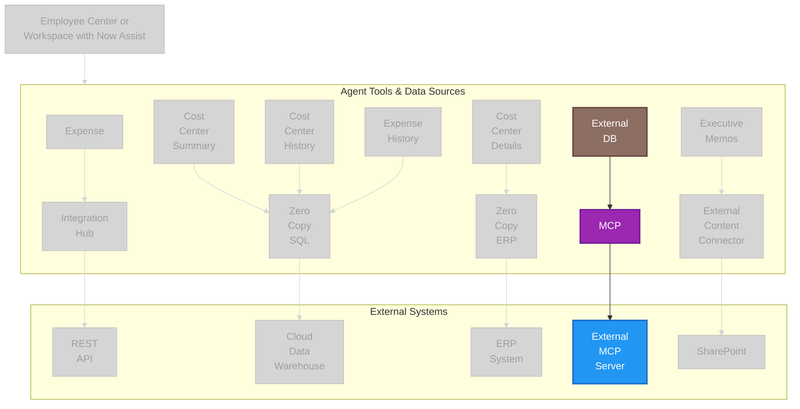

# Outcome: Agent Flow — MCP Highlight

Greyed-out variant with External DB → MCP → External MCP Server highlighted.
Used in `extended-exercises/lab-exercise-model-context-protocol-server-client.md`.

