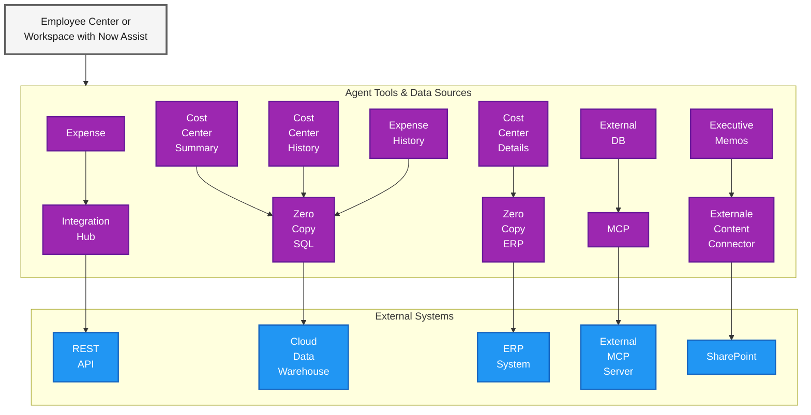

# Outcome: Agent Flow Diagram

Source mermaid for the outcome diagram in README.md. The PNG is generated from this and placed in `.gitbook/assets/dataflow_outcome_agent_flow.png`.

```mermaid
graph TD

    EC[Employee Center or<br/>Workspace with Now Assist]
  
    subgraph TOOLS["Agent Tools & Data Sources"]
        T1["Expense"]
        T2["Cost<br/>Center<br/>Details"]
        T3["Cost<br/>Center<br/>Summary"]        
        T4["Cost<br/>Center<br/>History"]
        T5["Expense<br/>History"]
        T6["External<br/>DB"]
        T7["Executive<br/>Memos"]
        S1["Integration<br>Hub"]
        S2["Zero<br/>Copy<br/>ERP"]
        S3["Zero<br/>Copy<br/>SQL"]        
        S6["MCP"]
        S7["Externale<br/>Content<br/>Connector"]
    end

    subgraph EXT["External Systems"]
        API["REST<br/>API"]
        CDW["Cloud<br/>Data<br/>Warehouse"]
        ERP["ERP<br>System"]
        MCP_EXT["External<br/>MCP<br/>Server"]
        SharePoint["SharePoint"]
    end
    
    EC --> TOOLS
    T1 --> S1 --> API
    T2 --> S2 --> ERP
    T3 --> S3 --> CDW
    T4 --> S3 
    T5 --> S3 
    T6 --> S6 --> MCP_EXT
    T7 --> S7 --> SharePoint
    
  

    %% Styling
    classDef external fill:#2196F3,stroke:#1565C0,stroke-width:2px,color:#fff
    classDef user fill:#F5F5F5,stroke:#616161,stroke-width:3px,color:#1a1a1a
    classDef nowassist fill:#FFB300,stroke:#F57F17,stroke-width:2px,color:#1a1a1a
    classDef wdf fill:#9C27B0,stroke:#6A1B9A,stroke-width:2px,color:#fff
    classDef user fill:#F5F5F5,stroke:#616161,stroke-width:3px,color:#1a1a1a

    class API,CDW,ERP,MCP_EXT,SharePoint external
    class Agent,RAG nowassist
    class T1,T2,T3,T4,T5,T6,T7,T8,S1,S2,S3,S6,S7 wdf
    class EC user
```
