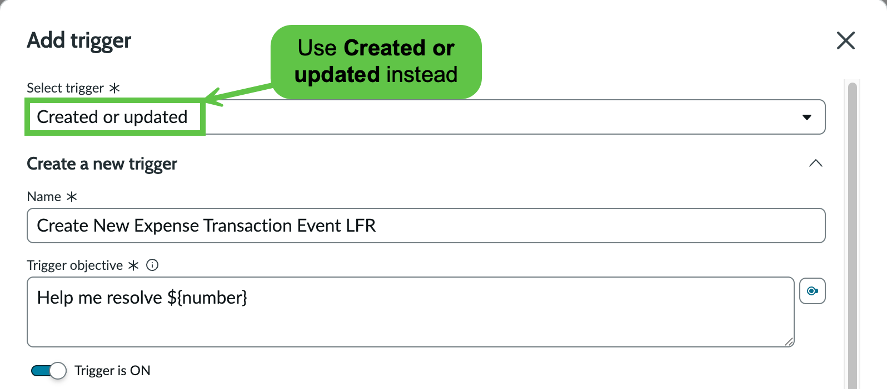
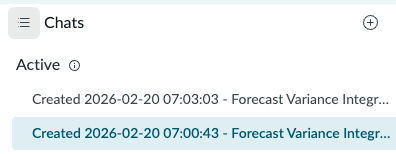
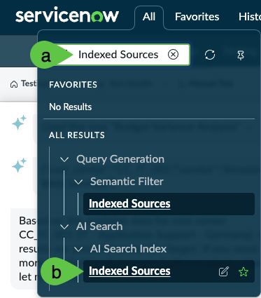
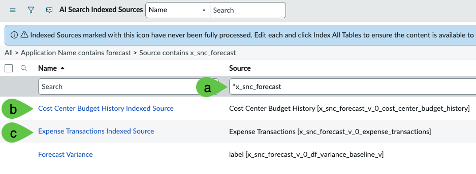
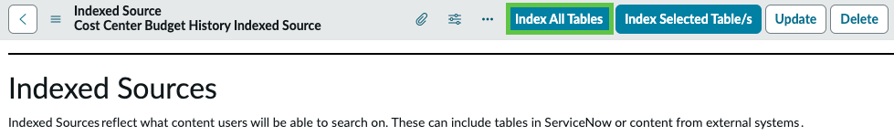
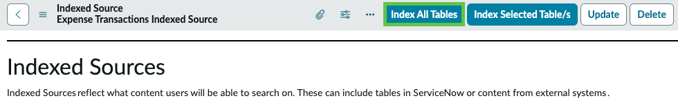

# Troubleshooting

<table><thead><tr><th width="71.28125" align="right" valign="top">#</th><th width="563.6953125">Step</th><th width="104.83203125">Applies to<select multiple><option value="LFyXCHeshTmv" label="All" color="blue"></option><option value="zbDYXJPlwJJs" label="DocIntel" color="blue"></option><option value="f8inXDHuidYg" label="IHub" color="blue"></option><option value="QqHed84A3kxI" label="MCP" color="blue"></option><option value="oav2uiRt4J5D" label="Stream" color="blue"></option><option value="bOQH5S6AXihu" label="XCC" color="blue"></option><option value="92wolRYTYAyA" label="ZCC" color="blue"></option></select></th></tr></thead><tbody><tr><td align="right" valign="top">1</td><td>
If the URL in <strong>Action Configuration</strong> > step 4 is failed to fetch data due to rate limiting or any other reason, you can upload the file here to trigger a created/updated row in x_snc_forecast_v_0_expense_transaction_event. <a href="https://raw.githubusercontent.com/leojacinto/WorkflowDataFabric-TypeA/refs/heads/main/.gitbook/assets/x_snc_forecast_v_0_expense_transaction_event.xml">Get the XML file here</a>. Additional notes:
<ul><li>If you are not using the action to fetch data via API and are uploading the XML file, change the trigger in <strong>Custom Forecast Variance AI Agent</strong> > step 11 to <strong>Created or updated</strong>, instead of <strong>Created</strong>.</li><li>
This approach is not representative of real integration scenario as you are only doing a file upload. A <strong>Created</strong> trigger will not initiate from an upload.

<figure><figcaption></figcaption></figure>
</li></ul></td><td>IHub</td></tr><tr><td align="right" valign="top">2</td><td>The agent might not trigger after creating a new expense event entry in <strong>x_snc_forecast_v_0_expense_transaction_event</strong> or throw errors like <strong>Sorry, there was a problem on my side trying to complete this request. Try asking again later.</strong> in Runtime of Flow, Actions, and AI agents > step 8. This can be fixed by doing a dummy change in Custom Forecast Variance AI Agent > Steps 10 to 13; e.g, recreating the trigger.</td><td>IHub</td></tr><tr><td align="right" valign="top">3</td><td>
If the Now Assist Agent is not showing the action being executed and the history of chats like below, wait for 5 minutes or so and refresh your browser. This is primarily due to the instance's fresh Now Assist settings which you have just configured earlier.

</td><td>IHub</td></tr><tr><td align="right" valign="top">4</td><td>
If you get messages in Now Assist from the agent saying messages like below, this just means that indexing of the tables needed by the agent to search transactions is not yet completed. Wait for 10 to 15 minutes.
<ul><li>
Errors/messages in Now Assist below. These do not affect the outcome of your lab activity as the agents and the tools related to this are already configured and is only related to the lab instance server load.
<ul><li>There is no available information indicating similar transactions for this vendor in the past based on the cost center being processed.</li><li>Based on the available information, there is insufficient data to determine whether the results are mostly 'On Target', 'Over Budget', or 'Under Budget.' Please provide additional details or context for a more accurate evaluation.</li></ul></li><li>
<strong>If the errors persist after waiting 10 to 15 minutes, do the following steps to force an indexing job, but this is not a guaranteed fix if there is a high load in the shared lab ML services used in AI search</strong>.
<ul><li>Navigate to <strong>All</strong> > <mark style="color:green;"><strong>a.)</strong></mark> type <strong>Indexed Sources</strong> > <mark style="color:green;"><strong>b.)</strong></mark> click <strong>AI Search > AI Search Index ></strong> and Ctrl / ⌘ + click <strong>Indexed Sources</strong> to open a new window.</li></ul>
<figure><figcaption></figcaption></figure>
<ul><li>
Search for <strong>Sources</strong> with the string <mark style="color:green;"><strong>a.)</strong></mark> *x_snc_forecast then Ctrl / ⌘ + click both <mark style="color:green;"><strong>b.)</strong></mark> <strong>Cost Center Budget History Indexed Source</strong> and <mark style="color:green;"><strong>c.)</strong></mark><strong> Expense Transactions Indexed Source</strong> so you have two new windows for these objects.

<figure><figcaption></figcaption></figure>
</li><li>In the new window for <strong>Center Budget History Indexed Source</strong>, click <strong>Index All Tables</strong>.</li></ul>
<figure><figcaption></figcaption></figure>
<ul><li>
In the new window for <strong>Expense Transactions Indexed Source</strong>, click <strong>Index All Tables</strong>.

<figure><figcaption></figcaption></figure>
</li><li>Once done, you can re-execute your agent.</li></ul></li></ul></td><td>DocIntel, IHub, MCP, ZCC</td></tr></tbody></table>
